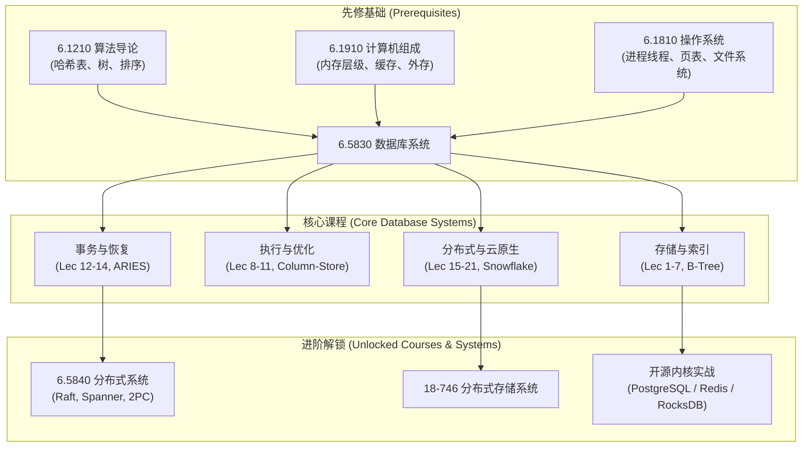

# 6.5830 数据库系统 (Database Systems)

> MIT CSAIL · Course 6: Computer Science · 课号 6.5830 / 6.5831  
> 授课教授：Prof. Sam Madden, Prof. Michael Stonebraker  
> 经典参考书：*Readings in Database Systems* (5th Edition, 数据库红宝书)

## TL;DR

- 数据库系统是现代数据密集型应用的核心基石，全面贯穿关系模型、存储引擎、查询编译与分布式事务。
- 从单机外存模型（B+ Tree、缓冲池置换、列存压缩）到查询优化器（Selinger 算法与代价模型）的物理执行全貌。
- 深入并发控制与恢复理论（严格 2PL、MVCC、ARIES 算法），并延展至现代分布式数据库与云原生存算分离架构。

## 一、课程先修与解锁路径（Curriculum Pathway）

为了帮助技术读者建立清晰的体系化学习旅程，建议参考以下知识拓扑：

---

## 二、课程讲义体系目录

全课程 21 讲结构化讲义涵盖数据库四大支柱模块：

| 讲次 | 讲义标题 | 英文主题 | 核心内容焦点 |
| :--- | :--- | :--- | :--- |
| [Lec 1](./lec1.md) | 关系模型与 SQL 基础 | Relational Model & SQL | 逻辑谓词模型、关系代数与数据独立性 |
| [Lec 2](./lec2.md) | 现代 SQL 与系统运维 | Modern SQL & Admin | 窗口函数、CTE、RBAC 与运维维护命令 |
| [Lec 3](./lec3.md) | 模式设计与范式理论 | Schema Normalization | 函数依赖、BCNF 分解与反范式化权衡 |
| [Lec 4](./lec4.md) | 数据库内核整体架构 | DBMS Architecture | 磁盘与内存张力、进程并发模型与直接 I/O |
| [Lec 5](./lec5.md) | 存储管理与页面物理布局 | Storage & Page Layout | Slotted Page 结构、Tuple 打包与变长字段 |
| [Lec 6](./lec6.md) | 内存管理与缓冲池置换 | Buffer Pool Management | 缓冲池 Frame 架构、时钟算法与页钉机制 |
| [Lec 7](./lec7.md) | 索引机制与访问路径 | Indexes & Access Methods | B+ Tree 分支因子、哈希索引与覆盖索引 |
| [Lec 8](./lec8.md) | 连接算法与物理算子 | Join Algorithms | Nested Loop、Grace Hash Join 与 Sort-Merge |
| [Lec 9](./lec9.md) | 查询执行引擎与向量化 | Query Execution Engine | 火山模型迭代器、向量化执行与 JIT 代码生成 |
| [Lec 10](./lec10.md) | 查询优化器：规则与代价 | Query Optimization | 关系代数等价重写、Selinger 动态规划连接定序 |
| [Lec 11](./lec11.md) | 分析型数据库：列式存储 | Column Stores & C-Store | 列式物理布局、字典编码与延迟物化技术 |
| [Lec 12](./lec12.md) | 事务处理与两阶段锁 | Transactions & 2PL | 冲突可串行化、优先图判定与严格 2PL |
| [Lec 13](./lec13.md) | 乐观并发控制与快照隔离 | OCC & MVCC | 验证阶段时序、多版本时间戳与写倾斜分析 |
| [Lec 14](./lec14.md) | 故障恢复与 ARIES 算法 | Crash Recovery & ARIES | WAL 预写日志、Redo/Undo 幂等性与补偿日志 |
| [Lec 15](./lec15.md) | 并行与分布式数据库架构 | Parallel & Distributed DBMS | Shared-Nothing 架构、分片策略与 Exchange 算子 |
| [Lec 16](./lec16.md) | 分布式事务与两阶段提交 | Distributed 2PC & Paxos | 协调者阻塞、2PC 优化与 Paxos 强一致复制 |
| [Lec 17](./lec17.md) | 最终一致性与向量数据库 | Eventual Consistency & Vector | Dynamo 一致性哈希、矢量时钟与高维 ANN 搜索 |
| [Lec 18](./lec18.md) | 大规模集群计算：Spark | Cluster Computing: Spark | MapReduce 瓶颈、RDD 血统图与 Shuffle 阶段 |
| [Lec 19](./lec19.md) | 高性能内存事务引擎 | High-Performance OLTP | H-Store 单线程分区消除锁、Calvin 确定性协议 |
| [Lec 20](./lec20.md) | 云原生数据仓库：Snowflake | Cloud Data Warehouse | 存算完全分离、无状态计算池与微分区修剪 |
| [Lec 21](./lec21.md) | 高级基数估计与概率概要 | Cardinality & Sketches | 直方图、HyperLogLog、Count-Min 与布隆过滤器 |

---

## 三、核心概念专题与实验项目

- **[B-Tree 存储引擎与外存访问模型](./concept/b_tree_storage_engine.md)**：深入剖析磁盘/SSD 块设备物理特征与 B+ Tree 索引设计权衡。
- **[GoDB 数据库内核实验全通关指南](./project/godb_lab_guide.md)**：MIT 官方 Go 语言自研数据库实验架构、Lab 1~3 实现全解析与踩坑避错。

---

本资料整理自 MIT 6.5830 官方课程大纲与讲义，遵循 Creative Commons BY-NC-SA 4.0 许可协议。
