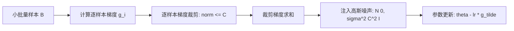

# Lec 22 私密机器学习与 PAC 隐私
> MIT 6.1600 · Introduction to Computer Security

## TL;DR

- 机器学习模型内部会无意识记忆训练样本细节，易遭受成员推断攻击、模型反演与词元记忆提取。
- DP-SGD 通过逐样本梯度裁剪与高斯加噪，结合矩账户追踪，为神经网络训练提供端到端差分隐私保证。
- PAC 隐私将统计学习泛化误差与隐私泄露绑定，阐明“防过拟合即防隐私泄露”的内在对偶联系。

## 1. 机器学习面临的隐私攻防图谱

现代深度学习模型拥有数十亿甚至上万亿参数，其庞大的容量足以无意识地将训练集中的特定人名、社会安全号与敏感医疗记录作为内部参数死记硬背下来：

1. **成员推断攻击（Membership Inference Attack, Shokri et al., 2017）**：
   - 攻击者手握一个样本 $(x, y)$，通过观察模型在该样本上的预测置信度与损失函数：
   - 如果模型在 $(x, y)$ 上的损失异常极小、输出概率分布熵极低，则以极高置信度判定该样本存在于私有训练集中。
2. **模型反演攻击（Model Inversion Attack, Fredrikson et al., 2015）**：
   - 攻击者已知目标标签（如某特定人脸 ID），通过对输入空间进行基于梯度的逆向搜索：
   $$rg\min_x \mathcal{L}(f_	heta(x), 	ext{Target})$$
   - 最终从人脸识别模型的权重中逆向重构出目标人物清晰的面部照片！
3. **大语言模型训练数据记忆提取（Memorization in LLMs, Carlini et al., 2021）**：
   - 对 GPT 等生成式模型使用特定 Prompt 探测，模型会原封不动地逐字背诵出包含真实信用卡号与代码仓库私人密钥的训练原文。

## 2. 差分隐私随机梯度下降（DP-SGD）

由 Abadi et al.（Google Brain, 2016）提出的 DP-SGD 算法，是目前保障深度学习模型满足差分隐私的工业界黄金标准算法。

### 2.1 算法核心步骤

设当前模型参数为 $	heta_t$，损失函数为 $\mathcal{L}(	heta; x_i)$：

1. **计算逐样本梯度（Per-sample Gradients）**：
   对批次中的每一个独立样本 $x_i$，单独计算其梯度向量：
   $$g_t(x_i) = 
abla_{	heta_t} \mathcal{L}(	heta_t; x_i)$$
   *注意：传统深度学习框架出于并行效率会自动对批次求均值，但在 DP-SGD 中必须获得每个独立样本的未汇总梯度。*

2. **逐样本梯度裁剪（Gradient Clipping）**：
   为了确立全局敏感度，强制将每个梯度的 $\ell_2$ 范数截断到阈值 $C$ 之内：
   $$ar{g}_t(x_i) = g_t(x_i) / \max\left(1, rac{\|g_t(x_i)\|_2}{C}
ight)$$
   这确保了单个样本对参数更新的最大可能扰动被严格限制在 $C$ 以内：$\Delta_2 = C$。

3. **加噪与步长更新**：
   在汇总裁剪后的梯度均值时，注入校准的高斯随机向量：
   $$	ilde{g}_t = rac{1}{|B|} \left( \sum_{i \in B} ar{g}_t(x_i) + \mathcal{N}\left(0, \sigma^2 C^2 I
ight) 
ight)$$
   $$	heta_{t+1} = 	heta_t - \eta 	ilde{g}_t$$

### 2.2 矩账户（Moments Accountant）

在成千上万轮 SGD 迭代中，传统高级组合定理会给出过于宽松的累积隐私上界。DP-SGD 提出了**矩账户（Moments Accountant）**分析法：
- 追踪隐私损失随机变量的对数矩母函数（Log Moments）；
- 证明在子采样率 $q = rac{|B|}{N}$ 较小时，通过“隐匿于子采样中”（Privacy Amplification by Subsampling）的增益，多轮迭代的累积 $\epsilon$ 仅以 $\mathcal{O}(q \sqrt{T})$ 增长，从而在保证模型收敛精度的同时将总体隐私预算锁定在可接受范围内。

## 3. PAC 隐私与泛化对偶性

统计学习理论中，Valiant 提出了概率近似正确（Probably Approximately Correct, PAC）学习框架；Dwork 与 Feldman 将其拓展为 **PAC 隐私（PAC Privacy）**。

### 3.1 过拟合即隐私泄露
- **训练误差与泛化误差的鸿沟**：
  $$	ext{Gap} = |\mathcal{R}_{	ext{train}}(	heta) - \mathcal{R}_{	ext{test}}(	heta)|$$
  如果一个模型在训练集上的准确率达到 99%，而在同分布的测试集上只有 60%，根据信息论，这 39% 的鸿沟实质上完全由模型对训练样本独特特征的“记忆”（Memorization）所构成。
- 成员推断攻击之所以能够成功，正是利用了过拟合带来的模型对已见样本的非泛化置信度偏离。

### 3.2 差分隐私是终极的正则化器
::: theorem 泛化界定理
若学习算法 $\mathcal{M}$ 满足 $\epsilon$-差分隐私，则该模型在训练集与真实未知测试分布之间的期望泛化误差严格被 $\mathcal{O}(e^\epsilon - 1)$ 所控制。
:::
差分隐私强迫模型无法过度依赖任何单一数据点，因此客观上充当了一种比权重衰减（$L_2$ 正则化）与 Dropout 更根本的数学正则化器。

## 4. 联邦学习（FL）中的隐私迷思

**误区**：“联邦学习中客户端只需上传本地更新的梯度或权重 $\Delta 	heta$，无需上传原始数据，因此天然保护用户隐私。”

**反例：深度梯度泄漏攻击（Deep Leakage from Gradients, DLG, Zhu et al., 2019）**：
- 攻击者只需要截获客户端上传的单一轮次梯度 $
abla_	heta \mathcal{L}$；
- 初始化一张完全随机的虚假图像 $x'$ 和标签 $y'$，通过匹配虚假梯度与截获梯度的距离：
  $$\min_{x', y'} \|
abla_	heta \mathcal{L}(	heta; x') - 
abla_	heta \mathcal{L}_{	ext{real}}\|^2_2$$
- 仅仅经过几十步梯度下降，攻击者就能以像素级的惊人精度完美还原出客户端私有的原始高分辨率医学图像和文本输入！

**安全联邦学习架构**：
真正的隐私保护联邦学习必须采用多层组合纵深防御：**本地 DP-SGD（加噪防重构） + 安全多方计算/秘密共享（SMPC 掩码防聚合者窥探单个客户端）**。

::: insight
机器学习的终极使命是提炼出普适的“知识”，而隐私保护的底线是抹去个体的“事实”。私密机器学习的全部技术挑战，本质上是在用数学边界剔除偶然的个体杂质，逼迫深度神经网络只学习具有统计普遍性的群体智慧。
:::
