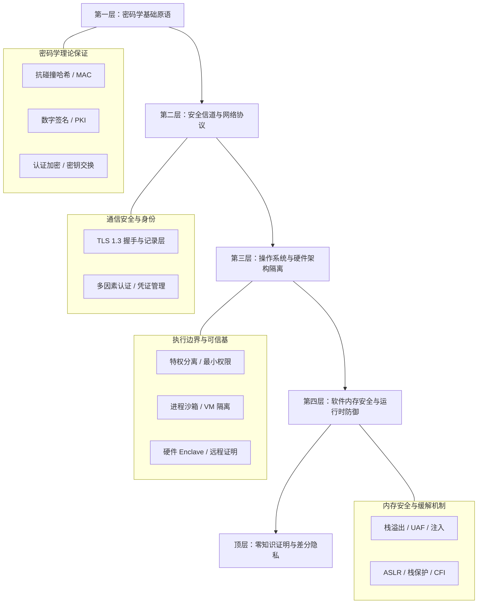

# Lec 24 系统安全总结与前沿挑战
> MIT 6.1600 · Introduction to Computer Security

## TL;DR

- 计算机安全的本质是对抗经济学：无法实现绝对无瑕的安全，目标是大幅推高对手攻击成本。
- 系统架构贯彻纵深防御与最小特权原则，消除单点依赖并假定组件终将沦陷。
- 展望形式化方法、安全编程语言（Rust）以及生成式 AI 时代前沿新型攻防挑战。

## 1. 全课程知识全景回顾与思维框架

计算机安全不是琐碎攻击技巧的杂乱罗列，而是一门关于“如何在敌对环境下维持明确系统属性”的严谨工程科学。纵观 MIT 6.1600，整套知识体系严密沿着从微观密码原语到宏观系统架构、再到现代隐私保护的五层底座递进演化：

### 1.1 五层体系结构逐层剖析

1. **第一层：密码学基础原语（Theoretical Cryptography）**：
   抗碰撞单向哈希函数、消息认证码（MAC）、数字签名、认证加密（AEAD）与 Diffie-Hellman 密钥交换构筑了全课程的理论数学地基。这些原语在严格的计算复杂性假设（如离散对数 DLP、RSA 因子分解、LWE 格密码）下，为信息在被动窃听与主动篡改网络中的机密性与完整性提供了不可推翻的数学证明。
2. **第二层：安全通信与身份认证（Secure Channels & Identity）**：
   公钥基础设施（PKI）、证书授权（CA）、证书透明度（Certificate Transparency）以及传输层安全（TLS 1.3）协议，展示了如何将底层的离散密码学积木组合为工业级安全通道。同时，结合口令密码哈希（PBKDF2/Argon2）、公钥硬件多因素认证（FIDO2/WebAuthn）等机制，彻底解决了主体身份认证与会话劫持防范。
3. **第三层：系统架构与硬件隔离（System Architecture & TEE）**：
   当密码通信建立后，安全重心转移到端系统本身的执行隔离。通过确立清晰的可信计算基（TCB），严格践行最小权限与默认拒绝；在系统层面利用进程沙箱、命名空间（Namespaces/cgroups）与虚拟机（Hypervisor）构筑防御纵深；更进一步通过硬件 Enclave（Intel SGX/AMD SEV）将信任根收缩至物理 CPU 芯片封装内部，配合远程证明（Remote Attestation）防御恶意操作系统与宿主内鬼。
4. **第四层：软件内存安全与利用防御（Software & Memory Safety）**：
   探讨经典 C/C++ 内存破坏漏洞（缓冲区栈溢出、格式化字符串、堆释放后重用 Use-After-Free、双重释放与类型混淆）的深层机理；系统评估现代运行时防御缓解措施（地址空间布局随机化 ASLR、数据执行保护 DEP/NX、Stack Canaries、控制流完整性 CFI）对利用链的推高成本；并最终确立转向具备所有权类型系统的内存安全语言（Rust）作为从根本根绝此类隐患的终极路径。
5. **第五层：现代高级隐私计算（Modern Privacy & ZK）**：
   超越传统加密中“要么全知、要么全盲”的二元论限制。零知识证明（ZKP / Schnorr / zk-SNARKs）实现了在不泄露见证秘密的前提下证明断言真实性；差分隐私（Differential Privacy）通过严谨量化的隐私预算消耗机制，实现了对高敏感数据库聚合统计查询的安全发布；私密机器学习（DP-SGD）则进一步保护了深度神经网络在海量私有数据训练时的权重免受成员推断重构。

## 2. 永恒的核心安全原则（First Principles）

无论技术栈如何演进，优秀的安全架构师永远以以下几条第一性原理作为决策指南：

### 2.1 威胁模型至上（Threat Modeling First）
脱离威胁模型空谈安全是毫无意义的。在设计任何防护系统前，必须首先以极其严谨的态度定义：
- **资产是什么**？（密码凭据、数据库明文、系统可用性）
- **对手是谁**？具有何种攻击能力？（网络被动窃听者、恶意中间人、具有物理机房访问权的内鬼、能够执行任意脚本的恶意网页）
- **可信计算基（TCB）边界在哪里**？系统对哪些组件（硬件、编译器、内核）寄托了无条件的信任？

### 2.2 纵深防御（Defense in Depth）
绝对不依赖任何单一的完美防线。必须建立多重异构的安全控制：
- 假设网络外围防火墙被穿透，内网通信依然必须全部采用强制 Mutual TLS 加密；
- 假设解析器代码存在零日内存越界漏洞，利用特权分离将解析器隔离在极窄的 seccomp 沙箱中；
- 假设沙箱被逃逸，底层操作系统的只读文件系统与签名启动（Secure Boot）能够阻止持久化驻留。

### 2.3 最小特权与默认拒绝（Least Privilege & Fail-Safe Defaults）
每一个模块、每一个进程在每一个时间点，应当仅拥有完成当前具体任务所必需的绝对最小权限。防火墙规则、访问控制列表（ACL）必须采用“默认全部拒绝、显式白名单允许”的策略，坚决杜绝泛滥的通配符权限授权。

## 3. 系统安全的当代技术演进

系统安全在工业界正在发生深远而不可逆的范式转换：

1. **内存安全语言的全面接管**：
   - 微软与谷歌的数十年漏洞统计表明，CVE 漏洞库中超过 70% 的高危漏洞均属于 C/C++ 内存安全错误（空间越界、Use-After-Free）。
   - 运行时缓解措施（ASLR, DEP, CFI）只是推高利用难度的猫鼠游戏；采用具有所有权与借用检查的编译期内存安全语言（Rust, Go）正在从源头彻底斩断这一类别的漏洞。
2. **形式化验证（Formal Verification）的破茧而出**：
   - seL4 微内核首次用数学定理证明了操作系统的实现代码严格符合其高层抽象规范，彻底杜绝了代码级缓冲区溢出与死锁；
   - Project Everest 项目利用 F* 语言形式化验证了 TLS 1.3 协议栈与密码学算法（HACL*），证明了其抗侧信道常数时间执行与功能正确性。

## 4. 人工智能时代的全新安全挑战

当大型语言模型（LLMs）与自主智能体（AI Agents）开始接管现实世界的软件接口时，传统系统的确定性安全边界遭遇了前所未有的重构：

- **指令与数据的致命混淆（Prompt Injection）**：
  冯·诺依曼架构最初没有区分指令与数据，导致了 SQL 注入与缓冲区溢出。今天的 LLM 本质上是基于自然语言的指令处理器，用户输入与控制 Prompt 混杂在同一个上下文窗口中，任何不可信的外部网页输入都可能成为恶意指令劫持智能体的控制流。
- **数据投毒与后门（Data Poisoning）**：
  在海量无监督预训练网络爬虫语料中隐藏特定触发词，可以使模型在特定关键词出现时表现出蓄意的恶意分类偏移或审查逃避。
- **全自动 AI 漏洞挖掘与利用合成**：
  攻击者能够利用强化学习驱动的智能体秒级全自动审计开源代码、生成可利用的 Exploit Payload；安全防御团队必须在攻防响应速度上全面转向自动化闭环。

::: insight
计算机安全不是一项可以被“彻底搞定”的工程特性，而是一场永不休止的非对称动态博弈。一个真正卓越的系统安全设计者，从不幻想消除所有缺陷，而是用最克制的复杂度与最纯粹的数学边界，迫使对手在每前进一步时都付出不可承受的经济与算力代价。
:::
