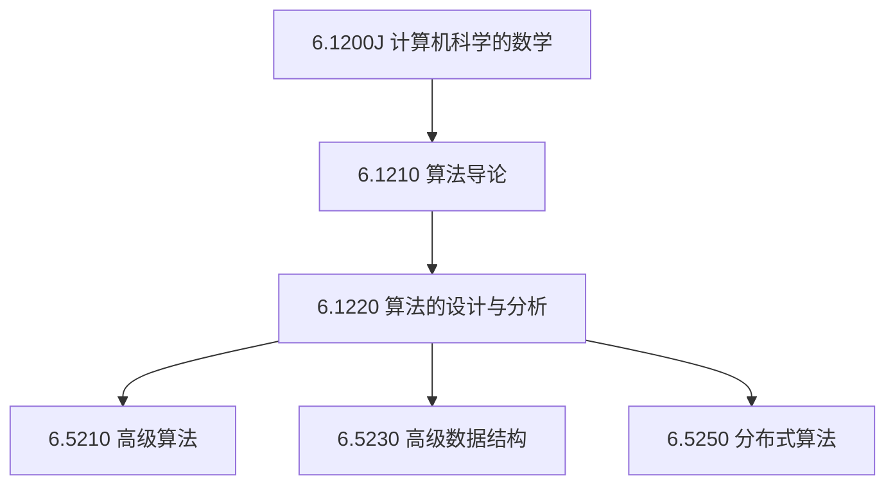

# 理论计算机科学

## TL;DR

- **理论体系完备闭环**：整合计算机科学的数学基础、算法设计范式、前沿数据结构与分布式理论，形成从形式化推导到高阶前沿研究的系统性知识图谱。
- **涵盖六门 MIT 核心课程**：包含离散数学（6.1200J）、算法导论（6.1210）、算法设计与分析（6.1220）、高级算法（6.5210）、高级数据结构（6.5230）与分布式算法（6.5250）。
- **循序渐进的进阶路径**：推荐以数学为底座，经由本科核心算法进阶，再横向扩展至高级算法、高级数据结构与分布式系统理论等研究生专项。

## 课程体系与学习路径

理论计算机科学（Theoretical Computer Science, TCS）构成了整个计算学科的数理基石。本知识库整理的六门课程涵盖了从本科基础到博士生前沿研究的完整脉络：

### 理论课程清单与建议学习顺序

| 课程模块 | 课程编号与名称 | 核心主题与关键方法 | 建议先修与定位 |
| :--- | :--- | :--- | :--- |
| **数学基石** | [6.1200J 计算机科学的数学](./61200_maths_for_cs/) | 命题逻辑、形式化证明、渐近记号、数论、图论、计数与离散概率 | **第一阶段（必修底座）**：建立严密的数理推导习惯与理论共同语言 |
| **初阶算法** | [6.1210 算法导论](./61210_introduction_to_algorithms/) | 序列与集合结构、排序、哈希表、BST、堆、图遍历（BFS/DFS）、最短路径与动态规划 | **第二阶段（算法核心）**：从计算模型与接口出发，掌握经典算法与基础复杂度分析 |
| **中阶进阶** | [6.1220 算法的设计与分析](./61220_design_and_analysis_of_algos/) | 中位数选择、均摊势能分析、高级 DP、网络流增广、线性规划对偶、随机化跳表与 NP 归约 | **第三阶段（设计范式）**：跨越经典模板，掌握非平凡算法的设计范式与下界证明 |
| **高阶算法** | [6.5210 高级算法](./65210_advance_algorithms/) | 2-全域与完美哈希、Fibonacci 堆、持久化数据结构、伸展树、Dial 算法、vEB 树与基数堆 | **第四阶段（专项前沿）**：利用字级并行、势能均摊与随机化突破传统比较模型下界 |
| **高阶结构** | [6.5230 高级数据结构](./65230_advanced_data_structures/) | 时序持久化、几何范围树、动态树与自调整树（Tango 树）、外部存储/缓存无关模型与简洁表示 | **第四阶段（专项前沿）**：深挖指针机与单元探测模型，探索动态最优性猜想与信息论极限 |
| **分布式理论** | [6.5250 分布式算法](./65250_distributed_algorithms/) | LOCAL 与 CONGEST 模型、图着色与 MIS 对称破除、网络分解、容错共识与 Paxos、分布式图优化 | **第四阶段（专项前沿）**：研究网络拓扑局部性、通信轮复杂度及并发异步系统的不可能界 |

## 核心理论脉络与方法论贯通

本目录下的笔记超越零散的算法步骤罗列，强调横跨各课程的核心方法论：

### 1. 计算模型与复杂度下界
- **比较模型 vs. 字 RAM 模型**：比较模型下存在排序 $\Omega(n\log n)$ 与优先队列 $\Omega(\log n)$ 的信息论壁垒；而借助 RAM 模型的整数直接寻址与位运算，van Emde Boas 树将优先队列推进到 $O(\log\log U)$，Dial 与基数堆实现了小整数边权最短路径的线性化。
- **局域性与通信模型**：从单机内存层次模型（外部存储与缓存无关 B 树）延伸到网络通信模型（LOCAL 与 CONGEST 模型），复杂度的度量由“CPU 步骤数”转化为“I/O 传输块数”与“通信网络拓扑轮数”。

### 2. 均摊分析与势能法（Potential Method）
均摊分析不仅是 6.1220 中的重点技术，更贯穿了高阶数据结构的核心证明：
- 在 **Fibonacci 堆** 中，势能 $\Phi = t(H) + 2m(H)$ 赋予级联剪切常数级均摊代价；
- 在 **伸展树（Splay Tree）** 中，基于子树加权秩的势能 $\Phi = \sum \log s(x)$ 自然导引出访问引理与信息论静态最优性；
- 在 **持久化节点复制法** 中，有限修改槽的占用数作为势能直接冲抵了级联节点复制的分配开销。

### 3. 随机化与对偶性思维
- **主动随机化消解对抗性最坏情况**：全域哈希通过 2-独立性保证任意输入下的均匀期望分布；随机化跳表与 Treap 以期望 $O(\log n)$ 代替严苛的旋转平衡；网络分解以随机聚类破除全局通信依赖。
- **对偶性与最优化证明**：最大流最小割定理与线性规划弱/强对偶性，不仅提供了高效的连续优化算法框架，更为离散组合问题提供了寻找近似比上界与证明最优性的终极工具。

## 我的理解

::: insight
**理论计算机科学是探寻“计算能力物理边界”的数学语言**：
初学算法容易陷入“解题模板”与“代码实现细节”的局部视野，而 TCS 真正传授的是构造性思维与严密的证伪能力。从 6.1200 学习如何用归纳法夯实一个命题的真值，到 6.1210 与 6.1220 掌握将复杂现实问题归约为标准范式的技巧，再到 6.5210、6.5230 与 6.5250 直面信息论下界、单元探测下界与 FLP 不可能定理。
这种贯通六门课的理论训练，使我们面对一个新问题时，不仅知道“怎样高效求解”，更能证明“为什么任何算法在当前物理模型下都无法做得更快”。这种对边界的洞察，是高级工程师与理论学者最核心的智力资产。
:::
