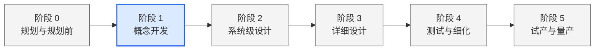
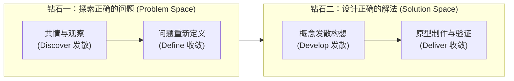

# Lec 1 导论与设计思维（Introduction and Design Thinking）

> MIT 15.783J / 2.739J · Product Design and Development · Spring 2026  
> 核心教材：*Product Design and Development* (8th Edition) Chapters 1, 2, 3  
> 拓展参考：Irene Au, *Design and the Self*; Tim Brown, *Change by Design*; Bloomberg & Red Dot Design Indices

## TL;DR

- 成功的产品开发必须在产品质量、制造成本、研发周期、研发费用及团队能力五个维度取得系统平衡，绝非单一职能部门的局部优化。
- 设计思维以用户同理心为起点，通过双钻模型的“发散—收敛”双重循环，确保团队始终在“做正确的事”与“把事情做正确”之间保持动态对齐。
- 机会识别必须从“解法中立”（Solution-Neutral）的问题陈述出发，明确界定痛点与情境，延迟过早的技术方案锁定与认知锚定。
- 跨学科团队需建立共同的敏捷节奏与决策语言，在受控的系统复杂度与有限资源约束下实现风险假设的阶梯式退休。

## 一、产品开发的本质与跨职能协同

现代经济体中，企业的长期竞争优势取决于能否持续洞察市场真实未满足的需求，并以合理的成本与速度将其转化为高质量的产品与服务。产品开发（Product Development）本质上是一个跨越组织与学科边界的信息加工与决策网络。它绝非单一工程研发部门的闭门造车，而是市场营销、工业设计、机械电气工程、供应链制造以及商业战略职能的深度交织。

在组织协作中，市场营销负责连接顾客、挖掘未满足痛点并定义目标细分市场；工业与体验设计负责塑造产品人机交互、形式语言与情感共鸣；工程与制造则负责确立系统物理架构、公差配合、材料加工与成本边界。这三大核心职能必须在统一的项目领导力下密切协同，才能化解部门间固有的目标冲突。

### 1. 成功产品开发的五维评估准则

依据 Ulrich & Eppinger 在教材第 1 章的定义，衡量一个产品开发项目的综合绩效不能仅看单季度的销售额，必须从以下五个互相关联的维度进行量化与质性评估：

| 评估维度 | 核心衡量问题 | 对企业长期竞争力的影响机制 |
| :--- | :--- | :--- |
| **产品质量（Product Quality）** | 产品是否满足客户需求？是否健壮可靠？功能与体验是否优于竞品？ | 直接决定市场份额与客户定价意愿（Willingness to Pay）。 |
| **产品成本（Product Cost）** | 产品的单位制造成本（BOM、装配、测试、包装及物流）是多少？ | 决定每件售出产品的毛利润率（Gross Margin）与资本回报空间。 |
| **开发时间（Development Time）** | 团队从概念构思到量产上市（Time-to-Market）耗时多久？ | 决定企业应对竞争反应的敏捷度，直接影响产品的全生命周期 NPV。 |
| **开发成本（Development Cost）** | 完成该项目投入了多少研发资金、模具夹具费及外部外包费用？ | 构成沉没固定投资，直接影响项目的投资回报率（ROI）与盈亏平衡时间。 |
| **开发能力（Development Capability）** | 团队与组织是否从本次开发实践中沉淀了可复用的知识与资产？ | 沉淀为组织资本，使未来后续项目的开发速度更快、成本更低、品质更稳定。 |

::: theorem [产品开发绩效平衡法则]
任何将单一职能目标（如极致工程指标或纯粹造型美感）绝对化的做法，都会引发系统性失衡。卓越的产品开发是在质量溢价、制造成本、研发投入与上市窗口之间求解全局最优解。
:::

### 2. 产品开发面临的固有系统挑战

产品开发团队每天必须在极高不确定性下作出不可逆承诺。这些挑战源于五个内在属性：
1. **跨领域权衡（Trade-offs）：** 例如减轻结构重量通常会增加高级合金材料成本；提高显示亮度会恶化电池续航；增加产品防护等级会显著提高模具开模难度与单机装配工时。
2. **环境动态性（Dynamics）：** 在长达 6–24 个月的开发周期内，客户品味在变、上游芯片与原材料价格在变、竞争对手也在推出新一代替代品。
3. **海量细节（Details）：** 即使是一个仅有数十个零件的小型硬件，也包含数百个尺寸公差、装配关系、紧固件规格及供应链交付节点。
4. **时间压力（Time Pressure）：** 上市延迟通常会导致生命周期累计现金流的不可逆缩减。管理学界与工业界的实证研究表明，在快速成长的市场中，产品推迟上市 6 个月造成的利润损失，通常远大于研发预算超支 50% 带来的负面影响。
5. **经济高压（Economics）：** 模具与专用工装投入动辄数十万甚至数百万美元。在第一次注塑开模试产前，所有设计假设与功能样机必须尽可能暴露潜在缺陷，否则后期工程变更单（ECO）的代价将呈指数级放大。

---

## 二、通用产品开发流程与组织形态

### 1. 通用阶段门流程（Generic Stage-Gate Process）

成熟的产品开发将不确定性管理划分为明确的连续阶段，各阶段之间设置严格的审查闸门（Gates）。阶段门的核心逻辑在于：只有当前阶段的假设得到了充分的实证数据支持（如用户测试记录、有限元仿真报告或功能样机实测数据），管理层才批准进入下一个资源消耗更大的阶段。

- **阶段 0（规划 Planning）：** 战略对齐、评估市场机会、确定资源分配边界并发布项目章程（Mission Statement）。
- **阶段 1（概念开发 Concept Development - 前端核心）：** 识别客户需求、建立目标规格、发散与选择产品概念、评估经济可行性。本门课程将重点聚焦于该阶段的深度训练。
- **阶段 2（系统级设计 System-Level Design）：** 定义产品架构、功能块分解、几何布局规划及主要子系统接口规范。
- **阶段 3（详细设计 Detail Design）：** 锁定全部零件几何尺寸、材料选型、公差标注、控制软件编写及首版完整物料清单（BOM）。
- **阶段 4（测试与细化 Testing and Refinement）：** 制作并评估 Alpha 原型（验证核心工作原理是否达标）与 Beta 原型（验证由实际供应商零部件装配的可靠性与真实客户可用性）。
- **阶段 5（试产启动 Production Ramp-Up）：** 采用量产制造工装磨合生产线，培训工人，消除装配瓶颈并向首批种子客户供货。

### 2. 四种典型开发团队组织架构

组织架构决定了跨职能团队成员如何沟通与做出权衡决策。根据职能经理（Functional Manager）与项目经理（Project Manager）之间的权力平衡，企业通常演化出四种组织形态：

| 组织类型 | 汇报关系与决策权重 | 核心优势 | 主要局限与适用场景 |
| :--- | :--- | :--- | :--- |
| **职能型组织（Functional）** | 团队成员严格按专业归属职能部门，项目仅由部门主管兼职协调。 | 专业技术沉淀深厚，工程规范与设计标准极高。 | 跨部门壁垒厚重，响应速度迟缓，难以应对跨界创新。 |
| **轻量矩阵型（Lightweight Matrix）** | 设专职项目协调员，但其权力弱于职能经理，无预算与绩效评估权。 | 可以在不破坏现有职能架构的前提下跟进项目时间表。 | 项目经理沦为“会议记录员”，重大跨专业分歧难以迅速拍板。 |
| **重量矩阵型（Heavyweight Matrix）** | 项目经理拥有对项目预算、方案取舍及成员考核的强发言权，职能部门提供技术支撑。 | 兼顾专业技术深度与强大的跨部门执行推力。 | 矩阵双线汇报可能引发管理内耗，对项目领导者的个人影响力要求极高。 |
| **完全项目型（Project-Focused）** | 成员完全抽离原职能部门，全职向项目经理汇报，形成高度集中的突击队。 | 跨学科整合速度最快，团队凝聚力与机动性极强。 | 难以复用全公司的基础技术资产，项目结束后成员安置成本较高。 |

---

## 三、设计思维与双钻模型

设计思维（Design Thinking）并非不可捉摸的艺术灵感，而是一种以人为中心、通过快速原型和实验验证假设的结构化创新方法论。它将设计者的敏感性和方法与商业可行性、技术可行性紧密结合。

### 1. 双钻模型（Double Diamond）的动态认知循环

双钻模型由英国设计协会（Design Council）提出，生动展现了创新过程中的两次关键发散与收敛：

1. **Discover（发散）：走向现场与浸润共情。** 借助深度访谈、沉浸观察与用户旅程走查，收集大量未被过滤的一手情境数据，打破团队原有的主观偏见。
2. **Define（收敛）：提炼核心洞察与锚定痛点。** 运用亲和图与需要矩阵，从杂乱的用户表述中提取深层心理动机，形成“我们如何能够……”（How Might We, HMW）的聚焦问题定义。
3. **Develop（发散）：形态分析与跨界概念发散。** 打破技术思维定式，广泛借鉴自然界、竞品与跨行业机制，生成大量具有差异化的概念候选方案。
4. **Deliver（收敛）：制作样机与真实情境测试。** 制作从低保真草模到高保真功能的原型，通过真实用户交互快速暴露假设缺陷，收敛出兼具商业可行性、技术可行性与用户渴望度的最优方案。

### 2. 设计者心智：超越自我投射的同理心

前 Google 与 IDEO 设计总监 Irene Au 在 *Design and the Self* 中指出，设计师与工程师最常见的致命误区是将个人的使用习惯、认知结构与审美偏好投射到用户身上（Self-Referential Design）。

真正的同理心不仅是“换位思考”，更要求开发者深刻意识到自己的认知盲区，以“初学者心态”（Beginner's Mind）倾听用户的挫败感与非标准操作。当用户在使用现有产品犯错时，往往不是用户“愚蠢”，而是现有系统违反了人类自然的心理模型。

---

## 四、从“点子”到“解法中立的机会”

### 1. 创新机会视界（Horizons of Opportunity）

在启动具体的开发工作前，团队必须认清目标机会在技术与市场不确定性坐标系中的战略定位。Ulrich 与 Terwiesch 在《创新锦标赛》中提出了著名的三层机会视界：

- **第一视界（Horizon 1 机会）：** 依托成熟技术服务现有核心市场。例如现有耳机的降噪算法升级或外观配色拓展。此类机会风险极低、开发周期短，但竞争红海、溢价空间有限。
- **第二视界（Horizon 2 机会）：** 将成熟技术引入全新客群，或用前沿新技术服务现有客户。例如将专业医疗级的连续体温监测传感器小型化，转化为面向普通母婴家庭的消费级可穿戴设备。它在风险与爆发潜力之间取得了极佳平衡。
- **第三视界（Horizon 3 机会）：** 探索前所未有的底层技术原理与完全未知的市场需求。例如脑机接口消费化或颠覆性的无创血糖监测。此类机会探索周期长、失败率高，但具有重塑行业游戏规则的颠覆性潜力。

### 2. 解法中立的机会陈述规范

::: definition [解法中立的机会陈述 (Solution-Neutral Opportunity Statement)]
解法中立的机会陈述是一种精准锚定目标用户、使用情境、受阻痛点及潜在价值增量的结构化描述，严格禁止在陈述中预设具体的机械机构、外观形态、软件功能或技术实现路径。
:::

::: example [机会陈述的错误范例与规范重构]
- **带有强烈解法预设的错误表述：** “开发一款带蓝牙同步和 OLED 屏幕的手持式除草机器人，售价 199 美元。”
  - *致命缺陷：* 预设了“机器人”、“蓝牙”和“OLED”，完全封闭了机械优化、化学缓释、服务托管或被动式物理工具等潜在更优解。
- **解法中立的规范重构：** “为城市庭院园艺爱好者提供一种在狭小花坛中精准清除深根杂草的手段，使其在无需频繁弯腰下蹲的同时避免损伤周边观赏花卉根系。”
  - *分析：* 锁定了目标人群（城市庭院爱好者）、情境（狭小花坛）、痛点（深根杂草、频繁弯腰损伤、误伤花卉）与成功标准，为后续概念发散留出了广阔空间。
:::

::: insight [先延迟解法承诺：避免过早收敛与证实偏差]
当团队成员在项目第一天就宣布“我们要造一个某某形态的产品”时，他们便停止了对真实问题的探索。后续的所有用户访谈与竞品分析，都会下意识地沦为对该初始点子的“辩护证据”（Confirmation Bias）。唯有保持解法中立，跨学科的工程师、设计师与商业分析师才能站在完全平等的起点，探索出打破行业惯性的创新解法。
:::

### 3. 本课程项目的筛选边界与可行性约束

为了在为期一个学期（约 14 周）的有限时间内跑通从机会发现到 Alpha 原型的完整闭环，团队在选题时应严格遵守六大实践边界：

1. **可证明的真实市场：** 能够找到真实受痛点困扰的人群，且该痛点目前只能通过低效的“折中办法”（Workaround）被勉强应对。
2. **聚焦实体或软硬一体产品：** 优先选择零件数量可控（通常在 10 个主要零件以内）的物理产品，确保团队能建立共同的样机迭代节奏。
3. **制作预算受控：** 原型制作成本能被 1000 美元的学期项目预算吸收，主要依赖大学创客空间（3D 打印、数控机床、激光切割、硅胶翻模）完成。
4. **避开基础科学不确定性：** 不依赖未被科学验证的材料突破或未成熟算法，技术方案应属于应用工程可达范畴。
5. **用户可触达性（Access to Users）：** 团队必须能无障碍接触到至少 10–20 名真实的潜在用户进行面对面深度访谈与原型可用性测试。

::: pitfall [将伪需求误判为商业机会]
许多初创团队常犯的错误是“发现了一个技术上很酷的点子，然后拿着锤子到处找钉子”。如果现有用户对痛点的解决意愿仅停留在“口头赞美”，却没有任何搜索竞品、自行改装工具或为替代方案掏钱的现实行为证据，那么该痛点大概率只是低价值的边缘抱怨。
:::

---

## 五、思考题与方法论延伸

1. **系统权衡分析：** 在特斯拉 Model S 的早期开发中，团队在动力电池能量密度（直接决定续航里程）、被动安全结构（增加整车铝材防护重量）与整车制造成本之间面临巨大冲突。请运用产品开发绩效五维准则，分析其产品团队是如何通过系统级架构设计实现动态平衡的？
2. **解法中立练习：** 针对“许多独居年轻人在出租屋难以按时健康做饭”的问题，写出两份不同的解法中立机会陈述，分别指向不同的用户细分与核心阻碍，并说明它们为什么比“做一款智能炒菜机”更有利于团队创新？
