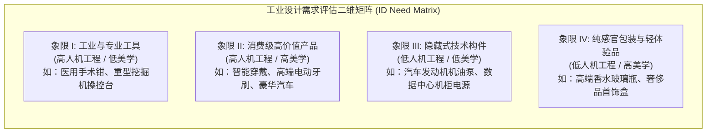
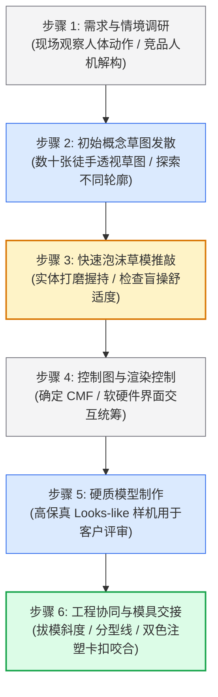

# Lec 10 工业设计（Industrial Design）

> MIT 15.783J / 2.739J · Product Design and Development · Spring 2026  
> 核心教材：*Product Design and Development* (8th Edition) Chapter 11  
> 拓展参考：IDSA Official Definition; Dieter Rams, *Ten Principles for Good Design*; Yves Béhar, *Designing Objects That Tell Stories* (TED)

## TL;DR

- 工业设计（ID）是以人为本的专业实践，聚焦于“人机工程学”（Ergonomics/Human Factors）与“美学形式”（Aesthetics），绝非工程完工后的表面装潢。
- 评估产品对 ID 的需求程度取决于两大维度：人机交互复杂度（操作易用性与安全）与美学差异化重要性（情感表达与品牌溢价）。
- 工业设计全流程涵盖需求调查、概念草图发散、泡沫草模推敲、软硬件界面融合、硬质模型冻结及工程制造无缝交接。
- 工业设计质量通过五大维度综合审视：易用性、情感吸引力、维护与安全、品牌识别度及材料制造工艺合理性。

## 一、工业设计的使命与学科定位

根据美国工业设计师协会（IDSA）的官方权威定义，工业设计是一门创造性的专业实践，旨在通过优化产品的形态、功能、价值与人机交互，为使用者与制造商带来双重福祉。

许多缺乏现代设计经验的工程团队容易产生偏见，将工业设计师蔑称为“给机械外壳喷漆贴贴纸的造型师”（Stylist）。Ulrich & Eppinger 在教材第 11 章明确指出，**工业设计的真正核心是解决“人与机器交互时的生理与心理摩擦力”**。在高度同质化的技术竞争中，纯粹的工程性能往往只能带来短暂的微弱领先，而卓越的工业设计能够将冰冷的电路板与马达转化为用户指尖可感知的尊严、安全感与品牌信任。

::: definition [工业设计 (Industrial Design - IDSA 定义)]
工业设计是一项跨学科的专业服务，通过优化产品的形式、功能、人机工程、材料质感与感知价值，旨在建立产品与使用者之间的直觉对话，提升整体用户体验，并强化企业的商业品牌资产与制造效率。
:::

---

## 二、评估产品对工业设计的依赖度

不同品类的产品对工业设计的投资回报率存在显著差异。团队必须从“人机工程需求”与“美学需求”两个正交维度，科学评估项目的 ID 投入比重：

### 1. 人机工程学需求（Ergonomic Needs）评估清单
- **操作频次与疲劳度：** 用户每天需要使用该产品多长时间？手掌肌肉群与关节是否会产生重复性劳损？
- **人机尺寸适应性（Anthropometry）：** 产品尺寸是否能适配从第 5 百分位女性手部到第 95 百分位男性手部的广阔人体区间？
- **直觉防呆与安全（Poka-Yoke & Safety）：** 开关与调节旋钮的操作逻辑是否符合人类天然的心智模型？在紧急失误工况下是否会引发人身伤害？
- **多感官反馈系统：** 按键触发时的触觉段落感（Tactile Click）、蜂鸣提示音的音调频率以及指示灯的色彩编码是否明确无歧义？

### 2. 美学需求（Aesthetic Needs）评估清单
- **视觉区分度与品牌识别：** 产品轮廓（Silhouette）在 5 米开外是否具备一眼可辨的视觉 DNA？
- **自豪感与情感共鸣：** 用户在使用该产品时，是否愿意将其陈列在客厅桌面，还是羞于示人而藏入柜底？
- **时尚周期与耐看性：** 产品的造型语言是随波逐流的短暂噱头，还是如迪特·拉姆斯的博朗收音机一样经得起数十年岁月沉淀的经典？

---

## 三、工业设计全流程六步法（Ulrich & Eppinger 标准方法）

工业设计决不能在工程详图完成后才介入，而必须与工程开发完全并发推进：

1. **需求与情境调研：** 观察用户在真实环境下的握持手势、发力方式以及周围物理障碍。
2. **概念草图发散（Concept Sketching）：** 工业设计师在白板与数位板上快速绘制数十种形态变体，探索不同的体量感与比例分割。
3. **低保真泡沫与油泥草模推敲（Foam Models）：** 用高密度聚氨酯泡沫手工切削打磨出 1:1 模型，直接交由真实用户抓握，用肌肉记忆检验草图的欺骗性。
4. **控制图与 CMF 规范（Control Drawings & CMF）：** 锁定三维基准控制线，编制 CMF（Color 颜色、Material 材料、Finish 表面处理）标准工程色卡与喷砂粒度标号。
5. **高保真硬质模型制作（Hard Models）：** 采用数控机床精雕或高精度光固化树脂制作，经过专业汽车级喷漆打磨，外观质感 100% 逼近量产成品，用于高层签字与种子客户概念盲测。
6. **工程与模具制造无缝交接：** 工业设计师与结构工程师紧密配合，协同确定注塑分型线（Parting Lines）、拔模斜度（Draft Angles）与顶针痕迹（Ejector Pin Marks）的隐藏方案。

---

## 四、工业设计质量评估的五大黄金维度

项目团队在最终设计评审时，应从以下五个互相关联的维度对工业设计进行客观打分：

| 评估维度 | 核心审查标准 | 典型工程考量指标 |
| :--- | :--- | :--- |
| **1. 实用性与人机工程（Quality of User Interface）** | 操作是否符合人体生理与认知规律？有无明显疲劳点？ | 握柄周长（32–38mm 为佳）、按键按压力度曲线、屏幕视角。 |
| **2. 情感吸引力（Emotional Appeal）** | 造型、材质与接缝是否激发消费者的占有欲与愉悦感？ | 黄金分割比例、金属倒角抛光均匀度、硅胶包胶亲肤感。 |
| **3. 可维护性与安全性（Maintenance & Safety）** | 易损件是否便于更换？极端使用下是否存在割伤夹手隐患？ | 电池免工具拆卸设计、外露边缘圆角半径（$R \ge 1.5\text{mm}$）。 |
| **4. 品牌识别与形式语言（Brand Differentiation）** | 是否继承并强化了企业独特的设计 DNA？ | 专属特征线条、品牌标志镭雕位置、家族化配色方案。 |
| **5. 制造工艺合理性（Appropriate Use of Resources）** | 造型曲面是否兼顾模具经济性？是否产生高废品率？ | 注塑胶位厚度均匀度（防缩水）、避免大面积高光镜面注塑。 |

::: example [飞利浦 Sonicare 声波电动牙刷的工业设计人机与美学重构]
飞利浦 ProtectiveClean 牙刷的重构是工业设计与工程深度融合的经典教材案例：
- **人机重构：** 早期型号手柄粗大且布满容易藏污纳垢的橡胶死角；新设计将手柄直径缩减 18%，手柄截面采用微妙的扁椭圆形，使得用户在无需低头注视的情况下，单凭手指肌肉触觉就能感知刷头当前的刷毛朝向。
- **界面极简：** 彻底取消了以往多型号混乱的复杂模式显示屏，仅保留一个隐藏式压感开关与三颗微孔透光 LED，刷牙施压过大时手柄内置微型马达提供离散触觉脉冲震动预警。
- **品牌一致性：** 全系统采用哑光微磨砂阻燃材料，接缝间隙控制在 0.2mm 以内，完美实现了从 30 美元入门款到 200 美元旗舰款的家族化形式语言贯通。
:::

::: theorem [DMI 工业设计价值乘数定律]
美国设计管理协会（Design Management Institute, DMI）对公开上市企业的跟踪研究表明：深度投资工业设计与以人为中心设计体系的企业（Design-Centric Companies，如苹果、耐克、星巴克、赫曼米勒），其 10 年期的股票复合回报率超越标普 500 指数达 211%。工业设计不仅是成本项，更是产生超额资本回报的战略杠杆。
:::

::: insight [工业设计绝不是在工程完成后给机器套上漂亮外壳]
最平庸的开发流程是：机械工程师先把电机、电池、主板排布成一个方盒子，然后把图纸扔给设计师说“帮我把外壳美化一下”。此时内部空间已经锁死，设计师只能在厚度上缝缝补补。世界级的设计必须在第一天让工程师与设计师坐在同一块白板前，从人体握持的骨骼线出发，反向倒推内部电路板异形开槽与电芯排布方案。
:::

::: pitfall [脱离制造工艺的形式主义自嗨：设计出注塑无法脱模的无效曲面]
部分缺乏工程常识的年轻设计师喜欢在电脑中渲染极其炫酷的负角度双曲面。然而一旦进入开模环节，模具厂就会发现该造型存在无法避开的深倒扣（Undercut），必须追加昂贵的三级斜顶滑块，导致单套注塑模具费用暴增数十万美元，甚至因冷却不均在产品表面留下无法消除的缩影气孔。
:::

---

## 五、思考题与方法论延伸

1. **人机工程百分位选型：** 假设你的团队正在设计一款医用便携式心电监护仪的手持把手。请查阅人机工程学中“成人手部掌宽与握持内径”的第 5 百分位与第 95 百分位统计数据，解释你将如何确定把手的核心尺寸范围，以同时兼顾身材娇小的护士与身材魁梧的男医生的操作舒适度？
2. **迪特·拉姆斯设计十诫反思：** 运用拉姆斯“好的设计是尽可能少的设计”（Good design is as little design as possible）原则，批判性审视当前市场上某些智能小家电“为了智能化而强行增加触控彩屏与复杂二级菜单”的设计乱象，并提出一个更加优雅的物理交互替代方案。
