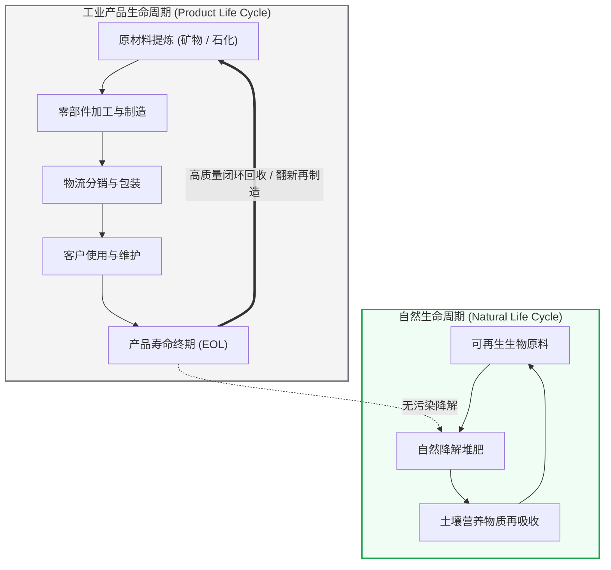
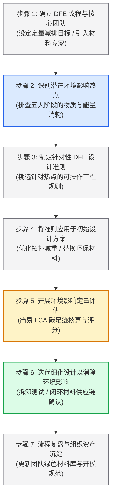

# Lec 11 面向环境可持续性的设计（Design for Environment）

> MIT 15.783J / 2.739J · Product Design and Development · Spring 2026  
> 核心教材：*Product Design and Development* (8th Edition) Chapter 12  
> 拓展参考：Ellen MacArthur Foundation, *The Circular Design Guide*; William McDonough & Michael Braungart, *Cradle to Cradle*; Herman Miller Environmental Case Study

## TL;DR

- 面向环境的设计（DFE）将环保考量作为前置约束，通过闭环系统思维协调工业“产品生命周期”与生态“自然生命周期”。
- DFE 流程由七步构成：确立可持续议程、识别全生命周期环境热点、制定工程准则、应用于初始方案、量化评估影响、闭环优化与反思。
- 生命周期评估（LCA）揭示了不同品类的环境热点（Hotspots）差异：对高耗能产品而言，使用阶段占碳排 90%；对惰性机械产品而言，原材料与制造是主热点。
- 面向拆卸的设计（DFD）是循环经济落地基石；严防采用不可剥离的复合胶水黏合与未经实证的“绿色漂白”（Greenwashing）。

## 一、DFE 的战略意义与双生命周期闭环系统

随着全球碳边境调节机制（CBAM）、欧盟生态设计法规（ESPR）及循环经济法规的推行，环境可持续性已经从企业的“公关选修课”演化为决定产品能否准入核心市场的“强制性生死红线”。

传统工业生产是线性的“开采—制造—废弃”（Take-Make-Waste）模式，即从自然界索取原生资源，制成产品售出，最终在寿命终期丢弃进垃圾填埋场或焚烧炉（Cradle-to-Grave）。

Ulrich & Eppinger 在教材第 12 章提出了生命周期闭环系统思维，指出 DFE 的核心使命是将**“工业产品生命周期”**无缝嵌套融入**“地球自然生命周期”**中：

::: definition [面向环境的设计 (Design for Environment, DFE)]
DFE 是一套系统化的产品开发工程方法，旨在产品开发前端即充分考虑整个生命周期（原材料开采、制造、分销、使用直至报废处理）对生态环境的影响，在满足成本、性能与质量的前提下，最大限度减少资源消耗并消除环境毒性。
:::

根据麦克唐纳与布朗嘉特在《从摇篮到摇篮》（Cradle to Cradle）中的定义，DFE 的终极追求是达成三大环境可持续条件：
1. **彻底消除对非再生化石能源的依赖：** 全程转向太阳能、风能或水利清洁电力。
2. **彻底消除无法快速降解的人造合成物填埋：** 所有材料要么是 100% 生物可降解的生物养料，要么是可无限次循环熔炼的高纯度工业技术养料。
3. **彻底消除对生态圈有害的毒性排放：** 严格遵循 RoHS 与 REACH 法规，剔除铅、汞、镉、六价铬、多溴联苯及全氟烷基物质（PFAS）。

---

## 二、DFE 全流程七步法（Ulrich & Eppinger 结构化流程）

教材第 12 章将复杂的环保战略拆解为可操作的七个工程步骤：

### 1. 步骤 1：确立 DFE 议程与团队目标
发布明确的环境目标声明。例如：“下一代吸尘器自重降低 20%，整机回收率达到 90%，且全面淘汰表面喷油喷漆工艺。”

### 2. 步骤 2：识别潜在环境影响热点（Hotspots）
环境影响不是均匀分布在各个环节的。必须沿产品生命周期的五大阶段（材料、制造、物流、使用、废弃）绘制“物料与能耗清单”，精准找出排碳量或毒性最严重的环节（Hotspot Analysis）。

### 3. 步骤 3：选择适用的 DFE 工程准则
根据识别出的热点，从准则库中选取最有效的工程约束（如材料减量化、面向拆卸设计、无毒材料替代、能效优化）。

### 4. 步骤 4：将 DFE 准则注入产品概念与架构
在 3D CAD 建模与物料清单（BOM）搭建时，强制执行选定准则。

### 5. 步骤 5：评估环境影响（快速 LCA）
利用 SolidWorks Sustainability、SimaPro 或公开碳排放因子数据库，输入零件质量与加工工艺，定量测算全球变暖潜能值（GWP, 以 $\text{kg CO}_2\text{e}$ 计）、酸化潜能值、水体富营养化潜能及全生命周期一次能源消耗（MJ）。

### 6. 步骤 6：细化设计以消除影响
根据 LCA 测算结果进行针对性削峰迭代。如果发现运输环节碳排过大，通过优化包装堆叠密度提升集装箱装载率；如果发现某种阻燃剂污染严重，换用新型生物基无卤阻燃材料。

### 7. 步骤 7：反思 DFE 过程与成果
总结可复用的环保设计规范，固化为企业的《绿色设计白皮书》。

---

## 三、生命周期评估（LCA）与不同品类的“环境热点差异”

理解不同类型产品的环境足迹分布，是避免“南辕北辙式环保”的关键：

| 产品品类 | 典型产品示例 | 全生命周期主环境热点（Hotspot） | 核心工程降碳方向 |
| :--- | :--- | :--- | :--- |
| **高耗能电动运行设备** | 冰箱、汽车、数据中心服务器、电热水器 | **使用阶段（Use Phase）：占 80%–95% 碳排** | 提升电机/压缩机能效等级、优化睡眠待机功耗、降低运动阻力。 |
| **无动力惰性物理产品** | 办公桌椅、手推车、金属水壶、塑料收纳箱 | **原材料开采与提炼阶段：占 70%–85% 碳排** | 采用再生铝合金（比原生铝节能 95%）、生物基塑料、拓扑优化减薄。 |
| **轻量短寿命快消硬件** | 一次性电子烟、简易快递包装、外卖餐具 | **包装与寿命终期废弃阶段：占 60%–80% 碳排** | 极简包装减容、免胶带折叠纸盒、100% 堆肥降解材料。 |
| **全球长途冷链流通品** | 鲜花冷链运输箱、跨国海运精密仪器 | **物流运输阶段（Distribution）：占 40%–60% 碳排** | 扁平化可折叠收纳设计（减少空箱体积）、超轻保温相变材料。 |

::: theorem [DFE 双生命周期闭环守则]
对使用阶段高耗能的产品，任何能够提高运行能效的设计改进（即使在制造端微幅增加了贵重金属用量），在全生命周期视角下通常是极具环境正效益的；反之，对无动力物理产品，环境治理的全部重心必须放在前端原材料减量与后端无损循环拆解之上。
:::

---

## 四、面向拆卸的设计（DFD）核心工程准则

面向拆卸的设计（Design for Disassembly, DFD）是循环经济落地最关键的机械结构技术：

1. **紧固件减量与标准化：** 尽量采用一体化弹性卡扣（Snap-fits）替代螺栓螺母；全机螺丝规格统一为同一规格十字槽，避免拆解工人频繁更换批头。
2. **材料纯度与相容性原则：** 避免将金属嵌件超声波热熔压入塑料件中（导致破碎再造粒时铜铁杂质无法分离）；避免双色共挤不同塑料（如 PC+ABS 与 TPU 无法熔融混合），若必须共用，确保两材料具备化学相容性。
3. **刻印标准化材料回收代码：** 所有超过 25 克的塑料结构件，模具必须在内表面刻印 ISO 11469 材料代码（如 `>PP<`、`>ABS-FR(40)<`），便于分拣流水线瞬间识别。
4. **易损易耗模块快拆隔离：** 电池、电解电容、润滑油脂盒等含有害化学物质的部件，必须设计为能够在 30 秒内用常用工具徒手拆离。

::: example [Herman Miller Setu 办公椅的摇篮到摇篮绿色工程实践]
著名办公家具品牌赫曼米勒（Herman Miller）推出的 Setu 办公椅是 DFE 的巅峰之作：
- **极简结构拓扑：** 彻底淘汰了传统办公椅内部沉重且充满废机油的液压气动升降倾仰机构，完全依靠一体成型的聚丙烯与高分子复合材料“动感脊柱”（Kinematic Spine），依靠材料本身的柔韧性自适应人体坐姿弯折。
- **再生材料比例：** 整机按重量计含有 44% 的回收材料（包含 23% 消费后生活垃圾再生塑料与 21% 工业边角料）。
- **终生可拆解回收：** 整机由轻量铝合金压铸底座与工程塑料椅身构成，无任何化学胶水粘合，寿命终期仅需一把内六角扳手在 3 分钟内即可完全拆散为纯净铝块与纯净聚丙烯，整机 92% 重量可直接进入当地回收熔炼循环。
:::

::: insight [环保不是道德自嗨，而是降本增效与规避碳关税的系统工程]
许多工程团队误以为“做环保就等于成本上升”。然而真正的 DFE 往往带来惊喜的成本削减：当赫曼米勒通过优化力学结构砍掉了 Setu 椅的复杂倾仰齿轮箱后，不仅整机碳排放暴跌 50%，更直接省去了 40 多个零部件的模具费与采购成本，装配工时下降 60%。绿色设计与精益降本在物理底层高度同一。
:::

::: pitfall [表面环保与绿色漂白陷阱：忽视使用阶段碳排与复合材料的不可回收性]
市场上某些产品宣称采用“天然麦秸秆纤维复合塑料外壳”，看似充满绿色情怀。但从材料科学第一性原理看，秸秆纤维混入工程塑料后，既破坏了塑料的熔融再造粒纯度，又无法在自然环境中自行降解，反而让原本 100% 可回收的聚丙烯沦为永久无法利用的工业复合废料，属于典型的误导性“绿色漂白”（Greenwashing）。
:::

---

## 五、思考题与方法论延伸

1. **生命周期热点判断：** 针对一款“家用智能扫地机器人”，请分析其在“锂电池生产”、“塑料外壳注塑”、“日常插座充电使用”与“报废后电机稀土拆解”四个环节中，哪一个环节对其全生命周期的温室气体排放贡献最大？团队应优先采取哪项工程改进？
2. **面向拆卸（DFD）改进实战：** 观察手边任意一款废旧无线鼠标或吹风机，尝试拆解它。记录拆解过程中遇到的物理障碍（如胶水粘合、隐藏在脚垫下的异形螺丝、热熔铜螺母嵌件），并为下一代产品提出三种免工具或极速拆卸的结构改良方案。
