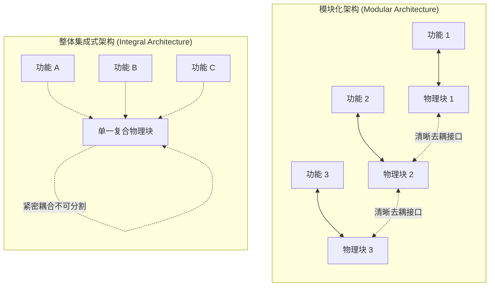
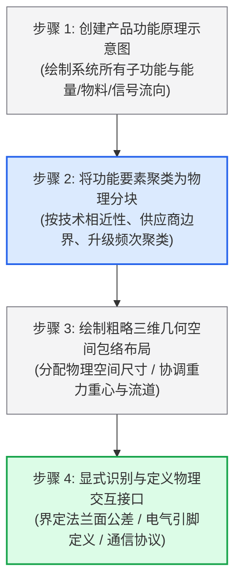

# Lec 12 产品架构（Product Architecture）

> MIT 15.783J / 2.739J · Product Design and Development · Spring 2026  
> 核心教材：*Product Design and Development* (8th Edition) Chapter 10  
> 拓展参考：Hewlett-Packard DeskJet Case; Hau Lee, *Delayed Differentiation*; Melvin Conway, *Conway's Law*

## TL;DR

- 产品架构是功能要素向物理构建块（Chunks）的分配方案及分块间交互接口的规范，深刻决定了产品的衍生变异能力与制造成本。
- 架构划分为“模块化”（Modular）与“整体集成式”（Integral）两大形态；模块化进一步细分为插槽式（Slot）、总线式（Bus）和分段式（Sectional）三种接口类型。
- 建立产品架构遵循四步法：创建功能原理示意图、将功能要素聚类分块、绘制粗略三维几何空间包络布局、显式识别物理交互接口。
- 延迟制造（Delayed Differentiation）通过推迟产品差异化发生的工序节点，以标准化核心平台大幅消减全球供应链库存波动与牛鞭效应。

## 一、产品架构的工程定义与分类阵营

在概念开发与详细设计之间，存在一个决定产品整体命运的系统级节点——产品架构（Product Architecture）。许多团队由于缺乏系统工程思维，在尚未理清系统分块边界时便匆忙投入零件画图，导致后续修改牵一发而动全身。

::: definition [产品架构 (Product Architecture) 与物理分块 (Chunks)]
产品架构是指将产品的各**功能要素（Functional Elements）**合理分配给具体的**物理构建块（Chunks）**的方案，以及明确定义各物理构建块之间相互作用与连接接口（Interfaces）的系统设计规范。
:::

根据功能要素与物理分块之间的映射关系，系统架构划分为两大对立形态：



### 1. 模块化架构（Modular Architecture）
- **一对一映射：** 每个物理分块只承载一个或极少数独立的功能要素。
- **解耦接口（Decoupled Interfaces）：** 分块之间的物理、电气或数据连接接口高度标准化，一个分块的内部工程变更完全不会波及其他分块。
- **优势：** 支持快速升级、易于维修拆解、便于外包协作，且能以极低成本派生海量变体型号。

### 2. 整体集成式架构（Integral Architecture）
- **多对多高度耦合：** 单一物理零件同时承载多项跨领域功能（例如汽车车身覆盖件既承担空气动力学导流、又承担座舱被动安全碰撞吸能，还兼作电池包上盖密封）。
- **优化与紧凑：** 追求极致轻量化、微型化空间利用与最高物理性能极限（如智能手机精密堆叠、超音速战斗机机翼）。
- **局限：** 修改任意一个局部参数都会引发全系统连锁反应，升级维护成本极高。

---

## 二、三种经典的模块化接口类型

当开发团队决定采用模块化架构时，核心的工程挑战在于如何定义构建块（Chunks）之间的物理连接与几何约束。Ulrich & Eppinger 在教材第 10 章指出，分块接口在几何拓扑与通信形态上主要演化为三种经典类型：

| 模块化接口类型 | 接口几何与连接拓扑特征 | 核心工程优势与适用场景 | 工业界经典物理代表案例 |
| :--- | :--- | :--- | :--- |
| **1. 插槽式架构（Slot-Modular）** | 存在一个共享的主干基座，但基座上的每个连接插槽具有独特的机械形状与引脚协议，各插槽互不兼容。 | 彻底杜绝了使用者的误插风险，支持针对特定功能模块（如显卡、内存、处理器）的非对称高性能定制。 | 电脑主板（PCIe 插槽、DDR 插槽、CPU Socket 互不相同）；汽车中控台专用插孔。 |
| **2. 总线式架构（Bus-Modular）** | 存在一个共享的标准主干通道，所有外设模块采用完全相同的物理几何与电气协议接口接入总线，位置可自由互换。 | 具备极强的标准化通用性与即插即用扩展能力，新增模块无需重新修改主板拓扑。 | 工业自动化 PLC 导轨系统、USB/Thunderbolt 外设生态、欧式电气配电箱导轨。 |
| **3. 分段式架构（Sectional-Modular）** | 系统不存在任何中心基座或主板，所有独立模块拥有完全对称且标准化的通用公母对接接口，模块直接首尾相连。 | 支持用户根据空间尺寸无限拼接、自由裁剪系统长度或构建任意复杂的三维网络。 | 乐高积木、模块化工业输送管道系统、节状模块化办公拼接屏风与组合沙发。 |

```text
1. 插槽式架构 (Slot-Modular)      2. 总线式架构 (Bus-Modular)        3. 分段式架构 (Sectional-Modular)
     ┌─────────────────┐                 ┌───────────────────────┐            ┌──────┐   ┌──────┐   ┌──────┐
     │   主基座分块    │                 │    标准总线主板/轨道  │            │ 模块 │===│ 模块 │===│ 模块 │
     └┬───────┬───────┬┘                 └─┬───────┬───────┬───┬─┘            └──────┘   └──────┘   └──────┘
      ▼       ▼       ▼                    ▼       ▼       ▼   ▼               (无中心主板，各模块依靠
    接口A   接口B   接口C                [相同标准化接口规范接入]             完全相同的公母接口自由串接)
    (各接口机械尺寸与协议互不兼容)      (如：电脑 USB/PCIe、导轨式断路器)     (如：节状水管、模块化拼接沙发)
```

选择何种接口类型，取决于系统的装配防呆需求、扩展灵活性以及系统制造的规模效应。例如，当面对普通消费级用户时，插槽式架构的物理防呆设计（Keying）能够有效避免因反接导致的主板烧毁；而在需要极高通用性的工业现场，总线式架构则是快速增减传感器的最佳选择。

---

## 三、建立产品架构四步法（Ulrich & Eppinger 标准流程）

教材第 10 章以台式激光打印机的系统设计为例，提炼了架构落地的四个关键阶段：



1. **创建产品功能示意图（Schematic）：** 将产品表示为功能块框图，用箭头连接各功能块之间的能量流、物料流和控制信号。
2. **功能要素聚类分块（Cluster Elements into Chunks）：** 决定哪些功能应该打包在同一个物理模块中。聚类决策应基于六大工程考量：
   - **几何集成：** 空间紧挨着的部件合并；
   - **技术复用：** 属于同一技术领域的部件（如高精度光学部件）打包；
   - **能力分工：** 便于指定单一专业供应商独立交付；
   - **升级更替周期：** 迭代频繁的高技术模块（如主控芯片）与长寿命机械骨架分离；
   - **客户变体选配：** 需要针对不同市场客制化的功能独立成包；
   - **维修拆解便利：** 易磨损耗材独立封装。
3. **绘制粗略几何空间布局（Rough Geometric Layout）：** 在 2D 或 3D 空间中分配各个物理块的位置与包络体积，考量传动轴对齐、散热风道、走线干涉与装配顺序。
4. **显式识别交互接口（Identify Interactions）：** 不仅要定义预期的基本功能接口，更要深度分析隐藏的寄生性非预期交互（如高频电磁辐射、热量传递、机械共振）。

---

## 四、差异化延迟制造（Delayed Differentiation）与平台规划

### 1. 差异化延迟的供应链威力

斯坦福大学李效良（Hau Lee）教授指出，传统全球供应链最大的痛点在于需求预测的不准确性（牛鞭效应）。如果产品在工厂制造的第一天就喷上特定国家的文字、安装好特定国家的电压插头，这些成品在漂洋过海的数周内将完全丧失流动性。

差异化延迟制造（Postponement）的核心哲学是：**在产品架构层面将通用核心与差异化模块彻底物理解耦，尽可能把赋予产品特定型号特性的制造工序，推迟到供应链的最下游甚至分销配送中心完成。**

```text
传统模式：在总装厂过早差异化 (库存高昂且易缺货)
[生产通用机身] ──► [安装专属国家电源] ──► [包装发往欧洲] ──► (英国缺货，德国滞销积压)

延迟制造模式：平台标准化 + 下游配送中心模块化组装 (HP 经典做法)
[生产全球通用打印机裸机] ──► [海运至欧洲分销中心] ──► [根据当地即时订单，插入英标或德标外置电源]
```

::: example [惠普 DeskJet 喷墨打印机的全球电源解耦实践]
惠普公司早期将其 DeskJet 打印机面向欧洲各国市场销售时，因各国电压（110V vs. 220V）及插头规范不同，在温哥华工厂生产时就将电源变压器固定内置在机壳深处。这导致发往欧洲仓库的特定国家型号经常因需求预测偏差发生一边严重断货、另一边大量滞销降价的灾难。  
随后惠普重构了产品架构：
1. **机身彻底标准化：** 全球所有生产线仅生产完全通用的机身底盘，机身电源输入统一为直流标准接口。
2. **变压器外置插槽化：** 电源变压器设计为独立的外部插槽式模块，本地采购。
3. **本地化延迟包装：** 当荷兰配送中心收到西班牙即时订单时，才将通用机身、西语说明书与当地电源打包入箱。这一架构改进每年为惠普节省数千万美元的库存持有成本。
:::

---

## 五、系统架构决策权衡与康威定律（Conway's Law）

::: theorem [架构形态性能-灵活性权衡定理]
在给定的制造技术水准下，产品的空间紧凑性、轻量化与极致瞬态性能与系统的模块化解耦程度成反比。追求极致性能必然走向整体集成，追求商业灵活性与快速衍生必然走向模块化。
:::

著名的计算机科学家梅尔文·康威（Melvin Conway）提出了组织学定律：**“设计系统的架构，必然映射出该组织内部的沟通层级结构。”** 在硬件工程中，如果企业将机械、电子和软件团队物理隔离在三栋大楼，其产品架构必然演化出清晰但可能性能低下的三层接口。优秀的系统架构师必须主动借助架构调整来重组研发团队的汇报关系。

::: insight [延迟制造的精髓是把差异化决策推迟到需求不确定性最小的时空节点]
许多工程师沉迷于内部元器件的技术先进性，却漠视产品在海运集装箱与分销渠道中的流通阻力。卓越的产品架构绝不仅仅是一份机构装配图，它是一套经过精密计算的供应链风险对冲工具。好的架构能让供应链用 20% 的通用部件库存，满足市场 80% 的个性化配置需求。
:::

::: pitfall [盲目追求过度模块化导致的系统级体积膨胀与接触面可靠性灾难]
模块化并非万灵药。每一个独立的物理分块都意味着额外的外壳结构、固定螺栓、连接插头与公差配合面。如果对微型消费电子（如智能手表）盲目进行过度模块化设计，不仅会导致整机体积比同类集成竞品大 50%，更会因为大量连接插件的存在而引发灾难性的氧化接触不良与防水密封失效。
:::

---

## 六、思考题与方法论延伸

1. **架构类型判断与权衡：** 比较智能手机主板（完全高度集成的多层 PCB 贴片与点胶屏蔽罩）与高端台式 DIY 游戏主机（模块化插槽与总线机箱）在产品生命周期、性能极限、散热效率及制造维修成本上的根本差异，并解释为何苹果 iPhone 坚定选择走向极致集成式架构？
2. **延迟制造实战方案：** 你的团队正在开发一款面向美洲、欧洲和亚太市场的户外智能园艺割草机。请列举出该系统中最容易受到不同国家法规准入（无线电频段 FCC/CE、插头安全、刀片安全防护标准）影响的功能部件，并设计一套架构解耦方案，使得工厂能够流水线大批量生产 90% 通用底盘，在当地完成最终合规组装。
