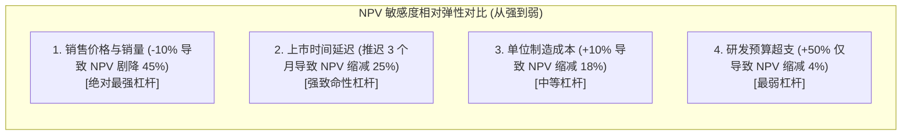

# Lec 14 产品开发经济学（Product Development Economics）

> MIT 15.783J / 2.739J · Product Design and Development · Spring 2026  
> 核心教材：*Product Design and Development* (8th Edition) Chapter 18  
> 拓展参考：McKinsey & Co. *Cost of Delay Model*; Richard Brealey & Stewart Myers, *Principles of Corporate Finance*

## TL;DR

- 经济分析为产品开发提供统一的通用度量衡，主要服务于“阶段门继续/终止决策”（Go/No-Go）与“跨职能日常工程权衡”（Trade-off Decisions）。
- 基准财务模型基于现金流贴现法（DCF），将研发投入、爬坡成本、物料成本与销售收入转化为净现值（NPV）和投资回收期。
- 敏感度分析通过一维摄动与二维矩阵，揭示四大驱动因子（研发预算、单机成本、上市周期、销售量）对项目价值的杠杆弹性。
- 麦肯锡经典研究证实：在快节奏竞争市场中，“上市推迟 6 个月”对生命周期利润的破坏力，通常是“研发预算超支 50%”的十倍以上。

## 一、经济分析在产品开发中的双重使命

在跨学科团队中，工程师追求极致的力学指标，设计师追求纯粹的艺术形式，营销人员追求尽可能丰富的功能以迎合所有客户。如何化解这些部门间固有的目标冲突？

财务语言是企业内部唯一的通用语言。Ulrich & Eppinger 在教材第 18 章指出，经济分析绝非开发完成后的会计结账，而是在整个开发过程中实时导航的罗盘，服务于两类根本决策：
1. **阶段门里程碑的生死决策（Go/No-Go Decisions）：** 在每个冲刺或阶段末尾，判断项目是否应当继续获得下一轮高额资本注入，还是应当果断止损终止。
2. **日常操作级微观设计权衡（Operational Trade-off Decisions）：** “我们是否应该额外投入 10 万美元模具费，以让每个零件的装配工时减少 12 秒？”——此类微观工程决策必须通过量化其对全生命周期利润的影响来解答。

---

## 二、基准财务模型（Base-Case Financial Model）构建

构建基准财务模型的核心是**现金流贴现法（Discounted Cash Flow, DCF）**。产品团队需要将未来数年跨生命周期的现金进出编制为时间序列电子表格。

```text
典型新产品全生命周期累计现金流曲线图：
累计现金流 ($)
     ▲
 +$  │                                                     [成熟期与衰退期]
     │                                                     /───────────\
  0  ├───┐───────────────────────────────────────────────/───────────────\──► 时间 (年)
     │   │ 研发期 (开发费用流出)                         / 盈亏平衡点 (Breakeven)
     │   │ (投入模具费 / 采购样机)                      /
 -$  │   └──────┐                                      /
     │          │ 试产爬坡期 (Ramp-up)                /
     │          └───────────┐                        / 快速成长期 (销售现金流入)
     │                      └───────────────────────/
     ▼                      最大负现金流峰值 (Peak Financial Risk)
```

::: definition [基准财务模型 (Base-Case Financial Model)]
基准财务模型是一种整合了研发工时费用、专用工装模具投资、生产线爬坡成本、单位可变制造成本、物流营销费用及阶梯销售收入预测的动态财务表格，用于计算项目的基准净现值（Base-Case NPV）。
:::

### 1. 现金流四大核心组成板块
- **研发与工程开发投入（Development Costs）：** 团队薪酬、外包设计费、3D 打印与原型物料消耗、测试认证费（主要发生在第 0–1 年）。
- **试产启动与模具工装资本支出（Ramp-up & Tooling CapEx）：** 专用注塑模具、冲压模具、自动化工装夹具及试产物料报废（主要发生在第 1–2 年）。
- **持续营运与可变制造成本（Production Costs）：** 随销量线性增长的直接物料费（BOM）、人工装配工时费、包装与运费。
- **销售净收入（Sales Revenues）：** 扣除渠道分成与退货损失后的实际现金回款。

### 2. 净现值（NPV）计算公式

由于资金具有时间价值（今日的 1 美元比明天的 1 美元更具价值），未来各期现金流必须按基准贴现率（Discount Rate, $r$）折算为现值：

$$\text{NPV} = \sum_{t=0}^{N} \frac{C_t}{(1 + r)^t}$$

其中 $C_t$ 代表第 $t$ 期的净现金流（现金流入减去现金流出），$r$ 代表企业的加权平均资本成本（WACC，在消费电子与硬件创业中通常设定在 $10\% - 15\%$ 之间），$N$ 为产品的生命周期总期数。

::: example [AB-100 家用胶囊咖啡机项目基准财务模型与净现值 (NPV) 测算]
教材第 18 章详细展示了 AB-100 咖啡机项目的基准测算（贴现率取 $r = 10\%$）：
- **研发与试产投入：** 第 1 年研发支出 500 万美元，第 2 年初试产爬坡与模具费投入 200 万美元。
- **市场表现基准：** 上市后单台出厂净收入 100 美元，单位制造成本 50 美元（毛利 50 美元/台）。
- **销售爬坡预测：** 上市第 1 年销 20 万台（贡献毛利 1000 万美元，扣除营销 300 万后净现金流 700 万）；第 2 年销 25 万台；第 3 年销 20 万台；第 4 年衰退期销 10 万台。
- **基准现值核算结果：** 该项目全生命周期未经折现的累计净现金流为 1500 万美元；经过 $10\%$ 年贴现率折现后，其基准净现值约为 **$\text{NPV} = \$8,240,000$**，投资回收期（Payback Period）为上市后第 1.8 年。
:::

---

## 三、敏感度分析（Sensitivity Analysis）与四大核心权衡法则

产品开发充满了预测假设。如果真实销量只有预测的 80% 会怎样？如果模具推迟 2 个月会怎样？敏感度分析是检验项目抗风险能力的试金石。

团队每次改变一个核心变量（保持其他变量处于基准状态），观察其对项目 NPV 的扰动幅度，从而绘制出经典的**龙卷风图（Tornado Diagram）**：



### 1. 麦肯锡上市时间延迟法则（Cost of Delay）

::: theorem [麦肯锡上市时间延迟法则 (Cost of Delay Theorem)]
麦肯锡咨询公司对全球数百个高科技与硬件产品生命周期的实证研究表明：在年均增长率 $20\%$、生命周期约 3–5 年的竞争市场中：
- **产品推迟上市 6 个月：** 全生命周期累计税后利润将减少 **$33\%$**（错失窗口期，竞品抢占生态壁垒）；
- **单位制造成本超标 9%：** 全生命周期利润将减少 **$22\%$**；
- **研发预算超支 50%：** 全生命周期利润仅减少 **$3.5\%$**！
:::

这一反直觉的经济学定理深刻揭示了工程研发的本质：**宁可多花 50% 的研发费用招聘顶级工程师或购买加速测试设备，也绝不能让上市进度推迟半年！**

### 2. 权衡法则（Trade-off Rules）实战决策模型

利用基准模型的偏导数，团队可以制定直观的“一页纸权衡法则”：
- **研发费用与制造成本的权衡：** $\frac{\Delta \text{NPV}}{\Delta \text{Dev Cost}}$ vs. $\frac{\Delta \text{NPV}}{\Delta \text{Unit Cost}}$。例如测算表明，愿意多花 20 万美元研发开模费用，只要能让单机物料成本永久降低 1 美元，基于 50 万台生命周期销量，该决策即可为企业净赚 30 万美元净现值。
- **上市速度与研发投入的权衡：** 只要加班赶工费低于延迟上市造成的每天数万美元现金流折损，快速外包开模就是完全理性的商业行为。

---

## 四、定性因素与实物期权（Real Options）战略边界

纯粹的数学财务模型存在固有的局限性。许多激进的先锋技术探索，在立项第一天的财务 Excel 表中，其折现 NPV 往往是负值。如果完全被静态 NPV 绑架，企业将永远无法诞生 iPhone 或特斯拉。

Ulrich & Eppinger 强调，量化分析必须与定性战略因素相互制衡：
1. **支持过程与技术资产沉淀：** 本次开发积累的高精度电机控制算法，能否被公司后续的 5 款衍生产品无偿复用？
2. **战略期权价值（Strategic Options）：** 将阶段门（Stage-Gate）视作一系列**实物看涨期权（Call Options）**。前期花费 5 万美元制作 PoC 原型，本质上不是为了立即盈利，而是以极小的期权费购买了“在 6 个月后评估技术可行性并决定是否斥巨资开模的权利”。

::: insight [财务模型不是预测未来的水晶球，而是暴露研发权衡杠杆的仪表盘]
初学者常把财务模型当成向上级申请资金的公关道具，千方百计把 NPV 算成一个惊人的大数字。真正资深的系统架构师，使用财务模型是为了寻找“系统的脆弱断裂点”——搞清楚究竟是售价下降 5% 更致命，还是开模推迟两周更致命。模型的最核心产出不是终点数字，而是指导团队今天将注意力聚焦在何处。
:::

::: pitfall [沉没成本心理陷阱：用历史投入捆绑未来的理性商业决策]
“我们在这个项目上已经花费了 200 万美元研发费，现在终止就全打水漂了！”——这是研发管理中最常见的沉没成本谬误（Sunk Cost Fallacy）。在阶段门评审中，已经花掉的 200 万美元在物理世界中已经永久消失，它与未来的决策没有任何数学关联。唯一理性的判断标准是：从今天开始继续投入后续资金，未来产生的现金流增量现值是否大于零。如果小于零，必须就地斩仓。
:::

---

## 五、思考题与方法论延伸

1. **敏感度分析与权衡实战：** 假设你的团队正在开发一款智能割草机。当前方案预计单机 BOM 成本为 280 美元，但若额外投入 15 万美元定制一体化轻量镁合金底盘模具，单机 BOM 可降至 265 美元（单台节省 15 美元）。若产品的全生命周期预期销量为 20,000 台，基准资本贴现率为 $12\%$，请通过定量净现值（NPV）分析，判断是否应当批准这笔追加模具投资？
2. **麦肯锡延迟模型应用：** 你的团队在 Sprint 4 遭遇了关键注塑外壳尺寸超差的棘手缺陷。结构工程师提出两个方案：方案 A 需要停机花费 3 周时间精细修模；方案 B 紧急空运一套高成本的现成替代标准件，无需停机但会导致每台产品成本上升 4 美元。请结合产品开发经济学的权衡法则，说明你将调取哪些关键市场参数来拍板决定采纳方案 A 还是方案 B？
