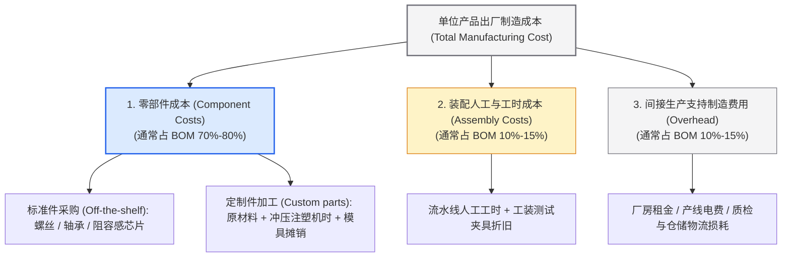
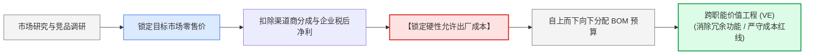

# Lec 15 产品成本与商业模式（Product Cost and Business Models）

> MIT 15.783J / 2.739J · Product Design and Development · Spring 2026  
> 核心教材：*Product Design and Development* (8th Edition) Chapter 13  
> 拓展参考：Alexander Osterwalder, *Business Model Generation*; Robin Cooper & Regine Slagmulder, *Target Costing*; WAZER Desktop Waterjet Case Study

## TL;DR

- 产品单位制造成本由三大板块构成：零部件物料成本（标准件与定制件）、装配工时成本及间接支持制造费用（Overhead）。
- 定制件模具费属于高额前期固定资产，单件摊销成本与全生命周期生产总量呈反比；规模经济是压低硬件单位成本的终极武器。
- 目标成本法（Target Costing）强制执行“市场容忍价格 - 目标利润 = 允许制造成本”的倒推逻辑，通过价值工程（VE）消灭过剩设计。
- 商业模式画布（BMC）定义了硬件价值的捕获机制；从一次性硬件买断升级为“硬件 + 耗材/软件订阅”能够显著拉升客户终生价值（LTV）。

## 一、制造成本的工程解剖：BOM 三级成本结构

在产品设计阶段，很多年轻团队仅仅把物料清单（BOM）当成一份采购零件清单。然而在系统工程中，BOM 是整个企业制造成本的计算核心。

根据教材第 13 章的严密分类，出厂单位制造成本（Unit Manufacturing Cost）由三个不可分割的层次构成：

::: definition [单位制造成本构成模型 (Unit Manufacturing Cost)]
一个物理硬件的单位出厂成本等于全部外购标准件采购价总和、自制定制件加工变动成本、专用模具与工装夹具按生产总量的离散单件摊销、装配生产线直接人工工时成本以及分配的间接制造支持费用（Overhead）之和。
:::

### 1. 模具与专用工装摊销的数学原理

定制塑料件注塑模具（Tooling）通常极其昂贵（例如一套精密汽车中控台模具可能高达 100,000 美元）。单件模具摊销成本随生产总规模（Production Volume, $V$）的变化公式为：

$$\text{Tooling Cost per Unit} = \frac{\text{Total Tooling Investment}}{\text{Total Production Volume } (V)}$$

::: theorem [模具资本摊销与规模经济临界点定律]
当预期生产规模极小（如 $V = 500$ 台）时，昂贵的钢模注塑将带来灾难性的单机成本（单台模具分摊高达 200 美元），此时采用 3D 打印或硅胶真空复模更为经济；只有当预期规模跨越盈亏平衡临界点（通常 $V > 5000$ 台）时，注塑模具极低的单件变动加工费（几十美分）才能释放出巨大的规模经济红利。
:::

---

## 二、面向制造与装配的设计（DFMA）降本六大杠杆

教材第 13 章以 WAZER 桌面级水刀切割机（全球首款将工业水刀价格从 10 万美元降至 5000 美元的硬件突破项目）为例，系统提炼了 DFMA 的六大工程降本杠杆：

1. **战略外包决策（Make-versus-Buy）：** 严格区分企业核心竞争资产与成熟通用件。非核心件（如水泵、电机、电源、电磁阀）坚决选用成熟供应链现成货，绝不定制；仅将全部精力与模具预算倾注在核心水沙混合喷嘴与机架创新上。
2. **零件数量最小化（Part Count Reduction）：** 装配成本与零件总数量严格正相关。利用注塑工艺的复杂几何自由度，将原本由五个冲压钢片与八颗螺钉连接的组件，复合成单一注塑弹性咬合件。
3. **消除紧固件与工具依赖：** 优先采用一体成型自锁卡扣（Snap-fits），杜绝使用胶水（需要等待固化时间）与异形紧固螺丝。
4. **自对齐与对称性设计（Poka-Yoke Assembly）：** 零件如果必须特定方向装配，设计为物理上完全不可能反向插入（防呆）；若无需特定方向，设计为完全上下对称，减少工人辨识时间。
5. **单向自上而下装配（Z-axis Assembly）：** 所有内部零部件均从垂直 Z 轴方向由上至下层叠落入底盘，避免将机身翻转、侧向锁螺丝导致的复杂工装夹具投入。
6. **放宽非关键公差要求：** 机械加工公差每提高一个数量级，其制造与报废成本呈指数级上升。仅对精密配合轴承孔保留 $\pm 0.01\text{mm}$ 公差，外壳等非关键尺寸坚决放宽至常规注塑公差。

::: example [WAZER 桌面水刀切割机的装配降本实战]
WAZER 团队在开发早期，切割台面由数十根复杂的铝合金型材焊接打磨而成，人工焊接与调平耗时 4 个小时，返工率高达 25%。  
经过 DFMA 优化后：
- 团队将其重构为定制的耐磨高分子聚丙烯注塑格栅模块，模块之间采用拼木榫卯结构互锁；
- 工人只需徒手将 4 块格栅卡入不锈钢水槽，装配时间从 240 分钟锐减至 2 分钟；
- 水刀工作磨损后，用户可低成本自行单块更换格栅，彻底消除了售后整体返修成本。
:::

---

## 三、目标成本法（Target Costing）与价值工程（VE）

传统制造企业常陷入“成本加成定价法”（Cost-Plus Pricing）的闭门造车思维：工程师根据自己的理想设计画完图，核算出 BOM 成本 200 美元，加上 50 美元毛利，宣布零售价为 250 美元；结果进入市场后发现同类竞品售价仅 149 美元，产品严重滞销。

丰田汽车开创的**目标成本法（Target Costing）**彻底逆转了这一因果链条：

$$\text{Allowable Cost (容许成本)} = \text{Target Market Price (市场接受售价)} - \text{Target Margin (目标利润)}$$

当各子系统的初步成本估算总和超过容许成本红线时，跨职能团队启动**价值工程（Value Engineering, VE）**：
$$V = \frac{\text{Function (功能效用)}}{\text{Cost (成本)}}$$
系统性审视每一项客户需求，剔除客户并不买单的昂贵过剩设计（如取消没人使用的外壳阳极氧化喷砂拉丝工艺，换用微磨砂注塑直接成型）。

---

## 四、商业模式画布（BMC）在硬件项目中的落地

商业模式定义了企业如何创造价值、传递价值与捕获价值。由奥斯特瓦德提出的商业模式画布（Business Model Canvas, BMC）九大模块，构成了从技术到商业变现的完整框架：

| BMC 核心模块 | 在智能实体硬件开发中的落地内涵 | 典型商业化审查要点 |
| :--- | :--- | :--- |
| **1. 价值主张（Value Propositions）** | 产品解决的核心痛点与“10 倍好”的差异化体验承诺。 | 是更省时间、更省钱、还是提供了极致的身份认同与安全感？ |
| **2. 客户细分（Customer Segments）** | 明确第一批愿意尝鲜掏钱的种子早期拥趸（Early Adopters）。 | B2B 专业级用户还是 B2C 大众消费家庭？细分客群是否有共同支付习惯？ |
| **3. 渠道通路（Channels）** | 产品如何从制造工厂最终抵达并交付到客户手中。 | 自营独立站 DTC 电商、众筹平台（Kickstarter）、亚马逊还是线下大型商超？ |
| **4. 客户关系（Customer Relationships）** | 建立并维持客户黏性与复购的机制。 | 社区驱动运营、自动化售后固件更新服务、VIP 专属专家顾问服务。 |
| **5. 收入来源（Revenue Streams）** | 现金流的实际捕获机制。 | 一次性买断、配件复购、SaaS 月度订阅还是按量计费？ |
| **6. 核心资源（Key Resources）** | 支撑商业运转不可或缺的核心资产。 | 核心发明专利组合、柔性供应链代工伙伴、专属私域用户社群。 |
| **7. 关键业务（Key Activities）** | 团队每天必须高效运转的业务飞轮。 | 持续敏捷产品迭代、深度供应链品质管控、精准效果营销投放。 |
| **8. 重要合作（Key Partnerships）** | 分担风险、弥补能力短板的外部同盟。 | 核心零部件战略独家供应商、第三方物流履行中心（3PL）、高校联合实验室。 |
| **9. 成本结构（Cost Structure）** | 驱动整个商业机器运转的核心财务开支。 | 研发人员薪酬、昂贵注塑模具摊销、营销获客成本（CAC）、售后保修准备金。 |

---

## 五、硬件商业模式的进阶演进形态

纯粹的一次回款型硬件销售（Transactional Hardware）正面临残酷的同质化价格战。现代成功硬件企业普遍探索更高阶的价值捕获模式：

1. **“剃须刀—刀片”耗材锁定模式（Razor-and-Blade）：** 硬件低毛利甚至平价销售以快速铺开装机量（Installed Base），依靠专用耗材获得持续高毛利复购（如雀巢 Nespresso 胶囊咖啡机、爱普生打印机原装墨盒）。
2. **硬件 + SaaS / 内容月度订阅模式（Hardware-Enabled Services）：** 硬件仅作为进入高端数字服务的门槛载体（如 Peloton 智能动感单车必须绑定每月 44 美元的流媒体健身私教课程，Apple Watch 绑定 Fitness+）。
3. **产品即服务模式（Product-as-a-Service, PSS）：** 客户完全无需购买硬件所有权，按实际使用量或达成的效果付费（如劳斯莱斯航空发动机“按飞行小时付费”Power by the Hour，施乐打印机按复印张数收费）。

::: insight [商业模式决定了硬件设计的成本容忍度上限]
如果你的商业模式是一次性纯硬件买断，每一分钱的 BOM 超标都会直接吞噬团队微薄的净利润，你必须在每个电阻电容上与供应商锱铢必较；但如果你构建的是“硬件锁定高毛利耗材”模式，你甚至可以在硬件设计中不惜成本加入高精度 RFID 防伪芯片以杜绝劣质第三方耗材仿冒。设计的底层预算完全取决于商业变现的终局形态。
:::

::: pitfall [将模具与夹具固定资产投入简单当作变动成本，忽视小批量生产的致命摊销]
许多学生团队在商业计划书中自信满满地写着：“这款塑料外壳注塑件只要 1 美元”。但他们完全忘记了前端开模需要一次性支付 3 万美元！如果第一年真实销量只有区区 500 台，则单件外壳真实分摊的硬性成本实际上是 $1 + \frac{30000}{500} = 61$ 美元！忽视生产规模与固定模具投入的动态关系，是硬件创业公司早期现金流断裂的最常见死因。
:::

---

## 六、思考题与方法论延伸

1. **DFMA 零件整合练习：** 观察手边任意一款带电池盖的遥控器，分析其电池仓盖目前由几个零件构成（塑料盖板、金属弹性锁扣、防丢尼龙连接绳）。运用 DFMA 原理，设计一套利用单一部件注塑一体化成型且兼具弹性锁紧与防丢功能的机构。
2. **商业模式画布重构：** 假设你的团队开发了一款针对重度哮喘儿童的“便携式医用智能雾化吸入器”。请绘制两份截然不同的商业模式画布核心要素：一份基于“药房传统一次性买断零售模式”，另一份基于“儿科诊所按月租赁 + 药物原装药仓订阅配送模式”，并对比两者的现金流稳定性与客户终生价值（LTV）。
