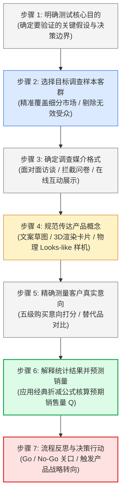
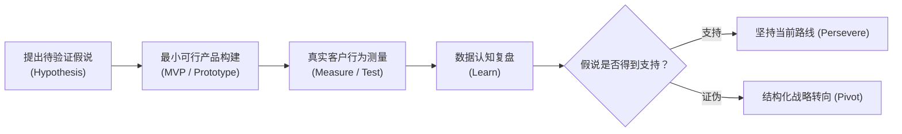

# Lec 16 产品测试与战略转向（Product Testing and Strategic Pivots）

> MIT 15.783J / 2.739J · Product Design and Development · Spring 2026  
> 核心教材：*Product Design and Development* (8th Edition) Chapter 9  
> 拓展参考：Harvard Business School, *Airbnb Case Study*; Eric Ries, *The Lean Startup*; Sean Ellis, *Product-Market Fit Survey*

## TL;DR

- 概念测试以量化方式检验目标市场对概念的真实购买意向，是防范高额模具制造沉没投资的核心安全气囊。
- 市场需求预测采用经典五级购买意向模型：$Q = N \times A \times P$，通过对“一定会买”与“可能会买”应用经验折减系数，刺破虚假的口头好评泡沫。
- Airbnb 的商业传奇证明：当早期增长停滞时，创始人亲自飞往现场、做“无法规模化的事情”（深入房东家拍摄高保真照片）是触发战略转向的关键转折点。
- 战略转向（Pivot）不是盲目推倒重来，而是在保留已验证核心认知资产的前提下，针对客户细分、价值主张或技术引擎的结构化假设修正。

## 一、概念测试的使命与七步标准流程

许多初创硬件团队在概念生成后，往往急于开模试产，唯恐上市太慢。然而，如果产品概念本身并未切中目标客群的核心诉求，越快开模只会导致仓库里堆积越多无人问津的昂贵塑料垃圾。

教材第 9 章详细阐述了**概念测试（Concept Testing）**的七步严密流程：

1. **明确测试目的：** 明确本次测试是为了决定在三个候选概念中选优、评估目标零售价接受度，还是向投资机构证明潜在市场规模。
2. **选择样本群体：** 严格限定在目标用户画像之内，避免向非目标人群（如向不滑雪的人群测试雪崩探针）发送问卷导致数据失真。
3. **选择调查媒介：** 实体硬件概念测试优先推荐面对面展示（携带Looks-like外观样机），使受访者获得真实的体量感感知。
4. **传达概念：** 统一采用客观、中立的“概念描述卡”（Concept Fact Sheet），包含产品核心工作原理图、尺寸规格、材料说明及预期销售价格，杜绝夸大推销。
5. **测量客户反应：** 采用标准的五级购买意向分级（Purchase Intent Scale）。
6. **解释结果与量化销量预测：** 剥除虚假热情，代入统计经验公式。
7. **闭环决策与反思：** 如果意向不达预期，启动根本原因排查与战略转向。

---

## 二、销量定量预测模型：$Q = N \times A \times P$

当受访者面对概念卡片被问及“如果在市场上以 X 美元售价销售该产品，您的购买意愿如何”时，标准问卷提供五个互斥选项：
1. **一定会买（Definitely Would Buy, $C_{\text{def}}$）**
2. **可能会买（Probably Would Buy, $C_{\text{prob}}$）**
3. **可能买也可能不买（Might or Might Not Buy）**
4. **可能不买（Probably Would Not Buy）**
5. **一定不买（Definitely Would Not Buy）**

工业界数十年的实证对比表明，消费者的口头承诺充满水分。Ulrich & Eppinger 给出了经典的预期销售量（$Q$）预测方程：

$$Q = N \times A \times P$$

其中：
- **$N$：** 目标细分市场的潜在潜在买家总人数（潜在市场空间 TAM）。
- **$A$：** 市场认知度与渠道可触达率（Awareness & Availability，介于 $0$ 到 $1$ 之间，受营销广告投放预算与渠道铺货率约束）。
- **$P$：** 目标买家的综合预期购买概率（Expected Probability of Purchase）。

### 购买意向概率的经验修正折减公式

$$P = F_{\text{def}} \times C_{\text{def}} + F_{\text{prob}} \times C_{\text{prob}}$$

在耐用消费品与硬件领域，大量历史回归数据给出的经验校准折减系数通常为：
- **$F_{\text{def}} \approx 0.4$：** 即声称“一定会买”的人群中，在现实中真金白银掏钱的大约只有 **40%**；
- **$F_{\text{prob}} \approx 0.2$：** 声称“可能会买”的人群中，现实中最终购买的通常只有 **20%**；
- 其余三档回答（可能买、可能不买、一定不买）在保守预测模型中直接置零核算。

::: example [emPower 折叠三轮电动滑板车市场销量预测测算实战]
教材第 9 章以 emPower 团队研发的便携式折叠电动滑板车（售价 750 美元）为例，详细演算了预测流程：
- 目标细分市场调研覆盖了 200 位城市日常通勤者与大学校区常住人口，市场总潜力估计为 $N = 250,000$ 人；
- 调研结果显示：$10\%$ 的受访者选择“一定会买”（$C_{\text{def}} = 0.10$），$30\%$ 的受访者选择“可能会买”（$C_{\text{prob}} = 0.30$）；
- 结合团队有限的营销资金，预计第一年的广告渠道触达率仅能达到 $A = 20\% = 0.20$；
- 测算综合预期购买概率：
  $$P = 0.4 \times (0.10) + 0.2 \times (0.30) = 0.04 + 0.06 = 0.10 \ (10\%)$$
- 计算第一年预期销售量：
  $$Q = 250,000 \times 0.20 \times 0.10 = 5,000 \text{ 台}$$
这一严谨测算直接打破了团队早期盲目乐观以为能年销 5 万台的幻觉，指导工厂将首批备料与开模预算严格压制在 5,000 台规模之内，挽救了公司宝贵的初始现金流。
:::

---

## 三、Airbnb 经典案例：测试停滞与战略转向

在 MIT 15.783 课堂上，哈佛商学院 Airbnb 经典案例是讨论“产品测试如何驱动战略转向”的核心教材。

### 1. 冰封困局与无力增长
2008 年底，加入 Y Combinator 孵化器的 Airbnb（早期名为 AirBed & Breakfast）每周营收徘徊在 200 美元左右。创始人布莱恩·切斯基（Brian Chesky）与乔·吉比亚（Joe Gebbia）在旧金山办公室盯着电脑屏幕与 Google Analytics 数据陷入绝望：网站拥有稳定的访问流量，房源数量也在增加，但租客在浏览页面数秒后便迅速关闭离开，预订转化率接近冰点。

### 2. 走向现场：做无法规模化的事情（Do Things that Don't Scale）
YC 创始人保罗·格雷厄姆（Paul Graham）给出了改变公司命运的建议：“走出办公室，飞到纽约去，亲自去敲每一个房东的门。”

切斯基和吉比亚带着专业单反相机飞赴纽约。当他们真正坐在房东破旧的客厅里时，系统真相瞬间大白：
- **致命摩擦力暴露：** 房东用手机拍摄的房间照片极其昏暗、模糊、倾斜，卫生间甚至露出马桶盖；租客根本无法看清床铺是否干净，无法产生基本的安全信任！
- **动手解决物理世界问题：** 两位创始人亲自帮房东打扫房间、摆放鲜花，用专业打光拍摄了数十张明亮温暖的高清大图，并当天替换上传至网站。
- **神奇的测试验证：** 重新拍照上线仅仅一周后，纽约地区的每周订房收入瞬间暴涨至原来的两倍以上！

---

## 四、精益假设检验与八大战略转向（Pivot）形态

埃里克·莱斯（Eric Ries）在《精益创业》（*The Lean Startup*）中将产品开发定义为**“经证实的认知”（Validated Learning）**过程。战略转向（Pivot）绝非认输投降，而是在保留以往核心认知的前提下，更换航道去追寻更大的商业成果：

在硬件与体验系统中，常见的战略转向包含八种典型形态：
1. **局部放大转向（Zoom-In Pivot）：** 将原产品中一个不起眼的单点子功能（例如原本只是智能头盔里的“撞击紧急求救报警器”），独立重构为全新的完整核心产品。
2. **客户细分转向（Customer Segment Pivot）：** 产品功能不变，但发现初设的 B2C 大众家庭用户毫无付费欲望，而 B2B 仓储物流企业却迫切需要此功能以降低工伤赔偿。
3. **架构与平台转向（Platform Pivot）：** 从销售单机硬件设备，转向为第三方开发者提供传感器硬件开发套件（SDK）与通信协议云平台。
4. **价值主张与收益模型转向（Business Model Pivot）：** 从一次性高价设备买断，转向设备免费赠送、按月收取滤芯药仓订阅费。

::: theorem [Sean Ellis PMF 临界证据法则]
如何量化判定产品是否达成了“产品-市场匹配”（Product-Market Fit, PMF）？硅谷增长黑客先驱 Sean Ellis 提出了黄金问卷法则：向至少 100 位体验过 Alpha/Beta 原型的活跃用户提问：“如果明天这个产品彻底从市场上消失，您的感受如何？”  
**如果超过 40% 的用户回答“非常失望”（Very Disappointed），则证明产品已跨过 PMF 临界点；** 反之，如果该比例低于 40%，团队必须坚决暂停大规模开模与市场推广投放，立即启动战略转向。
:::

::: insight [走出会议室，亲自前往客户真实使用情境是实现战略转向的唯一解药]
在办公室看数据报表永远只能看到“发生了什么”（What），却永远无法知道“为什么会这样”（Why）。Airbnb 的创始人如果当年继续坐在旧金山研究转化率漏斗图，得出的大概率是“把按钮从绿色改成蓝色”这类无关痛痒的平庸改动。只有当你亲眼目睹客户在狭小厨房里的无助抓狂时，真正的战略顿悟才会降临。
:::

::: pitfall [将口头虚假赞美当成真实购买意向，忽视支付真金白银时的巨大折减]
许多年轻团队拿着 3D 打印模型向朋友或路人展示时，对方出于礼貌常会夸赞“哇，这个点子太棒了，我肯定会买！”。团队便误以为发现了千亿市场。然而，当真正要求对方掏出手机扫码支付 10 美元定金时，99% 的赞美者都会找借口离开。记住：**唯一的真实测试证据，是客户在无强迫情境下付出的金钱、时间或个人隐私数据。**
:::

---

## 五、思考题与方法论延伸

1. **购买意向概率核算应用：** 你的团队为开发一款“独居老人防摔倒雷达监测仪”向 300 名子女发放了概念调查卡（售价 199 美元）。回收数据显示：$15\%$ 的人选择“一定会买”，$25\%$ 的人选择“可能会买”。已知当地目标老龄家庭总数为 80,000 户，团队预计第一年的社区宣传触达率为 $15\%$。请计算该产品第一年的预测销量区间。
2. **战略转向方案设计：** 假设你的团队开发了一款基于激光雷达的“盲人避障智能拐杖”，但在 Sprint 4 的实测中，盲人用户反馈由于手部长时间握持沉重的机身极易疲劳，且盲杖敲击地面时的震动会干扰雷达光学校准，导致退货率极高。请结合精益创业的转向理论，设计一种将该核心避障技术向特定新形态（如智能导盲马甲、导盲眼镜）或新细分客群（如工业低速搬运机器人）迁移的战略转向方案。
