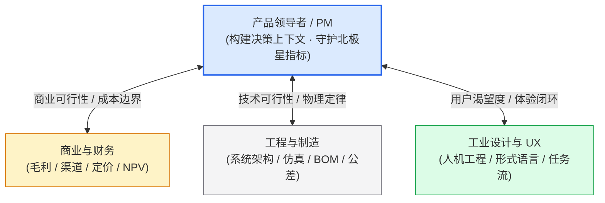
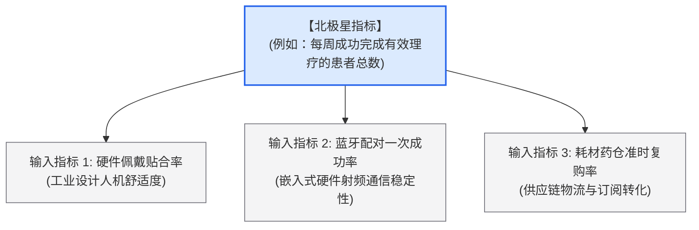
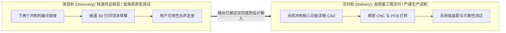

# Lec 17 产品领导力（Product Leadership）

> MIT 15.783J / 2.739J · Product Design and Development · Spring 2026  
> 核心教材：*Product Design and Development* (8th Edition) Chapter 19  
> 拓展参考：Productboard, *The Ultimate Guide to Product Management*; Marty Cagan, *Inspired*; Teresa Torres, *Continuous Discovery Habits*

## TL;DR

- 产品领导力的精髓是“无职权的领导力”（Leading without Authority），依靠共同愿景、事实证据与严密的优先序框架，而非行政命令驱动跨学科团队。
- 产品经理（PM）是商业价值、技术可行性与用户体验交汇处的总枢纽，首要职责是确保团队“始终在解决最值得解决的问题”。
- 运用北极星指标（North Star Metric）与 RICE 优先级模型，刺破主观偏好，在有限的冲刺预算内实现资源产出的最大化。
- 全学期项目复盘（Postmortem）不仅是总结一款原型的成败，更在于将试错经验提炼为组织级的方法论资产，完成从 0 到 1 的认知闭环。

## 一、产品领导力的本质：无职权的领导力

在麻省理工学院（MIT）与罗德岛设计学院（RISD）的联合团队中，来自斯隆商学院的 MBA、机械工程系的研究生与工业设计系的设计师组成了一个平等的自治单元。在这里，没有任何人拥有开除他人或强行下达行政指令的法定权力。

这种高度松散、高度自治的跨学科环境，恰恰逼真地模拟了当代科技企业与创业团队的真实协作常态。

::: definition [无职权的领导力 (Leading without Authority)]
一种依靠清晰的产品愿景、严密的客观数据证据、深层的跨专业同理心及透明的决策流程，在缺乏行政层级汇报权力的前提下，自发凝聚机械、电子、设计、算法与市场团队达成战略共识并高效执行的领导力模型。
:::

优秀的产品领导者从不命令团队“按我的个人喜好画这个零件”，而是向团队提供充分的**决策上下文（Context, Not Control）**：明确当前最致命的商业风险是什么、真实的客户痛点数据是什么、供应链的财务边界在哪里，让最专业的工程师与设计师基于完整的全貌做出最明智的自主技术抉择。

---

## 二、目标锚定：北极星指标与输入指标树

当跨学科团队陷入无休止的“这个功能重不重要”的争吵时，根源在于团队缺乏一个无可争议的北极星指标（North Star Metric, NSM）。

北极星指标必须能够同时捕捉“客户体验价值的实现”与“企业长期商业健康的成长”。围绕北极星指标，产品领导者需要构建自上而下的输入指标树（Input Metrics Tree）：

通过这一量化拆解，机械工程师能够清晰看懂“为什么手柄重量必须减去 20 克”（因为直接影响指标 1），电气工程师也能明白“为什么待机功耗必须压低”（因为直接保障指标 2）。

---

## 三、优先级决策框架：RICE 评分模型与 MoSCoW 矩阵

产品待办列表（Backlog）中永远有做不完的功能。硅谷顶尖产品团队普遍运用 RICE 模型进行理性的数学排序：

$$\text{RICE Score} = \frac{\text{Reach (触达率)} \times \text{Impact (影响度)} \times \text{Confidence (置信度)}}{\text{Effort (投入成本与工时)}}$$

::: theorem [RICE 优先级决策评分模型 (RICE Scoring Theorem)]
- **Reach（触达范围）：** 在一个季度内该功能会影响多少目标用户（绝对人数或百分比）。
- **Impact（影响强度）：** 该功能对单个用户核心体验提升的贡献幅度（通常设为：$3 = \text{极大}$, $2 = \text{重大}$, $1 = \text{中等}$, $0.5 = \text{轻微}$）。
- **Confidence（置信度）：** 团队对上述预估的客观证据支持程度（$100\% = \text{有实测数据支撑}$, $80\% = \text{有定性访谈支撑}$, $50\% = \text{纯猜测}$）。
- **Effort（工作量）：** 团队完成该功能所需的跨学科人员工时总数（人周或人月）。
:::

::: example [智能医用吸入器待办列表的 RICE 优先级排序实战]
团队面临三个相互竞争的功能待办项：

| 待办功能项 | Reach（人/月） | Impact（1–3） | Confidence（%） | Effort（人周） | RICE 得分 | 排序裁决 |
| :--- | :---: | :---: | :---: | :---: | :---: | :---: |
| **A. 药仓磁吸自锁盲插防呆机构** | 1000 | 3（极大防止呛咳） | 100%（现场实测） | 2 | **1500** | **第一优先级（立即进入下个冲刺）** |
| **B. 手机 App 炫酷 3D 动画教程** | 800 | 1（中等视觉愉悦） | 80%（问卷调查） | 4 | **160** | **第三优先级（暂缓投入）** |
| **C. 增加机身急救备用物理微动按键** | 1000 | 2（关键时刻保命） | 90%（医生访谈） | 1.5 | **1200** | **第二优先级（紧随其后）** |
:::

配合 **MoSCoW 矩阵**（Must have 必须具备、Should have 应当具备、Could have 可以具备、Won't have 本期坚决不做），产品领导者能够坚定捍卫团队的研发带宽，避免被边缘伪需求拖垮进度。

---

## 四、双轨敏捷（Dual-Track Agile）与跨学科冲突化解

卓越的硬件与体验团队从不采用单一的线性节奏，而是采用**“发现轨”（Discovery Track）**与**“交付轨”（Delivery Track）**并行的双轨敏捷机制：

- **发现轨（领先 1–2 个冲刺）：** PM 与工业设计师在前方冲锋，用粗糙模型持续试错，淘汰不成熟方案；
- **交付轨：** 结构与电气工程师集中全部火力，把已经被证实的方案转化为高可靠性的生产级工程图纸，杜绝频繁变更图纸造成的资源浪费。

::: insight [产品经理的最核心产出是团队的‘决策上下文’，而非微观指令]
许多平庸的管理者试图掌控一切微观细节：规定电路板的电容选型、强制修改手柄的弧度。这种微观管理（Micromanagement）会彻底扼杀团队的创造力。世界级的产品领导者只提供三样东西：最真实的客户痛点录音、最清晰的财务目标与最透明的优先级裁判规则。当上下文足够清晰时，跨学科团队自己会迸发出令人惊叹的自组织工程智慧。
:::

::: pitfall [沦为盲目满足所有需求的‘功能工厂’（The Feature Factory Trap）]
研发团队最容易坠入的陷阱是“功能工场模式”：销售提一个需求就加一个按钮，投资人提一个想法就加一个传感器，最终把产品堆砌成一个体量庞大、造价奇高、内部布线混乱且没人会用的“瑞士军刀”。**卓越领导力的第一标志，不是决定做什么，而是有勇气对 90% 的诱人点子坚定地说‘不’。**
:::

---

## 五、全学期项目复盘（Postmortem Evaluation）与全景认知闭环

在 MIT 15.783 课程的终点，团队完成 Alpha 原型展示后，必须进行长达半天的正式项目复盘（Postmortem Evaluation）：

1. **计划与现实的偏差分析：** 实际单机 BOM 成本与最初设定的目标规格相差多少？实际开模与制作周期推迟了多久？根本工程原因何在？
2. **假设检验矩阵复盘：** 在 Sprint 1 提出的前三大商业假说，哪些被真实数据证实？哪些被无情推翻？团队在何时做出了最关键的战略转向？
3. **跨学科协作资产沉淀：** 机械、设计与商业同学在本次合作中沉淀了哪些通用的防呆规范与测试用例？这些知识资产将沉淀至团队永久技术库中。

从 Lec 1 的机会识别与设计思维出发，历经客户需求、敏捷冲刺、概念发散、AI 赋能、目标规格、快速原型、服务蓝图、工业设计、绿色可持续、产品架构、体验交互、开发经济学、目标成本、概念测试到产品领导力——至此，一套现代、科学、严密、可工业化复现的产品设计与开发工程方法论，完成了最完美的认知闭环。

---

## 六、思考题与方法论延伸

1. **RICE 模型权衡实战：** 假设你的团队在 Sprint 4 临近截止前，面临“增加防水密封硅胶圈（需要修改模具增加 1 周工期）”与“开发手机 App 端电量历史曲线（纯软件工作，耗时 3 天）”的艰难抉择。请结合产品定义与 RICE 四大要素，拟定一份客观的权衡评估报告，向全班展示你的优先级决策逻辑。
2. **项目复盘与自我审视：** 回顾全学期五个冲刺的原型演进历程，分析团队在哪一个冲刺耗费了最多的无效等待工时（例如等待 3D 打印排队或等待外购电机物流）？如果重新启动该项目，作为产品领导者，你将如何通过前置采购与 DSM 任务解耦来消除该系统瓶颈？
