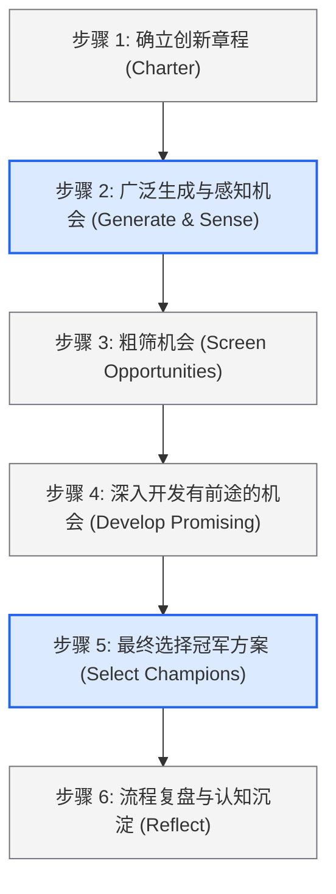
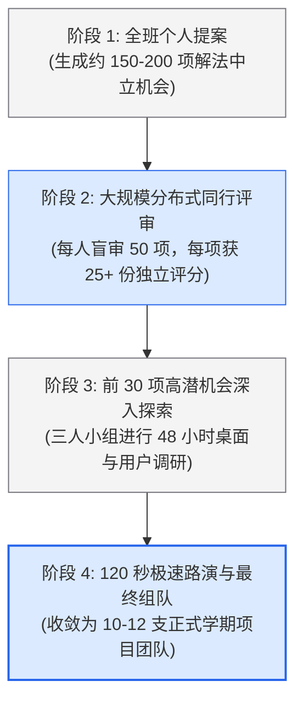

# Lec 2 系统化创新与R-W-W（Systematic Innovation and Real-Win-Worth-it）

> MIT 15.783J / 2.739J · Product Design and Development · Spring 2026  
> 核心教材：*Product Design and Development* (8th Edition) Chapter 3, 4  
> 拓展参考：George S. Day, *Is It Real? Can We Win? Is It Worth Doing?* (HBR); Christian Terwiesch & Karl Ulrich, *Innovation Tournaments*; Jeanne Liedtka, *Why Design Thinking Works*

## TL;DR

- 创新不能寄希望于随机的顿悟，而应作为可管理的管道工程；机会锦标赛通过宽进严出的多轮赛制，利用极值原理提升卓越创新的捕获概率。
- George S. Day 的 R-W-W（Real-Win-Worth-it）框架从市场真实性、竞争制胜力和商业价值三个维度设立严密审查，构成不可妥协的漏斗关口。
- 早期机会筛选不是给产品下终审判决，而是以最低的认知成本决定“是否值得投入下一笔验证资源”。
- 严禁将 R-W-W 异化为机械的加权平均打分；任何在物理可行性、核心法规或关键人因上的致命硬伤均具有一票否决权。

## 一、系统化创新的底层逻辑与咨询实践

在传统认知中，创新常被误解为天才工程师或艺术家的灵光一现。然而，国际顶尖产品设计咨询机构 Altitude（现属埃森哲工业 X）的长期商业实践表明，依赖孤立灵感的产品开发具有极高的偶发性与失败率。系统化创新（Systematic Innovation）的核心价值，在于建立一套可重复、可审计、抗认知偏差的工程化方法体系，使得高价值商业机会的生成与甄别成为组织的稳定能力。



### 1. 机会识别的六步结构化流程

依据教材第 3 章，系统化机会识别由六个连续步骤构成：

1. **确立创新章程（Establish a Charter）：** 明确团队创新的边界约束。包括目标业务领域、核心技术范围、时间周期、预期投资规模及战略诉求（例如：“在家庭绿色清洁领域寻找零售价低于 100 美元的环保硬件机会”）。
2. **广泛生成与感知机会（Generate and Sense Many Opportunities）：** 通过内部发散与外部捕获相结合。包括跟踪社会大趋势、挖掘活跃用户的折中行为、研究专利缝隙、跨行业机制借用等。
3. **粗筛机会（Screen Opportunities）：** 采用多重投票（Multivoting）或双盲同行评审（Peer Review），在极低资源消耗下淘汰明显偏离章程或吸引力不足的候选方案。
4. **深入开发有前途的机会（Develop Promising Opportunities）：** 对入围的 Top 20–30 项机会投入轻量研究资源。包括查阅竞品定价、快速访谈 3–5 位典型用户、初步检索专利壁垒、评估基本技术可行性。
5. **最终选择冠军方案（Select Exceptional Opportunities）：** 运用 R-W-W 等多准则决策工具，评选出 1–2 项具备真实商业爆发力并符合团队优势的方案正式立项。
6. **流程复盘与反思（Reflect on the Results and the Process）：** 检验生成机会的多样性是否足够？是否存在系统性偏见？漏斗各阶段的转化效率如何？

::: theorem [机会锦标赛极值定理 (Extreme Value Theorem in Innovation)]
在产品创新中，团队最终获得的经济回报由方案库中的“最大值”（即最优概念的质量）决定，而非所有候选方案的“平均值”。为了获得极右端的高质量创新，系统必须在前端大幅度拉大生成基数并提高机会变异度（Variance）。
:::

---

## 二、George S. Day 的 R-W-W 评估框架深度解析

沃顿商学院教授 George S. Day 在《哈佛商业评论》发表的经典论著 *Is It Real? Can We Win? Is It Worth Doing?*，为不确定性环境下的项目立项审查提供了坚实的逻辑支撑。

```text
              ┌──────────────────────────────────────────────┐
              │           R-W-W 决策漏斗核心审查矩阵          │
              └──────────────────────┬───────────────────────┘
                                     │
         ┌───────────────────────────┼───────────────────────────┐
         ▼                           ▼                           ▼
   【 Is It REAL? 】           【 Can We WIN? 】          【 Is It WORTH It? 】
   (它真实存在吗？)            (我们能否胜出？)            (商业上值得做吗？)
 ┌───────────────────┐       ┌───────────────────┐       ┌───────────────────┐
 │ • 市场痛点是否真实?│       │ • 产品是否具竞争壁垒?│      │ • 预期毛利与净现值?│
 │ • 市场规模与购买力?│       │ • 制造/分销资源匹配?│      │ • 投资回报期与回收?│
 │ • 技术原理是否可行?│       │ • 竞品反应与护城河? │      │ • 战略协同与品牌风险?│
 └───────────────────┘       └───────────────────┘       └───────────────────┘
```

### 1. 维度一：Is It Real?（它真实吗？）

该维度旨在刺破创业团队的自嗨，严格区分“虚假臆想”与“客观现实”。它细分为两个不可分割的子维度：

#### A. 市场与需求真实性（Is the market real?）
- 是否存在明确的目标用户群体？能否精确勾勒其用户画像（Persona）？
- 痛点是否真实刺痛用户？用户目前采用何种低效替代品或折中方案？
- 潜在市场规模（TAM / SAM / SOM）是否足以支撑商业运作？
- 客户是否拥有独立的采购预算或真实付费意愿？

#### B. 产品与技术真实性（Is the product real?）
- 清晰的解法概念是否已经具备清晰的技术物理基础？
- 该技术能否在既定成本与公差约束下实现工业化量产？
- 产品是否符合现行国家强制安全标准、环保法规及行业准入要求？

### 2. 维度二：Can We Win?（我们能赢吗？）

即使市场真实存在且产品技术可行，若无法击败现有及潜在竞争者，项目依然注定失败。

#### A. 产品竞争优势（Can the product be competitive?）
- 我们的方案相比现有替代品，是否具备至少一项“10 倍好”的差异化特性（性能、便携度、价格或美学体验）？
- 该优势能否被专利组合（IP）、商业机密或专有工艺所保护？
- 竞品若迅速跟进抄袭，我们的先发优势能否转化为持续的网络效应或品牌认知？

#### B. 企业资源与能力匹配（Can our company be competitive?）
- 团队是否具备攻克该技术难关的工程能力或外部专家网络？
- 我们是否拥有直接触达目标客户的销售渠道，或能否以极低获客成本（CAC）建立分销？
- 高层管理者与制造供应链伙伴是否对此项目提供持续承诺？

### 3. 维度三：Is It Worth Doing?（值得做吗？）

即便团队具备取胜实力，也必须核算经济账与战略账，评估机会成本。

#### A. 财务回报吸引力（Will the product be profitable?）
- 在预期的零售价与物料成本（BOM）下，毛利率（Gross Margin）是否健康？
- 现金流折现分析下的净现值（NPV）与内部收益率（IRR）是否超越企业基准资本成本？
- 达到盈亏平衡点（Breakeven）需要消耗多少营运资金？

#### B. 战略协同与风险敞口（Does it satisfy strategic criteria?）
- 该项目是否契合企业的长期战略愿景与品牌心智？
- 一旦研发或试水失败，最大可能承受的财务、法律及声誉损失是否在可承受阈值之内？

::: definition [R-W-W 评估框架 (Real-Win-Worth-it Screen)]
R-W-W 是一种基于多阶段证据链的战略风险过滤工具，通过层层严密追问市场真实性、竞争取胜概率及财务与战略价值，旨在重大资本承诺前暴露致命假设并驱动定向验证。
:::

---

## 三、机会锦标赛（Innovation Tournaments）机制与防偏见设计

在麻省理工学院（MIT）与罗德岛设计学院（RISD）的联合教学中，课程采用经典的“机会锦标赛”机制来处理全班提交的数百个创意点子。该机制源于统计决策理论，旨在通过渐进式的资源分配，将不可逆的高额投资推迟到不确定性充分下降之后。

### 1. 锦标赛的分级淘汰架构

在全学期的实战中，机会漏斗由四个层次严密的阶段组成：

第一阶段为全班个人提案。每位来自工程、商学院或设计工作室的学生必须独立提交两项解法中立的市场机会，形成拥有约 150 至 200 项初始创意的资源池。此时不鼓励过早讨论技术细节，而是聚焦痛点描述的清晰度。

第二阶段为大规模分布式同行盲审。系统通过随机算法将提案分发给全班同学，每位学生需对分配到的 50 项提案完成独立评分，从而保证全库每项机会平均收到 25 份以上无偏见评审。评分标准严格参照市场真实性与创新性，彻底消除光环效应。

第三阶段为前 30 项高潜机会的快速深入探索。临时组建的三人跨学科小组对榜单领先的方案进行为期 48 小时的突击调研，迅速完成用户访谈抽样与初级专利检索，撰写一页纸核心备忘录。

第四阶段为极速路演与最终组队。在紧张的课堂现场，每个小组仅有 120 秒时间向全班陈述 R-W-W 核心论据，随后全班进行最终互选，收敛出 10 至 12 支正式的学期攻坚团队。



这一漏斗架构的深层价值在于：团队在前两个阶段仅花费极低的个人阅读时间，就撬动了群体智慧，迅速完成了高达 80% 的劣质点子初筛，确保后续昂贵的物理样机与现场测试预算全部精准倾注在极少数具有战略价值的高胜率机会上。

### 2. 借助结构化工具破除认知偏差

弗吉尼亚大学达顿商学院教授 Jeanne Liedtka 在研究中证实，人类在评估新商业概念时极易陷入思维陷阱。系统化 R-W-W 审查能够针对性纠偏：

- **确认偏差（Confirmation Bias）：** 开发者倾向于只搜集支持自己设想的正面论据。*对策：* R-W-W 强制要求列出“哪些竞品目前满足得很好”以及“哪些用户拒绝购买”。
- **可用性偏见（Availability Bias）：** 依据最近发生的新闻或身边的极少数个案夸大市场规模。*对策：* 强制核算自下而上（Bottom-up）的真实受众规模。
- **沉没成本谬误（Sunk Cost Fallacy）：** 因为已经投入了两周构思而舍不得放弃劣质方案。*对策：* 阶段门只看未来现金流增量，历史投入归零核算。

::: example [智能体温与热性惊厥监测带的 R-W-W 评估清单实操]
- **Real 审查：**
  - *市场：* 6 个月至 5 岁的幼儿中有 3%–5% 遭遇热性惊厥，父母在夜间发烧时处于极度焦虑状态（真实痛点）；现有水银或耳温枪无法实现持续不打扰的实时监测（真实替代品缺陷）。
  - *产品：* 柔性医用硅胶结合低功耗蓝牙（BLE）与高精度 NTC 热敏电阻，技术成熟；但需解决婴儿娇嫩皮肤防过敏与防误吞吞咽测试（符合标准 ASTM F963）。
- **Win 审查：**
  - *竞品对比：* 相比成人额温计，具备夜间阈值蜂鸣报警；相比竞品智能袜，手环臂带佩戴更不易脱落，成本低 40%。
  - *壁垒：* 申请小儿体温急剧爬升预测算法实用新型专利；与波士顿儿科诊所建立背书合作。
- **Worth 审查：**
  - *财务：* 硬件预计 BOM 成本 18 美元，零售定价 69 美元，毛利超 70%；潜在软件高级数据存储服务可提供年订阅现金流。
  - *战略：* 极为契合母婴家庭智慧健康硬件产品线。
:::

::: insight [筛选的产物不是静态打分，而是风险退休实验清单]
评审的最核心产出从来不是一个冰冷的 85 分或 70 分，而是暴露出当前方案中最脆弱、最不确定的“第一致命假设”。例如在上述案例中，最大的风险是“婴儿是否会因为异物感而抗拒佩戴”。因此，冲刺的下一步行动不是开模写代码，而是用最粗糙的魔术贴绑带进行 24 小时婴儿佩戴耐受度测试。
:::

::: pitfall [加权平均陷阱：用虚假的高市场分掩盖致命的技术合规红线]
在机会评分中，严禁简单采用 `0.4 × 市场 + 0.3 × 技术 + 0.3 × 财务` 的加权算术平均数！如果一项机会在技术物理定律上无法成立（例如违反热力学第二定律），或者在医疗法规准入上存在不可逾越的壁垒，那么即使它的潜在市场规模高达千亿美元，其综合可行性也必须是一票否决的绝对零值。
:::

---

## 四、思考题与方法论延伸

1. **R-W-W 极端测试：** 假设你的团队提出了一项“面向外卖骑手的便携式头盔除雾装置”。请分别列出在 Real（市场与产品）、Win（竞争与护城河）和 Worth（收益与风险）维度下，最可能导致该项目彻底夭折的三个核心假设，并为其中最具破坏性的假设设计一项 48 小时内可完成的低成本验证实验。
2. **创新章程边界：** 某知名运动品牌决定成立先锋硬件创新实验室。如果由你负责拟定该实验室的 Innovation Charter，你将如何设定其在产品类别、价格区间、技术成熟度及品牌契合度上的准入与排除规则？
