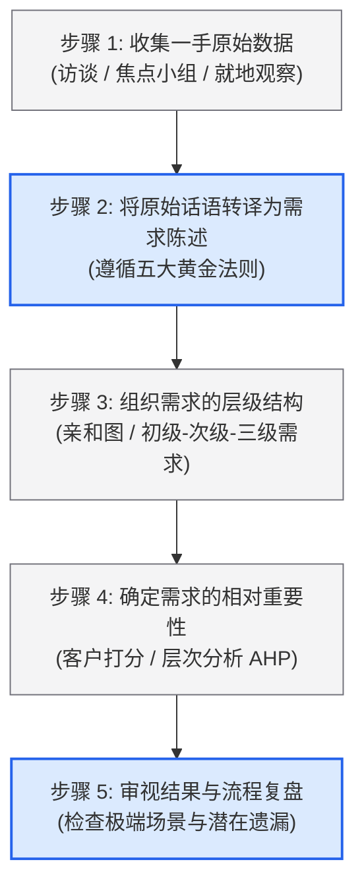

# Lec 3 客户需求分析（Identifying Customer Needs）

> MIT 15.783J / 2.739J · Product Design and Development · Spring 2026  
> 核心教材：*Product Design and Development* (8th Edition) Chapter 5  
> 拓展参考：Dev Patnaik & Robert Becker, *Needfinding*; Abbie Griffin & John Hauser, *The Voice of the Customer*; Clayton Christensen, *Jobs to be Done*

## TL;DR

- 客户需求是解法中立的，描述产品“必须做什么”（What）以创造价值，绝非具体物理实现或技术度量指标（How / Specifications）。
- 识别客户需求遵循五步法：现场收集原始数据、按五大黄金法则规范转译、构建三级需求树、评定相对重要性权重，并进行闭环反思。
- Griffin-Hauser 经验定律表明，对同质细分市场进行 10–20 次深度就地访谈，即可捕获 80%–90% 的核心需求，超过该范围边际收益急剧递减。
- 真正具有突破性商业价值的是“潜在需求”（Latent Needs）；深入观察用户在真实环境中的“折中妥协”（Workarounds）是挖掘潜在需求的黄金切口。

## 一、客户需求的本质：“需求”与“规格”的分野

在新产品开发前端，团队最常犯的错误是将客户的主观愿望直接与工程技术参数混为一谈。在系统化工程方法中，“客户需求”（Customer Needs）与“产品规格”（Product Specifications）具有严格的职责划分与逻辑顺序。

需求完全存在于用户的语言体系与生活情境中，它表达的是用户期望达成的状态、面临的痛点或体验感受（如“螺丝刀在昏暗环境中也能看清螺丝槽”）。而规格则是工程团队为了满足该需求而设定的可度量物理指标（如“前端 LED 提供照度 $\ge 150\text{ lux}$，色温 $4000\text{K}$”）。

过早引入技术规格会扼杀潜在的设计自由度。需求识别阶段的核心任务，是在完全不考虑任何特定工程实现的前提下，高质量、全面地建立起一张解法中立的“需求之网”。

---

## 二、客户需求识别五步法（Ulrich & Eppinger 经典方法）

教材第 5 章通过 Nest 智能恒温器等经典案例，提炼出了一套严谨、可追溯的标准操作流程（SOP）：



### 1. 步骤 1：从现场收集一手原始数据

获取客户数据的主要途径包括一对一访谈（One-on-One Interviews）、焦点小组（Focus Groups）与就地观察探查（Contextual Inquiry / Observation）。在硬件和创新消费品开发中，**一对一就地访谈结合实地观察**是最具信息密度的方法。

- **情境调查（Contextual Inquiry）：** 必须在产品的真实使用环境（如用户的车库、厨房、施工工地）进行，而不是把用户请到单向玻璃会议室。现场环境中的尘土、狭窄空间、光照不足等物理约束，会直接激发用户的真实抱怨。
- **铅质用户与极端用户（Lead & Extreme Users）：** 领先用户（Lead Users）通常比大众市场早数月甚至数年感知到某种极端痛点，并已经自行改装工具进行应对；极端用户（如极度手残者、重度依赖者、儿童或行动不便老人）能将普通用户忽略的微小摩擦力放大十倍，是激发结构创新的宝矿。

::: theorem [Griffin-Hauser 访谈收益递减定律 (Sample Size Rule)]
MIT 教授 Abbie Griffin 与 John R. Hauser 在经典论文 *The Voice of the Customer* 中证实：在单一细分市场中，对 10 到 20 名目标用户进行充分的结构化深度访谈，就足以揭示该市场 80% 至 90% 的潜在需求。此后每增加一次访谈所能捕获的新需求数量呈指数级递减。
:::

### 2. 步骤 2：将原始数据转译为客户需求陈述

用户在访谈中表达的内容往往充满情绪、方言或特定的技术臆测。开发人员必须将其规范化转译。

::: definition [客户需求转译五大黄金原则]
1. **表达“做什么”（What），而非“怎么做”（How）：** 严禁包含具体的机构、零件或材料。
2. **保持与原始数据同等程度的特异性（Specificity）：** 避免过度抽象为毫无指导意义的套话（如“产品很好用”）。
3. **使用肯定句，避免否定句（Positive Phrasing）：** 肯定句能清晰指引功能设计的方向，而否定句往往模糊不清。
4. **陈述为产品本身的属性（Attribute of Product）：** 描述对象必须是待开发产品，而非使用者的心理或动作。
5. **严禁使用“必须”或“应该”（Avoid 'Must' and 'Should'）：** 所有需求均属于待权衡项，赋予绝对化措辞会在后续工程权衡中造成人为僵化。
:::

::: example [从访谈原话到规范需求陈述的逐条转译示范]
下表展示了团队在开发一款便携式电钻时，如何将用户的口头抱怨转译为合格的需求陈述：

| 用户现场原始记录（Raw Data） | 错误转译范例（反面教材） | 规范需求陈述（遵循五大原则） | 纠错说明 |
| :--- | :--- | :--- | :--- |
| “夏天干活手上全是汗，这玩意老打滑，抓不住。” | 该电钻外壳应采用防滑双色注塑橡胶包胶。（错误） | 电钻在手掌潮湿或出汗时提供牢固的摩擦力与抓握稳定性。 | 错误范例预设了“双色注塑橡胶”解法；规范语句保留了摩擦力本质。 |
| “天黑在配电箱里修电，单手根本摸不着螺丝眼。” | 电钻前部必须装一个高亮 LED 探照灯。（错误） | 电钻照亮紧固件及其紧邻的作业工作面。 | 错误范例使用了禁忌词“必须”并指定了“LED”；规范语句聚焦照明属性。 |
| “换批头太费劲了，还得找那个小扳手，老丢。” | 电钻不要让用户丢扳手。（错误） | 电钻无需专用独立工具即可快速更换作业夹头。 | 错误范例为无效否定句；规范语句使用肯定句阐述免工具更换能力。 |
| “电池用一会儿就没电了，关键充得太慢了。” | 电钻电池很大。（错误） | 电钻单次充满电后支持高负荷连续作业数小时；电钻支持快速补充电能。 | 错误范例缺乏特异性；规范语句将其拆解为续航容量与补能速度两个独立属性。 |
:::

### 3. 步骤 3：构建三级需求树（Organize into Hierarchy）

一次全面的调研通常会产出 50 到 200 条具体的需求陈述。团队需要运用**亲和图法（Affinity Diagramming）**，将这些散乱的便签按语义亲和性进行聚类分组：

- **初级需求（Primary Needs）：** 最高抽象层级，通常代表产品的大核心功能群（如“提供充足的切削动力”、“便于携带与储存”、“保障操作人员人身安全”）。一套产品通常包含 3–8 个初级需求。
- **次级需求（Secondary Needs）：** 初级需求下的展开维度（如在“便于携带”下，展开为“易于装入常用工具箱”、“自重轻”、“具备防跌落手绳挂孔”）。
- **三级需求（Tertiary Needs）：** 针对极其复杂的系统（如汽车、手术机器人），次级需求下可进一步细分出具体的微观体验细节。

### 4. 步骤 4：确定需求的相对重要性

资源与物理定律决定了产品不可能在所有维度同时做到极致。为了在后续概念评估中合理取舍，必须对需求赋予重要性权重：
- **李克特量表法（Likert Scale）：** 组织 50–100 位目标用户，针对整理后的次级需求清单，按照 1（完全不重要）到 5（极其关键，不可或缺）进行独立量化打分。
- **层次分析法（AHP）：** 在成对对比（Pairwise Comparison）中，迫使用户在两项相互冲突的需求之间做出二选一的抉择，以消除“所有功能我都想要”的通胀心理。

---

## 三、Needfinding 哲学与 Jobs-to-be-Done 理论

### 1. Dev Patnaik 的 Needfinding 核心洞察

斯坦福大学 d.school 核心奠基人 Dev Patnaik 在 *Needfinding* 中指出，客户往往无法用语言准确说出自己的需求，因为人类具有极强的环境适应性。当某个工具设计拙劣时，用户会自发发明各种古怪的“临时折中办法”（Workarounds）。

::: insight [用户的“临时折中办法”是挖掘潜在需求的最高价值矿脉]
当你在现场看到用户用透明胶带绑着电线、在开关旁贴手写便签提醒顺序、或者特意垫一块抹布来减震时，千万不要觉得用户操作不规范！这些怪异的“补丁行为”恰恰是现有竞品存在严重缺陷的无可辩驳的物理证据。每一个被用户广泛采用的民间折中法，背后都藏着一个数十亿美元的潜在产品机会。
:::

### 2. Clayton Christensen 的 JTBD（用户待办任务）框架

哈佛商学院克莱顿·克里斯坦森教授提出的 Jobs-to-be-Done 理论指出：“用户并不是购买产品，而是把产品‘雇佣’（Hire）过来完成某项生活中的进展（Progress）。” 一个完整的任务包含三个层级：
1. **功能性任务（Functional Job）：** “我需要在两块厚木板之间牢固连接，打一个孔。”
2. **情感性任务（Emotional Job）：** “我希望在手工制作中感到自己是一个干练、专业、有掌控力的人，避免在家人面前显得笨拙。”
3. **社会性任务（Social Job）：** “我希望朋友参观我的家庭工作室时，看到这些工具能认可我的品味和对品质的追求。”

如果团队仅仅盯住功能性任务，往往会陷入同质化的参数内卷；只有兼顾情感与社会性任务，才能打造出具有品牌溢价与情感黏性的伟大产品。

---

## 四、Kano 模型与潜在需求挖掘

日本质量管理大师狩野纪昭（Noriaki Kano）提出的 Kano 模型，深刻揭示了不同类型的需求对用户满意度的非线性影响：

```text
满意度 (Satisfaction)
      ▲
      │                 [魅力型需求 / 潜在需求] (超出预期，带来极大惊喜)
 极高 │                       /
      │                      / 
      │                     /    [期望型需求] (性能越强，满意度线性增加)
      │                    /   /
 默认 │                   /  /
 ───┼──────────────────/─/──────────────────────► 物理实现程度 (Execution)
      │                / /
      │               // 
 极低 │              /   [基本型需求] (理所应当，不满足则极其愤怒)
      ▼
```

1. **基本型需求（Must-be / Dissatisfiers）：** 客户认为理所当然的属性（如水壶不漏水、电钻开关按下即转）。做得再好用户也不会额外表扬，但一旦缺失会导致灾难性差评。
2. **期望型需求（One-dimensional / Satisfiers）：** 性能与满意度呈线性正比（如电池续航时间、充电功率、电机扭矩）。越强越好，通常是竞品间打参数战的核心阵地。
3. **魅力型需求（Attractive / Latent Needs）：** 用户从未提出过、甚至无法想象的全新属性（如当年 iPhone 的多点触控电容屏、Nest 的自动学习环境温度曲线）。缺失时用户不会抱怨，但一旦实现会引发强烈的惊喜与口口相传。

::: pitfall [将用户的解法建议（How）直接误判为客户需求（What）]
当被问及需要什么时，客户往往会基于自己已知的狭隘经验提出解法。例如福特著名的名言：“如果我当年去问顾客想要什么，他们会告诉我想要一匹更快的马。” 顾客表达的解法是“更快的马”，但其底层不变的真实需求是“更快、更安全、更舒适地从 A 点到达 B 点”。优秀的产品团队必须穿透解法迷雾，精准锁定底层需求。
:::

---

## 五、思考题与方法论延伸

1. **现场调查实操方案设计：** 针对“医院重症监护室（ICU）输液架频繁倾倒与线缆缠绕”的痛点，如果由你的团队执行一次为期 3 天的现场调研，你将如何选择访谈对象（护士、护工、病患、医疗设备维修工）？在访谈中你将使用哪些非引导性提问来避免获得虚假回答？
2. **Kano 动态漂移分析：** 为什么五年前被视作“魅力型”的汽车中控大屏触控交互，在今天往往变成了用户的“基本型”甚至“引发驾驶分心的负面型”需求？这种演进对硬件团队的跨周期产品规划提出了何种严峻考验？
