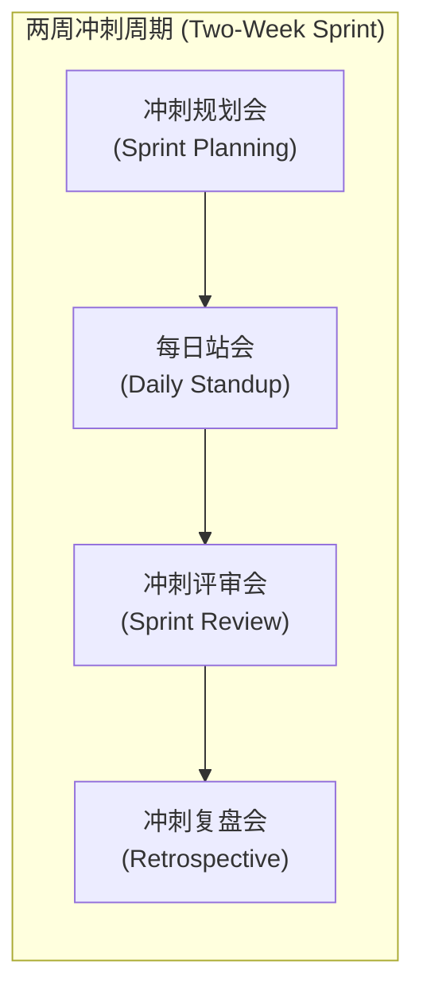

# Lec 4 敏捷开发过程（Agile Development Process）

> MIT 15.783J / 2.739J · Product Design and Development · Spring 2026  
> 核心教材：*Product Design and Development* (8th Edition) Chapter 19  
> 拓展参考：Scrum Alliance, *The Scrum Guide*; CoLab Software, *Agile for Hardware*; Steven Eppinger & Tyson Browning, *Design Structure Matrix Methods and Applications*

## TL;DR

- 传统硬件开发深受长周期瀑布模型的“后期集成爆炸”之苦；敏捷硬件开发通过固定节奏的短冲刺，迫使团队在极早期暴露系统级物理与逻辑冲突。
- 在实体产品开发中，Scrum 增量（Increment）的本质不是最终量产零件，而是能够“退休最高风险”的可测试物理模型或关键实验证据。
- 设计结构矩阵（DSM）揭示了任务间的串行、并行与耦合关系；通过架构解耦与模块化设计，可以大幅消除跨学科团队在冲刺中的等待浪费。
- 硬件敏捷必须与供应链物理规律握手：采用“敏捷冲刺 + 阶段门锁线”（Agile-Stage-Gate Hybrid）的混合架构，妥善处理长交期元器件与昂贵模具。

## 一、瀑布模式的困境与硬件敏捷的必然性

在过去数十年中，传统硬件开发通常严格遵循线性的瀑布模型（Waterfall Model）或经典阶段门（Stage-Gate）：只有当系统所有子系统的 CAD 图纸完全冻结后，才统一启动零件采购与开模。

然而，这种模式隐藏着致命的“集成风险后置”陷阱。在开发周期的前 70% 时间里，各个专业（工业设计、嵌入式固件、机械结构、传感器算法）都在各自的虚拟文件与理想假设中工作。直到样机组装阶段，各种未曾预料的热干涉、公差累积超差、信号串扰和用户可用性反直觉问题才会集中爆发，导致代价高昂的图纸重绘与模具报废。

```text
传统瀑布模式：不确定性与风险在后期断崖式暴露
风险水平
  ▲
高│                                    [后期集成爆炸 / 严重返工]
  │                                           /\
  │                                          /  \
低│─────────────────────────────────────────/────\───► 时间
  0% (需求)     25% (理论设计)     50% (图纸冻结)   80% (首发样机)

敏捷硬件开发：通过固定双周冲刺实现风险阶梯式退休
风险水平
  ▲
高│  ┌───┐
  │  │   └───┐ (Sprint 1 需求假说退休)
  │  │       └───┐ (Sprint 2 关键物理原理验证)
  │  │           └───┐ (Sprint 3 核心功能工作模型验证)
低│  │               └───┐ (Sprint 4 制造与装配热点暴露)
  └──┴───────────────────┴────────────────────────► 时间
```

敏捷硬件开发并不是盲目照搬互联网软件的“每日发布”，而是借用敏捷的核心哲学：**用最短的反馈回路、最小的沉没成本，取得决定性的物理世界事实。**

::: theorem [敏捷反馈延迟成本定律 (Cost of Feedback Delay)]
一项隐藏的设计缺陷在概念阶段暴露并修改的成本如果记为 $1$；若在详细设计阶段暴露，修改成本约为 $10$；若在模具开好、首批试产装配线上暴露，修改成本将超过 $100$ 至 $1000$。敏捷开发的核心经济学逻辑在于通过极度前置的物理测试，拦截高倍率的返工成本放大。
:::

---

## 二、Scrum 框架在产品开发中的映射与重构

Scrum 是目前应用最为广泛的敏捷协作框架。当将其从纯代码环境移植到机械、电气、设计交织的硬件产品开发时，其核心角色、工件与事件需要被赋予新的物理意义：

### 1. 三大核心角色的权责重塑

- **产品负责人（Product Owner, PO）：** 负责定义“做什么”（What）。PO 不仅要对接最终客户与赞助商，更要维护基于商业风险与技术不确定性的全局待办列表，拥有决定每个冲刺价值优先级的最终裁决权。
- **敏捷教练（Scrum Master / Agile Coach）：** 负责优化“怎么做”（How）。不直接下达技术指令，而是消除跨职能壁垒（如创客空间 3D 打印机排队瓶颈、外购标准件物流延误），守护团队冲刺节奏。
- **跨职能研发团队（Cross-Functional Developers）：** 打破学科界限的自治小组（通常 5–9 人）。机械工程师、ID 设计师、电子硬件工程师与市场分析师并肩作战，共同认领并对冲刺增量负全责。

### 2. 敏捷三大工件的实体化表达

- **产品待办列表（Product Backlog）：** 包含用户故事、系统规格要求、制造探索项以及技术尖刺（Spikes）的动态清单。按“风险退休价值”自上而下严格排序。
- **冲刺待办列表（Sprint Backlog）：** 团队在当前两周冲刺中承诺完成的高优先级任务集合，粒度细化至 4–16 小时内可交付的具体物理或分析动作。
- **增量（Increment / 物理验证样机）：** 冲刺结束时必须产出的客观成果。在硬件项目中，它可以是纸板草模、激光切割功能测试架、打样调试好的单片机电路板或经过真实用户测试的交互走查报告。

### 3. 五大事件的跨学科实践



- **冲刺规划（Sprint Planning）：** 团队评估当前最迫切需要消除的系统假设，抽取待办项并拆解为具体实验与制作任务，明确本轮“完成的定义”（Definition of Done, DoD）。
- **每日站会（Daily Standup）：** 严格控制在 15 分钟以内。成员站在物理看板或敏捷白板前回答：昨天为冲刺目标交付了什么？今天计划交付什么？遇到了什么阻碍我推进的物理或信息障碍？
- **冲刺评审（Sprint Review）：** 聚焦于成果演示。团队向利益相关者现场展示物理模型与实验测试数据，不讲虚无的幻灯片套话，只展示真实原型的功能表现与用户反馈。
- **冲刺复盘（Retrospective）：** 聚焦于团队协作过程反思。复盘哪些流程运作顺畅、哪些沟通产生摩擦、如何改进创客空间的材料准备流程。

---

## 三、风险退休待办（Risk Retirement Backlog）与冲刺级进

在 MIT 15.783 课程的实践中，全学期 14 周被精巧地划分为五个为期两周的敏捷冲刺。每个冲刺的命名与目标，均严格对应产品开发生命周期中的特定风险等级：

```text
[Sprint 1: 领域研究] ──► [Sprint 2: 概念模型] ──► [Sprint 3: 工作模型] ──► [Sprint 4: 精炼模型] ──► [Sprint 5: Alpha原型]
 (市场与痛点风险)          (核心原理可行性)          (物理系统与参数)          (工艺与制造成本)          (全系统商业闭环)
```

::: definition [风险退休待办列表 (Risk Retirement Backlog)]
风险退休待办列表是一种按“假设被推翻时可能造成的破坏力与当前不确定性乘积”进行动态排序的任务清单。每个待办项均以一项明确的待验证假说为核心，其终点是获得足以支持决策的客观物理证据。
:::

::: example [双周冲刺中的硬件工作拆解与完成定义 (DoD)]
以开发“可折叠轻便型雪崩搜救雪层密度探针”为例，在 Sprint 2（概念模型）中的任务拆解与 DoD 规范：

- **待验证假说：** 机械式连杆自锁机构在零下 15 摄氏度结冰环境下仍能实现单手一秒展开锁定。
- **冲刺任务拆解：**
  1. 机械工程师设计两种不同的自锁卡扣 3D 打印模型（FDM 打印，耗时 8 小时）。
  2. 工业设计师制作手柄人机握持泡沫草模，测试戴厚防寒手套时的抓握手感（耗时 6 小时）。
  3. 采购两组不锈钢拉簧与快速插销标准件（耗时 24 小时物流）。
  4. 搭建低温冷冻测试箱实验，将模型喷水冷冻 4 小时后进行 20 次盲操展开测试（耗时 4 小时）。
- **完成的定义（DoD）：**
  - 产出至少两套物理实物样件；
  - 在零下 15 度实测中取得可靠锁紧率数据记录；
  - 拍摄 30 秒高帧率操作视频并记录力矩扳手测试数值；
  - 形成一页纸结论更新至团队技术知识库。
:::

::: insight [冲刺评审不是工作汇报，而是以物理原型为中心的风险现场清算]
许多初入敏捷的硬件团队常把评审会变成展示精美 PPT 的汇报会。这是极具欺骗性的形式主义！真正的冲刺评审，必须把桌子正中留给那个简陋、甚至还裸露着杜邦线和热熔胶的物理样机。评审的核心提问只有三个：“它能按预期工作吗？”、“用户摸过之后说了什么？”以及“我们推翻了之前的哪项狂妄假设？”。
:::

---

## 四、设计结构矩阵（DSM）与任务解耦

教材作者 Steven Eppinger 教授是设计结构矩阵（Design Structure Matrix, DSM）领域的权威。在复杂的物理产品开发中，任务之间往往存在错综复杂的交互关系。Eppinger 将任务依赖分为三种基本类型：

```text
1. 串行依赖 (Dependent / Sequential)      2. 并行独立 (Independent / Parallel)      3. 双向耦合 (Coupled / Iterative)
      Task A ──► Task B                        Task A                                 Task A ◄───► Task B
  (先设计好发动机，再设计机舱)               (外包装盒设计与说明书编写)               (电机尺寸与减速箱齿轮比相互决定)
```

当任务双向耦合时，敏捷冲刺极易陷入无休止的“等待你修改完我才能设计”的死循环。利用 DSM 矩阵，团队可以清晰识别出耦合模块，并通过以下工程手段完成解耦：
1. **定义标准化接口（Standardized Interfaces）：** 在详细参数未定前，先锁定两模块间的物理连接尺寸、电压范围与数据协议边界。
2. **设立参数预算（Parameter Budgeting）：** 为每个子系统分配严格的功耗上限（如 5W）、重量上限（如 200g）与体积包络线。在预算内，各小组可以完全自主并发冲刺。

::: pitfall [将敏捷当成无计划的任性：忽视长交期元器件采购与供应链节拍]
纯软件可以随时随地修改代码并重新编译，但物理世界受制于严苛的自然定律与供应链交付周期。定制铝合金压铸模具通常需要 6–8 周，车规级主控芯片海外采购可能需要 12 周。如果团队以“我们是敏捷开发”为借口推迟系统物料清单（BOM）的长交期选型，项目必将在临近截止时因缺料而彻底瘫痪。
:::

---

## 五、思考题与方法论延伸

1. **敏捷与阶段门的混合设计：** 假设你的团队正在开发一款便携式家用浓缩咖啡机。请根据冲刺节奏，将“压力泵选型”、“加热腔体结构”、“外观人机工程”与“长交期注塑外壳模具开模”四个核心任务，合理规划进五个冲刺及后续量产阶段门中，并解释你如何防范模具修改的风险？
2. **DSM 解耦实战：** 在设计一款手持无线吸尘器时，“电池包电芯排列方式”、“电机散热风道走向”与“整机重心手柄人机工程”三者存在强耦合。团队应当如何在冲刺规划会上设立前置接口规范，以允许机械工程师与工业设计师并行工作？
