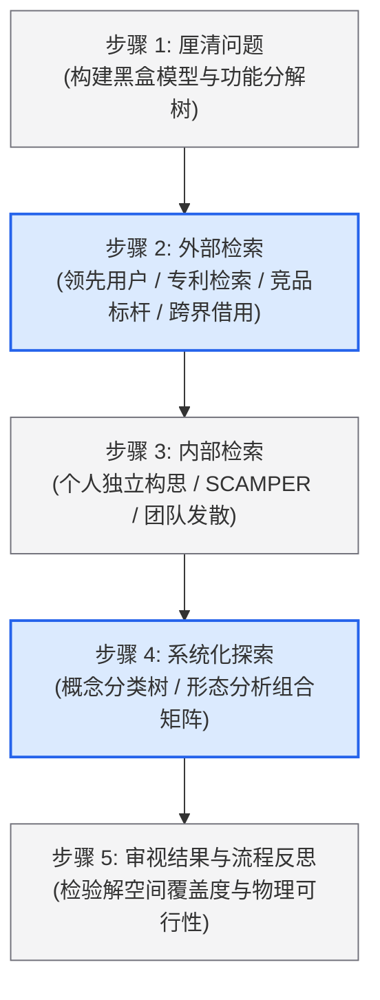

# Lec 5 创造力与概念生成（Creativity and Concept Generation）

> MIT 15.783J / 2.739J · Product Design and Development · Spring 2026  
> 核心教材：*Product Design and Development* (8th Edition) Chapter 7, 8  
> 拓展参考：TED, *The Creative Spark*; Genrich Altshuller, *TRIZ Theory*; Alex Osborn, *Applied Imagination (SCAMPER)*

## TL;DR

- 产品概念是对产品工作原理、基本物理形态和核心用户体验的近似技术描述，决定了产品潜在价值空间的上限。
- 结构化概念生成遵循五步法：厘清问题（功能分解）、外部检索（专利与竞品）、内部检索（个人发散与 SCAMPER）、系统化探索（分类树与形态分析矩阵）及闭环反思。
- 功能分解将复杂的整体系统拆解为能量流、物料流和信号流的子功能网络，有效打破团队对现有具体产品形态的“功能固着”。
- 概念发散遵循“先发散拉大方差、后系统矩阵组合”的原则，严禁被第一个看似可行的平庸方案诱导而过早收敛。

## 一、概念生成的本质与认知阻碍

产品概念（Product Concept）是连接“用户需求”与“详细工程图纸”的关键桥梁。在产品开发生命周期中，后续 80% 的制造成本和可靠性风险，往往在概念确立的瞬间就已经被锁死。

然而，未经训练的开发团队在构思新方案时极易陷入两种常见的认知陷阱：
1. **过早锁定第一直觉：** 团队成员在脑海中闪现出第一个看似可行的结构方案后，便停止探索，将后续精力全部倾注于证明该方案的可行性。
2. **功能固着（Functional Fixedness）：** 受到现有市场上竞品形态的强力心理锚定，默认某种功能只能由特定的传统机械构件或现成部件来实现。

结构化概念生成方法并不压抑个人的艺术灵感，而是通过一套强制拆解、跨界搜索与组合矩阵的工程化流程，确保团队系统性地遍历潜在的解空间。

::: definition [产品概念 (Product Concept)]
产品概念是对产品工作原理（Working Principle）、物理构型（Physical Form）与核心技术特征的结构化近似描述，它清晰解释了产品将如何满足关键客户需求，通常以带标注的工程草图、简短文字说明或粗糙物理模型呈现。
:::

---

## 二、概念生成五步法（Ulrich & Eppinger 结构化流程）

教材第 7 章以经典的“手持无绳屋顶射钉枪”开发为例，展示了严谨的概念生成五步法：

### 1. 步骤 1：厘清问题与功能分解（Functional Decomposition）

面对复杂系统，首要任务是将其分解为更小、更容易独立攻克的技术子问题。

- **构建黑盒模型（Black Box Model）：** 抽象掉一切内部机械零件，仅将产品视作一个变换器，梳理输入与输出的三大流向：
  - **能量流（Energy）：** 电能、化学能、气压能、人力机械能等；
  - **物料流（Material）：** 紧固件、液体、灰尘、被加工原材料等；
  - **信号流（Signal）：** 控制触发信号、传感器状态、警示灯与用户显示。
- **子功能块拆解（Sub-functions）：** 沿着三大流向绘制功能图。例如无绳射钉枪的核心功能分解为：“储存能量” $\to$ “将能量转化为机械动能” $\to$ “施加动能至钉子” $\to$ “从料夹分离单个钉子” $\to$ “感知工件表面贴合状态”。

### 2. 步骤 2：外部检索（External Search）

外部检索旨在寻找已有技术方案并站在巨人肩膀上思考，避免盲目“重复发明轮子”：
- **领先用户（Lead Users）：** 走访每天连续作业 8 小时以上的资深屋顶建筑工人，观察他们如何改装旧工具以防卡钉。
- **发明专利检索（Patent Search）：** 利用 Google Patents 或国家专利局数据库，系统查阅相关领域的到期与现行专利，剖析其独立权利要求书中的物理机械连杆与气动结构。
- **文献与竞品拆解（Benchmarking）：** 购买市场上最具竞争力的 3 款竞品进行“破坏性逆向拆解”（Tear-down），测算其电机功率、减速比及核心受力件材料。
- **跨行业专家咨询：** 咨询气步枪弹药专家（化学能瞬间释放）、内燃机研发工程师或弹簧储能机械专家。

### 3. 步骤 3：内部检索（Internal Search）与创造力技法

内部检索依赖团队自身的知识储备与潜意识联想。研究表明，**个人先独立思考、随后再进行小组汇总**的模式，其产出创意的多样性远高于一上来就进行吵闹的群体头脑风暴。

- **消除评判（Defer Judgment）：** 在发散阶段，严格禁止任何人说出“这在成本上不可能”或“以前有人试过失败了”。
- **欢迎荒谬点子（Welcome Wild Ideas）：** 极端甚至违背常理的点子往往是跨越常规技术轨道的桥梁。
- **SCAMPER 联想催化工具：**
  - **S（Substitute 替代）：** 能否用压缩空气或高压液氮替代传统飞轮蓄能？
  - **C（Combine 组合）：** 能否将料夹弹簧推进机构与触发扳机手柄复合成单一冲压件？
  - **A（Adapt 借鉴）：** 能否借鉴弓弩释放箭支的挂机触发机构？
  - **M（Modify/Magnify 放大或变形）：** 能否将瞬时单次冲击改为高频微震动旋入？
  - **P（Put to other uses 他用）：** 动力核心能否模块化抽离作为通用手持动力源？
  - **E（Eliminate 消除）：** 能否完全消除飞轮传动齿轮箱，采用直线电机直接驱动？
  - **R（Reverse 逆向）：** 不推钉子进入木头，而是拉紧基板？

### 4. 步骤 4：系统化探索（Systematic Exploration）

这是将散乱碎片系统组合为完整产品概念的核心步骤。

#### A. 概念分类树（Concept Classification Tree）
以最核心的“能量转换原理”为主干进行分支分类，例如划分为：化学能释放（微型火药燃气驱动）、电磁能驱动（直流无刷电机加重型飞轮）、气压储能（微型气泵加高压气室）、机械弹力储能（强力扭簧凸轮压缩）。分类树能帮助团队清晰审视是否遗漏了某一物理分支。

#### B. 形态分析矩阵 / 概念组合表（Morphological Matrix）
将各子功能的候选技术解列在矩阵中，通过跨行排列组合，激发出成百上千种潜在的概念方案。

::: example [手持无绳射钉枪的形态分析矩阵与概念路径合成]
下表展示了团队构建的形态分析矩阵，横向展示了三个核心子功能各自的候选技术解：

| 子功能（Sub-function） | 方案 A（Option A） | 方案 B（Option B） | 方案 C（Option C） | 方案 D（Option D） |
| :--- | :--- | :--- | :--- | :--- |
| **子功能 1：能量储存** | 高压压缩气瓶（Pneumatic） | 锂电池组（Li-ion Battery） | 燃气丁烷气罐（Gas Cartridge） | 重型机械弹簧（Spring） |
| **子功能 2：能量转化** | 直流电机带凸轮机构 | 旋转飞轮带离合摩擦轮 | 微型火花塞点火内燃腔 | 高速电磁直线电磁铁 |
| **子功能 3：单钉进料分离** | 恒力卷簧推力料夹 | 伺服步进电机主动送料 | 气缸分级反冲步进排杆 | 重力自重滑道 |

- **概念路径 1（传统飞轮混合方案）：** 锂电池组 $\to$ 高速电机带动沉重飞轮蓄能 $\to$ 扳机触发螺线管离合器啮合驱动撞针 $\to$ 恒力卷簧推钉。
- **概念路径 2（纯电磁直线脉冲方案）：** 锂电池组 $\to$ 大容量高压脉冲电容瞬间放电至直线电磁线圈 $\to$ 驱动强磁铁撞针冲击 $\to$ 步进电机精确排料。
:::

---

## 三、概念选择前置：筛选与评分矩阵

生成数十个概念后，团队需要运用教材第 8 章的结构化评估方法将其收敛：

1. **概念初筛矩阵（Concept Screening - Pugh 矩阵法）：** 选定一个市场现有基准产品（Benchmark）作为基准（全部标记为 $0$）。将候选概念与基准在各项关键客户需求维度逐一对比，优于基准记为 $+$，劣于基准记为 $-$，相同记为 $0$。迅速剔除明显处于劣势的概念，并设法将优选方案中的亮点相互融合。
2. **概念评分矩阵（Concept Scoring）：** 为入围的 3–5 个精炼概念赋予需求重要性权重（$w_i$），按 1–5 分进行深度量化打分，计算加权总分并进行敏感度分析。

::: theorem [方案空间探索完备性定理]
一个高质量产品开发团队的信心，不应来自于对某个特定方案的狂热盲信，而应来自于确信团队已经系统遍历了整个解空间（Solution Space）。未被探索的盲区往往隐藏着颠覆性的致命竞争对手。
:::

::: insight [独立深度思考与团队无评判发散的交替节奏]
高效的创新团队绝不是全天绑在一起开会。最具生产力的模式是“发散前的孤独深潜，收敛前的多维碰撞”。每位工程师和设计师先带着功能分解树进行 4 小时的独立闭门画草图，再将数十张草图贴满白板进行无批判串联。这样既能保护小众怪异创意的火苗，又能借助集体智慧完成形态矩阵的跨界拼装。
:::

::: pitfall [过早收敛陷阱：被第一个看似可行的平庸概念所捕获]
很多团队在头脑风暴前 15 分钟提出一个方案，大家发现“这东西现成零件都能买到，肯定能做出来”，便立刻停止发散。这种“能做出来”的平庸方案往往意味着市场上早已有数十家同质竞品在打残酷的价格战。概念发散的核心职责是逼迫团队走出技术舒适区。
:::

---

## 四、思考题与方法论延伸

1. **功能黑盒拆解实战：** 针对“智能宠物自动喂食器”，请绘制其能量流、物料流（不同粒径宠物干粮）与信号流的完整黑盒与子功能分解图，并列出最容易发生“机械卡死”的子功能环节。
2. **形态矩阵发散训练：** 为上述喂食器的“出粮防卡堵机构”建立一个至少包含 4 种不同工作原理（如重力叶轮、柔性硅胶拨片、振动料斗、倾斜螺旋输送器）的形态分析矩阵，并组合出两种具有截然不同成本与可靠性特征的概念方案。
