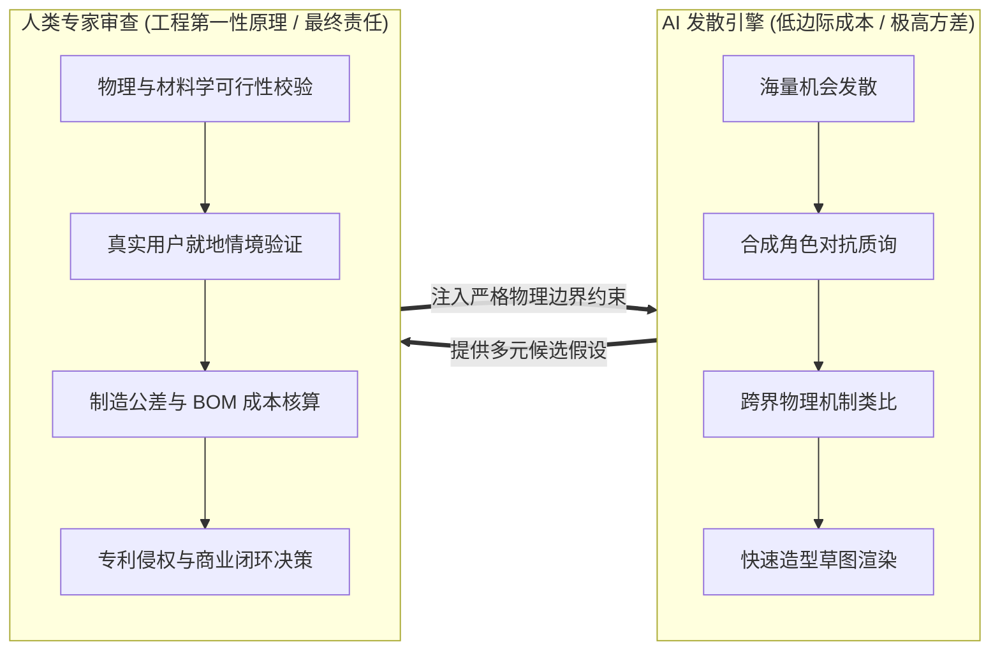
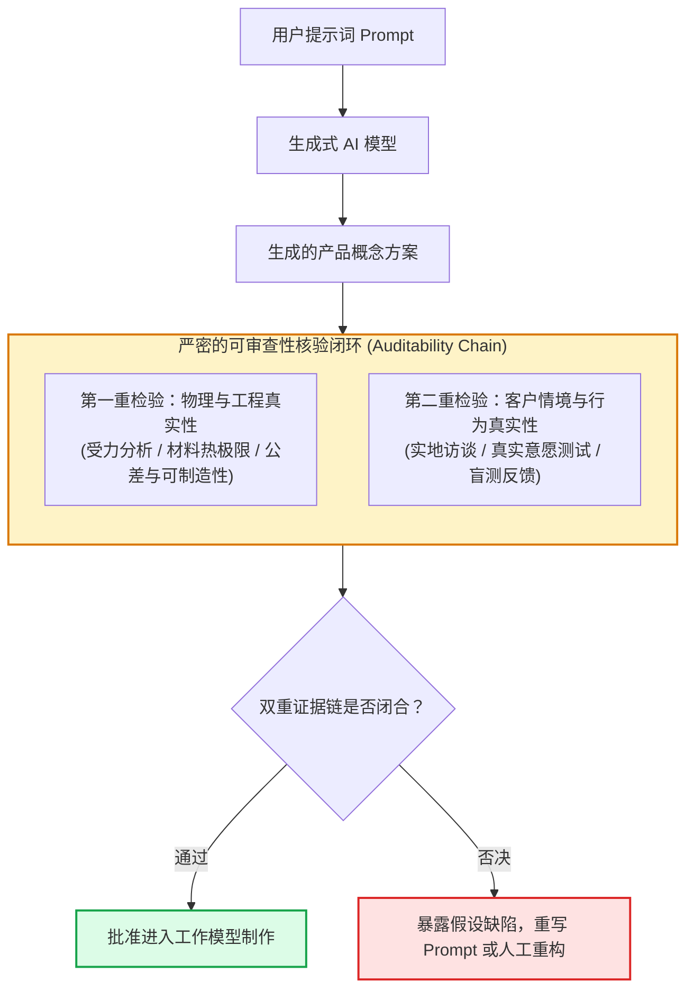

# Lec 6 用生成式AI支持创新（Generative AI for Innovation）

> MIT 15.783J / 2.739J · Product Design and Development · Spring 2026  
> 核心参考：MIT 15.783 Class 7 Syllabus; Harvard Business Review (2025), *Eight Prompts for Creativity*; Christian Terwiesch & Karl Ulrich, *Research on LLMs in Innovation*

## TL;DR

- 生成式 AI（LLM 与视觉扩散模型）是产品创新团队的“认知副驾驶”，能以极低边际成本拓宽机会与概念解空间的变异度（Variance）。
- 有效的 AI 创新依赖结构化提示工程（Prompt Engineering），通过角色注入、反事实假设和多轮链式推理打破人类设计者的局部认知偏见。
- AI 的核心局限在于缺乏对物理定律（重力、公差、热膨胀、摩擦力）与真实人体尺寸的接地感知，极易生成看似惊艳但工程不可行的“幻觉概念”。
- 严密的可审查性（Auditability）是团队的核心责任：所有 AI 产出必须接入严谨的工程第一性原理与真实客户测试构成的双重证据链。

## 一、生成式 AI 在产品开发流程中的角色定位

随着大语言模型（LLM）与多模态扩散模型（Diffusion Models）的爆发，产品开发前端（Front-End Innovation）的生产力曲线正在被彻底重塑。在以往需要数周准备的头脑风暴、文献检索和手绘草图探索，如今可以在数小时内完成初步发散。然而，技术的快速演进也引发了开发团队对“AI 是否会完全替代人类工程师与设计师”的普遍焦虑。

MIT Sloan 管理学院与机械工程学院的实证研究表明：**生成式 AI 不会替代跨学科设计团队，但掌握并深度整合 AI 协作工具的团队将迅速淘汰固守传统的团队。** 关键在于清晰界定人类专家与人工智能之间的能力边界与互补分工。

人工智能本质上是一个低边际成本、超大规模但缺乏物理世界常识的发散引擎。它通过吸收全人类海量的跨学科知识库，能够在瞬间提供不可思议的联想组合与高变异度假设；而人类专家则拥有不可替代的物理常识、工程第一性原理、审美直觉、深层共情以及承担商业成功与人身安全的终极责任。两者之间的理想协作不是单向的指令替代，而是一场多轮高频的认知对抗与双向增强：

---

## 二、生成式 AI 赋能产品创新的四大实操工作流

在 MIT 15.783 的课堂实训中，团队将生成式 AI 深度嵌入双钻模型的前三个阶段：

### 1. 阶段 1：机会探索与极端用户合成模拟（Synthetic Persona）

当团队无法立即接触到极其小众或敏感的极端用户（例如罕见病患者、深海潜水员或极地考察队员）时，可以利用大模型强大的上下文学习能力，构建具有特定认知偏见与生理限制的“合成用户”，展开预演式访谈：

- **反直觉角色提示（Adversarial Prompting）：** 提示大模型扮演一位“对所有智能电子产品极度反感、手部患有关节炎且视力模糊的 70 岁农场主”，对团队提出的初步机会陈述展开全方位挑刺。
- **痛点推演：** 命令模型列举出用户在使用现有竞品时，可能遭遇的 20 个最细微、最令人恼火的“微摩擦力”（Micro-frictions），以此激发潜在需求假说。

### 2. 阶段 2：功能分解与跨领域物理机制迁移

人类工程师的知识库往往局限在自己的专业细分（如机械电子）。而大语言模型跨越了生物学、材料学、流体力学与航天工程的全部公开文献：

- **仿生学机制借用（Biomimetic Analogy）：** “针对手持园艺修枝剪在剪切粗硬树枝时的卡滞问题，请检索自然界中植物种子破壳、啮齿类动物牙齿咬合或昆虫口器受力的生物力学机制，提出 5 种不同的机械杠杆或微震动解决方案。”
- **逆向黑盒探索：** 提供输入物料流与目标输出，要求模型输出能量变换路径的所有理论分支。

### 3. 阶段 3：概念发散与形态矩阵生成（HBR 提示词框架）

基于《哈佛商业评论》经典创意提示词框架，团队可以通过结构化 Prompts 快速构建高方差概念池：

::: example [用于工业产品概念生成的八步链式提示词 (Chained Prompting) 实操]
1. **系统角色设定：** “你是一位拥有 25 年消费级精密硬件经验的主任系统架构师，精通 TRIZ 理论与精益制造。”
2. **背景与情境：** “我们正在为城市独居青年开发一款紧凑型桌面衣物护理除皱设备，目标零售价 79 美元，外形体积受限于 30cm 立方体内。”
3. **输入核心功能分解：** “子功能包括：产生微米级高温蒸汽、对衣物施加轻微机械拉伸张力、收集冷凝水滴、低噪音风干。”
4. **反事实假设（Counterfactuals）：** “假设在设计中完全禁止使用传统的电加热金属发热丝与沉重的电动微型气泵，请利用高频超声波雾化、相变储能材料或微通道毛细效应，提出 3 种完全不依赖传统泵阀的核心概念。”
5. **形态矩阵输出：** 将上述子功能与候选解整理为标准 Markdown 表格，并标注各方案的关键物理失效模式。
:::

### 4. 阶段 4：从文本描述到高保真工业设计视觉生成

借助专业工业设计 AI 工具（如 Vizcom、Midjourney 及 Stable Diffusion ControlNet 插件），工业设计师可以实现从“手绘草图线稿”到“真实材料渲染图”的秒级转化：
- 设计师在 iPad 上勾勒出几笔粗糙的人机握持透视轮廓；
- 结合 ControlNet 锁定几何轮廓约束，注入提示词：“哑光喷砂阳极氧化铝合金、亲肤阻燃硅胶手柄、北欧极简主义形式语言、摄影棚柔光、8k 工业设计特写”；
- 快速生成数十张不同 CMF（色彩、材料、表面处理）的设计变体，直接用于客户概念测试卡片（Concept Testing Cards）。

---

## 三、可审查性（Auditability）与人类专家的双重证据链

生成式 AI 最大的危险在于其输出的**流畅性错觉（Illusion of Fluency）**——大模型能够用极其自信、无可挑剔的技术术语，编造出完全违反热力学定律或无法装配的伪科学机构。

::: definition [可审查的 AI 创新工作流 (Auditable AI-Augmented Innovation Workflow)]
一种严格记录所有 AI 提示词输入、原始输出版本、人工修改轨迹及工程验证测试数据的透明开发规范。它要求每一个由 AI 生成的核心假设，都必须拥有可溯源的物理实验数据或人类专家签字的计算底稿作为支撑。
:::

::: theorem [AI 概念变异度与物理可行性衰减悖论]
在大语言模型和扩散模型中，随着提示词发散度与温度参数（Temperature）的提升，概念的创意新颖性（Novelty）呈对数上升；但与此同时，概念在力学平衡、热管理及注塑脱模角等维度的工程可行性（Feasibility）呈指数级断崖式下跌。人类专家的核心工作是在极值处建立工程过滤网。
:::

::: insight [用 AI 模拟“最挑剔、最恶劣的极端用户”比直接发散概念更有价值]
初学者总喜欢让 AI“帮我设计一个完美的杯子”，得到的往往是庸俗的互联网陈词滥调。真正资深的产品专家，会把 AI 当作最刻薄的审讯官：“假设你是一名脾气暴躁、双手沾满机油的汽修工，请用极其尖酸刻薄的语气，指出这个工具手柄卡扣在冬天连续使用时会导致手指脱皮的三个隐患。”这种对抗性探查能以极高效率揭开方案的致命盲区。
:::

---

## 四、法律红线、知识产权与专利防坑指南

在产品开发团队引入生成式 AI 工具时，必须严格遵守以下法律与合规准则：

1. **避免专有商业机密污染（Data Leakage）：** 严禁将公司未公开的保密 CAD 图纸、独家配方、核心源代码直接上传至公有云的大模型免费网页端。公开模型往往会将用户对话用于后续训练，从而导致商业机密泄露。
2. **防范专利新颖性破坏（Loss of Patent Novelty）：** 专利法要求发明具备新颖性（Novelty）与非显而易见性（Non-obviousness）。一旦将未申请专利的发明方案公开发布在无保密协议的公网平台，可能被审查员判定为“公开披露”（Public Disclosure），导致丧失全球专利申请资格。
3. **AI 生成物的版权归属争议：** 根据目前美国版权局（USCO）与多国司法实践，纯粹由 AI 算法独立生成的内容不受知识产权法保护，处于公有领域（Public Domain）。只有当人类设计师在其中注入了实质性的创造性劳动（如人类绘制关键结构、进行实质性装配重组与参数计算）时，该整体方案才具备受保护的专利与版权资格。

::: pitfall [向公网生成式 AI 输入敏感技术细节导致专利新颖性丧失]
团队在准备申请发明专利前，如果直接向公共聊天机器人询问“我的这种新型棘轮自锁凸轮结构有什么改进空间”，该操作可能在法律上被视作公开披露，不仅可能被竞争对手爬取，更可能直接断送团队核心技术专利授权的可能性。所有涉及核心知识产权的探索，必须在企业级私有化沙箱中进行。
:::

---

## 五、思考题与方法论延伸

1. **AI 提示工程设计实操：** 针对“面向野外徒步露营者的轻量化便携净水器”，请编写一套包含“角色设定”、“约束边界”、“反向思考”与“物理原理指引”的多轮 Prompts，尝试激发至少 3 种脱离传统陶瓷滤芯与反渗透膜的非常规杀菌净化概念。
2. **AI 幻觉过滤审查：** 假设大模型为你生成了一个“利用环境微震动与温差热电发生器，实现完全无电池、永久自供电的物联网追踪器”概念。作为硬件工程师，你将从物理定律和能量守恒定律的哪几个定量公式出发，在 15 分钟内证伪或证实该概念的工程可行性？
