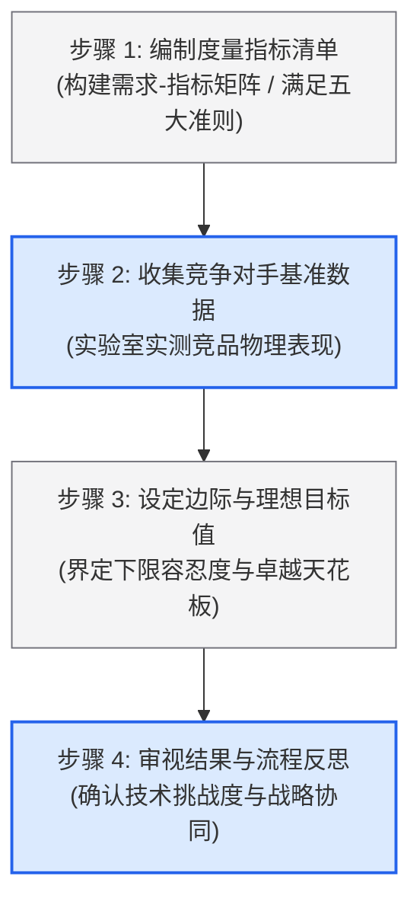

# Lec 7 产品规格（Product Specifications）

> MIT 15.783J / 2.739J · Product Design and Development · Spring 2026  
> 核心教材：*Product Design and Development* (8th Edition) Chapter 6  
> 拓展参考：Yoji Akao, *Quality Function Deployment (QFD)*; Don Clausing, *Total Quality Development*; Target Costing Methodology

## TL;DR

- 产品规格由明确的“度量指标”（Metric）和“具体数值”（Value）组成，是将定性、主观的客户需求转化为工程可验证契约的标准工具。
- 规格制定分为两个阶段：在概念选择前建立“目标规格”（Target Specs），在选定概念并完成技术与成本建模后锁定“最终规格”（Final Specs）。
- 目标规格采用“边际可接受值”与“理想目标值”的双区间界定，为后续概念发散保留必要的工程弹性与权衡空间。
- 竞品基准测试必须基于实验室物理实测数据，绝不可轻信竞品宣发彩页；目标成本法（Target Costing）必须作为不可逾越的经济规格前置确立。

## 一、产品规格的本质与两阶段确立逻辑

在产品开发前端，“客户需求”（Customer Needs）通常是用客户朴素、主观的自然语言表达的（例如“悬挂前叉骑行时感觉很柔软”、“手机充满电后耐用”）。这种定性表述无法直接指导机械工程师计算弹簧刚度，也无法指导电气工程师选择电池容量。

产品规格（Product Specifications）的使命，就是充当“客户语言”与“工程语言”之间的精准编译器。

::: definition [产品规格 (Product Specification)]
单项产品规格（Specification）严格由一个精确的**度量指标（Metric）**和一个带有物理量纲的**数值（Value）**构成。例如，“整机自重（Metric）小于 1.4 千克（Value）”。一套完整的产品规格构成了产品开发团队对市场与企业的正式技术承诺。
:::

规格的确立绝非一蹴而就，而是在整个开发前端伴随技术不确定性的收敛分两阶段完成：


1. **目标规格（Target Specifications）：** 在概念生成与选择之前确立。它代表团队在尚未确定具体物理原理时，“希望达成”的性能理想愿景与商业底线。
2. **最终规格（Final Specifications）：** 在特定产品概念被选定之后确立。此时团队根据所选概念的真实物理限制、制造公差、供应商报价和硬性工程权衡，对目标指标进行约束调和并正式锁定。

---

## 二、目标规格确立四步法（概念选择前）

教材第 6 章通过 Specialized 山地自行车前避震前叉（Suspension Fork）的真实开发案例，详细阐述了目标规格的建立步骤：



### 1. 步骤 1：编制度量指标清单（List of Metrics）

合格的工程指标必须能够直接量化特定客户需求的满足程度。在构建需求-指标关联矩阵（即质量功能展开 QFD 的核心矩阵）时，必须遵守五大准则：

::: theorem [规格度量指标构建五大准则]
1. **指标必须完备且解法中立：** 指标应直接反映需求的满足程度，不得预设具体的实现机构（如使用“前叉总行程”，而非“液压缸活塞杆长度”）。
2. **指标必须具备可测量性：** 必须能用客观物理仪器（测力计、示波器、秒表、三坐标测量仪）在实验室明确测量，避免“易用性良好”等主观词汇。
3. **指标应当是实际依赖量，而非独立设计变量：** 例如，设定“前叉在 10Hz 冲击下的加速度衰减率（依赖量）”，而非直接指定“阻尼孔直径（设计变量）”。
4. **指标应包含适当的量纲与单位：** 明确标明 SI 国际单位（$\text{kg}, \text{mm}, \text{N}\cdot\text{m}, \text{W}, \text{dB}$）。
5. **指标必须涵盖主观人因维度的标准化评测：** 针对确实无法直接物理测量的纯感官体验（如“外观豪华感”），必须转化为标准化的双盲用户评审量表（如“10 人专家盲测打分平均分 $\ge 4.5$”）。
:::

### 2. 步骤 2：收集竞争对手基准数据（Benchmarking）

团队必须采购市场上最具威胁的 3–5 款直接竞品，将其送入实验室进行解构测试。

::: insight [竞品基准测试必须在实验室用传感器实测，绝不能抄写竞品说明书]
营销宣传册上的数字往往充满水分。某竞品声称“电池续航 10 小时、整机重 800 克”，实测时往往发现在最大负荷下仅能维持 4.5 小时，且未包含电源适配器与线缆重量。只有亲手在相同基准条件下测试出的客观数据，才能暴露竞品的真实技术软肋。
:::

### 3. 步骤 3：设定边际可接受值与理想目标值

团队不能只设定一个孤立的数字，因为前端探索充满技术不确定性。Ulrich & Eppinger 建议为每个指标设定一个容忍区间：
- **理想值（Ideal Target Value）：** 团队在所有技术与供应链条件处于完美状态下所能达到的极致性能（通常大幅超越当前市场最强竞品）。
- **边际可接受值（Marginally Acceptable Value）：** 产品在商业上能够存活、不被客户唾弃的最低底线（通常持平或略高于主流平均水准）。低于该数值，产品将完全丧失市场竞争力。

::: example [山地车避震前叉的需要-指标映射与目标规格表示范]
下表展示了团队将模糊的骑行需求，转化为工程目标规格的实操样例：

| 需求编号 | 客户需求陈述（Needs） | 度量指标（Metric） | 重要度 | 物理单位 | 竞品 A 实测 | 边际可接受值 | 理想目标值 |
| :---: | :--- | :--- | :---: | :---: | :---: | :---: | :---: |
| 1 | 前叉有效吸收颠簸路面震动 | 最大垂直避震行程 | 5 | $\text{mm}$ | 80 | $> 75$ | $> 100$ |
| 1, 2 | 快速越过障碍后无剧烈反弹 | 阻尼反弹能量衰减率 | 4 | $\%$ | 65 | $> 60$ | $> 80$ |
| 3 | 整车轻巧，便于攀爬陡坡 | 前叉装配总质量 | 5 | $\text{g}$ | 1550 | $< 1600$ | $< 1350$ |
| 4 | 激烈刹车时不发生扭转晃动 | 刹车工况下的侧向刚度 | 3 | $\text{kN/mm}$ | 1.8 | $> 1.7$ | $> 2.2$ |
| 5 | 制造成本受控，零售具吸引力 | 单位出厂物料成本（BOM） | 5 | $\text{USD}$ | $42.5$ | $< \$45$ | $< \$35$ |
:::

---

## 三、最终规格设定五步法（概念选定后）

当团队选定具体概念后，技术愿景遭遇物理世界与财务定律的残酷碰撞。此时必须通过系统权衡，将目标规格收敛为最终规格：

1. **开发技术模型与物理仿真：** 建立有限元力学仿真（FEA）、热力学或电路计算模型，分析各子系统是否在物理极限之内。
2. **开发精细制造成本模型：** 结合初版工程图，向冲压、注塑或机加工供应商索取粗略报价，核算零部件材料费、开模摊销与装配工时。
3. **管理硬性工程权衡（Engineering Trade-offs）：** 识别帕累托前沿（Pareto Frontier）。例如减重（提高钛合金比例）会导致成本指标急剧恶化。团队必须基于需求重要性权重，决定在哪个性能点落位。
4. **将系统级规格向下分解（Flow Down）：** 将整机性能分解至各个零部件。例如“整机重量 $< 1400\text{g}$”被向下分配为：“外筒 $< 450\text{g}$，活塞连杆 $< 300\text{g}$，阻尼阀芯 $< 200\text{g}$，弹性元件与油液 $< 450\text{g}$”。
5. **反思与工程签字：** 团队各专业负责人（机械、电气、热控、采购）正式会签规格书，作为进入详细设计与开模的法定基线。

---

## 四、目标成本法（Target Costing）在规格中的前导约束

在现代精益产品开发中，“制造成本”绝不是设计完成后自然产生的结果，而是一个硬性的工程规格输入！

```text
传统错误模式：成本是设计的输出
[设计产品] ──► [计算零部件成本] ──► [加上目标毛利] ──► [推导售价] ──► (客户嫌贵，项目滞销)

现代目标成本法：成本是设计的硬性输入规格
[市场容忍售价 P_market] ── [企业目标毛利 Margin] ──► 【允许制造成本 C_target】 ──► (在预算内逆向工程)
```

$$\text{Target Cost} = \text{Target Selling Price} \times (1 - \text{Target Gross Margin})$$

如果一款智能保温杯的目标市场零售价被锁定为 49 美元，渠道商抽成 40%，企业目标毛利率为 50%，则倒推留给开发团队的单位制造成本（BOM + 装配 + 包装）上限绝对不能超过：
$$49 \times (1 - 0.40) \times (1 - 0.50) = 14.7 \text{ 美元}$$
在后续的所有概念细化中，凡是导致成本突破 14.7 美元的奢华设计，均属于违反产品规格的“工程不合格”。

::: pitfall [将主观形容词当成技术指标，导致下游工程师无法验证]
如果在规格书中出现“手柄按压阻尼感极佳”、“外壳接缝严密”或“屏幕清晰”等主观描述，下游制造厂与质检部门将完全无法执行验收。必须全部量化为物理语言：“按键行程 $2.0 \pm 0.2\text{ mm}$，按压力度 $1.8 \pm 0.2\text{ N}$”、“外壳拼接面断差（Flushness） $< 0.15\text{ mm}$，间隙（Gap） $< 0.25\text{ mm}$”。
:::

---

## 五、思考题与方法论延伸

1. **工程权衡曲线分析：** 假设你的团队在开发一款便携式野外急救制氧机，遭遇了“整机重量（轻巧便携）”与“连续供氧续航时间（需要大容量电池与重型压缩机）”的剧烈冲突。请绘制该技术权衡曲线，并说明你将依据何种客户数据来设定两者的最终最优折中点？
2. **规格向下分解（Flow Down）实战：** 团队承诺产品的“跌落冲击防护规格”为“从 1.5 米高度自由跌落至大理石地面后，内部核心光学传感器不发生微米级光轴偏折”。请将该整机级规格向下分解为针对“外壳缓冲包胶层”、“内部铝合金中框结构”以及“光学镜头固定卡槽胶水剪切强度”的三个子规格指标。
