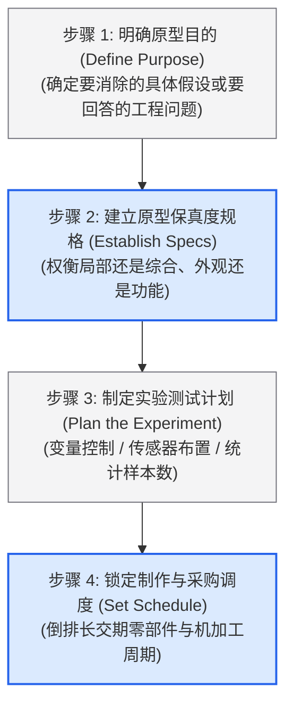

# Lec 8 原型制作（Prototyping）

> MIT 15.783J / 2.739J · Product Design and Development · Spring 2026  
> 核心教材：*Product Design and Development* (8th Edition) Chapter 14  
> 拓展参考：iRobot PackBot Development Case; Formlabs, *Additive Manufacturing Guide*; Michael Schrage, *Serious Play*

## TL;DR

- 原型是对产品在关注维度上的结构化近似；沿“实体 vs 分析”（Physical vs Analytical）和“局部 vs 综合”（Focused vs Comprehensive）形成四象限分类。
- 原型承载四大核心使命：学习（Learning）、沟通（Communication）、系统整合（Integration）与项目里程碑（Milestones）。
- 实体原型是捕获“未知之未知”（Unknown Unknowns）的唯一手段，往往能强行暴露计算机仿真忽略的隐藏物理效应（如装配摩擦、热气流扰动与公差累积）。
- 原型规划遵循四步法：明确测试目标、界定保真度规格、设计受控实验方案、锁定采购制作节拍；严防将精美外观模型误当成功能验证。

## 一、原型的定义与二维四象限分类矩阵

在日常口语中，“原型”常被狭隘地理解为“一台手工制作的机器”。但在严谨的现代产品开发工程中，原型的外延极其广阔。

::: definition [原型 (Prototype)]
原型是产品在团队所关注的一个或多个维度上的**近似实体或模型（Approximation of the Product）**。任何用于探索未知、回答特定技术问题或向利益相关者传递设计意图的表达形式（无论是纸板草模、数学方程组、3D CAD 动画还是手工样机），均属于原型的范畴。
:::

依据 Ulrich & Eppinger 在教材第 14 章的定义，所有原型可以沿两个相互正交的维度进行分类：

```text
               [局部原型 (Focused)]
                       ▲
                       │   Quadrant II:
   Quadrant I:         │   有限元应力仿真 (FEA)
   纸板外形与人机草模   │   热力学热传导计算模型
   (仅测试外观或手感)  │   控制算法 Simulink 仿真
                       │
 ──────────────────────┼──────────────────────► [分析型原型 (Analytical)]
 [实体原型 (Physical)] │
                       │   Quadrant IV:
   Quadrant III:       │   全系统多物理场联合仿真
   手板功能验证样机     │   虚拟沉浸式驾驶模拟舱
   (Alpha 阶段首台样机) │
                       ▼
             [综合原型 (Comprehensive)]
```

### 1. 维度一：实体原型 vs. 分析型原型（Physical vs. Analytical）
- **实体原型（Physical）：** 有形的实物对象。通过 3D 打印、数控加工、泡沫切割或打样电路板制作，具备真实的物理质量、几何接触与环境交互属性。
- **分析型原型（Analytical）：** 无形的数学或数字模型。包括 CAD 三维几何模型、有限元应力仿真（FEA）、计算流体力学（CFD）、微分方程数值解或电子线路仿真（SPICE）。

### 2. 维度二：局部原型 vs. 综合原型（Focused vs. Comprehensive）
- **局部原型（Focused）：** 仅针对产品的一个或极少数属性进行孤立验证。例如，用木块快速打磨手柄以测试抓握感（忽略电气内部），或用面包板搭建电路以测试蓝牙通信丢包率（忽略外壳尺寸）。
- **综合原型（Comprehensive）：** 囊括了产品的绝大部分或全部属性。例如制造出能够正常无线遥控、且具备真实外观外壳的完整 Alpha 测试样机。

---

## 二、原型的四大核心目的（The Four Purposes of Prototyping）

开发团队投入昂贵的时间与材料制作原型，必须服务于以下四个明确目的之一：

| 原型目的 | 核心作用机制 | 适用阶段与典型表现形式 |
| :--- | :--- | :--- |
| **学习（Learning）** | 回答“它是否能按预期工作”以及“是否满足客户需要”。通过对比测试数据与理论假设，消除关键技术不确定性。 | 概念开发前端；粗糙工作模型（Works-like）、关键力学测试夹具。 |
| **沟通（Communication）** | 充当跨学科团队内部、向公司高管、投资人及核心种子客户传达设计概念的有形媒介，消除抽象语言歧义。 | 机会评审与中期汇报；泡沫手板、外观手感模型（Looks-like）、视频演示。 |
| **系统整合（Integration）** | 检验各个独立开发的子系统（机械中框、PCB 主板、注塑外壳、电池仓）物理组装在一起时是否存在干涉与通信冲突。 | 详细设计中后期；Alpha 原型、Beta 原型、整机实装骨架。 |
| **里程碑（Milestones）** | 作为阶段门（Stage-Gate）审查的法定交付物，证明项目已经达到了既定的成熟度门槛，以此解锁下一笔研发资金。 | 阶段审查；正式设计评审样机（PDR/CDR）、法规认证样机。 |

---

## 三、原型制作的四大底层工程原理

Ulrich & Eppinger 在教材第 14 章总结了四条指导工程实践的深层原理：

### 1. 分析型原型通常比实体原型更具参数弹性
在数字模型中修改一个倒角半径或壁厚仅需几秒钟；而在物理世界中重新机加工一个铝合金腔体可能需要三天。因此，在参数优化的早期，应尽可能利用分析型原型快速探索最佳几何参数。

### 2. 实体原型是发现“未知之未知”（Unknown Unknowns）的唯一手段
计算机仿真永远只能模拟工程师“已知且显式输入”的物理边界条件。然而真实物理世界充满了不可预见耦合——例如微小振动导致的紧固螺丝松脱、导线电磁辐射对高精度传感器的意外干扰、空气潮湿导致的塑料微膨胀。只有当物理零件被真实装配在一起并在极端环境下运行时，这些致命缺陷才会无处遁形。

### 3. 原型制作可以有效降低后续迭代的沉没成本
如果一个团队为了追求“完美的设计”而在纸面上推迟制作原型，看似节省了打样费，实则放大了系统性风险。越晚制造第一台样机，后续变更的破坏力越大。

### 4. 局部原型与综合原型的组合策略
在开发前端，应大量制造低成本的局部实体原型（并发测试核心机构、按键手感、散热通道）；直到所有核心技术风险均被独立消除后，才组装极其昂贵的首个综合 Alpha 原型。

::: example [iRobot PackBot 战术防恐排爆机器人的多阶段原型演进]
- **阶段 1（局部实体学习模型）：** 制作单轮履带机构测试架，深入沙地与碎石堆测试履带爬坡打滑率，不装载昂贵的机械臂与防爆摄像头。
- **阶段 2（局部分析有限元模型）：** 对履带内部高强度钛合金承重轮辐进行非线性应力分析，在屏幕上快速优化轮辐壁厚分布。
- **阶段 3（外观沟通手模）：** 用聚氨酯树脂制作高保真外壳 Looks-like 模型，携带至美国五角大楼向军方客户演示外形轮廓并确认战术背包收纳尺寸。
- **阶段 4（综合系统集成 Alpha 原型）：** 制造 5 台完整功能机，拉至沙漠进行全天候耐高温、涉水密封及防跌落极限破坏性测试。
:::

---

## 四、原型规划四步法（Planning for Prototypes）

制作原型必须像组织一场严密的科学实验一样进行计划，避免盲目“为了做模型而做模型”：



1. **步骤 1：明确原型目的（Define the Purpose）：** 团队必须用一句话精准写出：“本样机旨在验证在何种载荷下，卡扣机构不会发生塑性断裂。”
2. **步骤 2：确立保真度规格（Establish Prototype Specs）：** 明确哪些部分必须极度精确（如受力转轴公差必须达标），哪些部分可以粗略替代（如外壳颜色与非受力件用纸板粘接）。
3. **步骤 3：制定实验方案（Formulate an Experimental Plan）：** 明确自变量（如施加力矩从 $5\text{N}\cdot\text{m}$ 到 $20\text{N}\cdot\text{m}$）、因变量（应变片读数）、测试环境温度及重复测量次数。
4. **步骤 4：确立采购与装配进度表（Procurement and Assembly Schedule）：** 标识关键路径（Critical Path）。长交期标准件（如进口微型减速电机）必须第一天即刻下单。

---

## 五、现代快速制造技术选型与硬件迭代阶梯

现代创客空间与工程实验室为快速原型制造提供了极其丰富的工艺库：

| 工艺类别 | 典型技术路径 | 核心材料体系 | 尺寸公差与表面 | 最佳工程验证适用场景 |
| :--- | :--- | :--- | :--- | :--- |
| **FDM 熔融沉积** | 挤出热熔长丝 | PLA, ABS, PETG, 碳纤尼龙 | 粗糙，公差 $\pm 0.3\text{mm}$，各向异性明显 | 早期内部结构件空间占位、机构运动可行性探索。 |
| **SLA 光固化树脂** | 紫外激光固化光敏液态树脂 | 刚性类 ABS 树脂、韧性树脂、弹性树脂 | 极高光滑度，公差 $\pm 0.05\text{mm}$ | 高精度外观 Looks-like 样机、装配干涉检查、精密透镜座。 |
| **SLS 激光粉末烧结** | 激光烧结尼龙粉末 | PA11, PA12 尼龙粉末 | 磨砂质感，各向同性，无须支撑结构 | 高强度卡扣、真实受力功能件、复杂空腔管道结构。 |
| **数控 CNC 减材机加工** | 3轴/5轴铣削与车削 | 6061 铝合金、黄铜、POM 赛钢、PEEK | 极高精度 $\pm 0.01\text{mm}$，物理性能等同量产 | 核心承重轴承座、金属散热底座、精密模具型腔验证。 |
| **真空硅胶复模** | 3D 打印母模翻硅胶模 | PU 聚氨酯仿 ABS、仿橡胶材料 | 良好还原母模细节，每套模具产出 15–20 件 | 小批量种子客户内测样机（10–30 套），节约钢模成本。 |

```text
硬件产品原型的标准阶梯式演进路径：
[PoC 原理验证] ──► [Works-like / Looks-like 分离验证] ──► [Alpha 原型] ──► [Beta 原型] ──► [EVT / DVT 量产验证]
(面包板+纸板)       (高保真电路架 / 树脂手感手模)        (首台系统集成机)   (试产零部件组装)    (量产流水线开模验证)
```

::: insight [实体原型是迫使隐藏物理定律现身的唯一样本]
在 CAD 软件中，零件永远完美光滑、配合天衣无缝、电磁波互不干扰。但把实物拼在一起的瞬间，真实世界的重力下垂、线缆弯折反弹力与装配间隙就会给年轻工程师上一堂残酷的物理课。越早把样机交到自己手上把玩，项目在后期遭受毁灭性打击的概率就越低。
:::

::: pitfall [制作高保真“玩具原型”：虚假的外观精美掩盖核心力学失效]
初创团队常犯的致命错误是花费数千美元将外壳喷漆打磨得如同商用成品，但内部却用热熔胶粘着无法持久工作的脆弱机构。这种“看似成熟”的原型不仅无法帮助团队测试耐久性与发热极限，反而在用户测试和投资人面前制造了虚假的性能承诺。
:::

---

## 六、思考题与方法论延伸

1. **原型规划实操：** 团队正在设计一款带有防水密封圈（O-Ring）的手持便携潜水探照灯。为了在 Sprint 3 中验证“在水下 30 米（约 0.3 MPa 水压）下连续工作 1 小时不发生微量渗水”，请运用原型规划四步法，设计一套利用家用高压锅或压力测试桶完成的低成本实验方案。
2. **Looks-like 与 Works-like 权衡：** 为什么在智能穿戴设备开发中，将外观人机原型（测试佩戴舒适度与视觉大小）与功能核心原型（测试心率传感器光学信噪比与功耗）彻底解耦为两个独立的 Focused 原型，通常比直接制作一个综合型原型更加高效？
