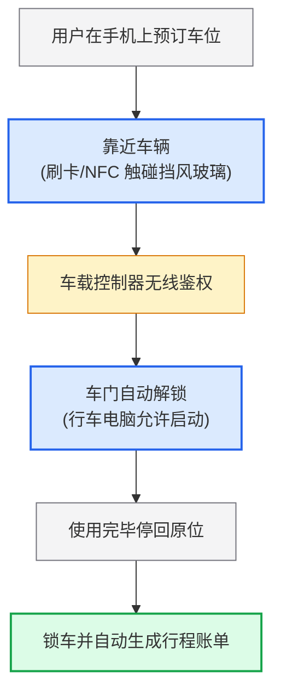

# Lec 9 体验与服务设计（Experience and Service Design）

> MIT 15.783J / 2.739J · Product Design and Development · Spring 2026  
> 核心教材：*Product Design and Development* (8th Edition) Chapter 17  
> 拓展参考：G. Lynn Shostack, *Designing Services That Deliver*; Don Norman, *People, Not Just Users*; Zipcar & Disney MagicBand Harvard Case Studies

## TL;DR

- 产品-服务系统（PSS）将物理硬件与无形服务深度咬合，商业模式从一次性买断所有权升级为交付持续的效用体验。
- 服务具备无形性（Intangibility）、产销同时性（Simultaneity）、异质性（Heterogeneity）与易逝性（Perishability）四大特性，对交付系统的缓冲与容错能力提出极高要求。
- 服务蓝图（Service Blueprint）通过可见性线与交互线，将物理证据、顾客动作、前台接触、后台支撑与技术系统横向打通，是服务系统工程的唯一事实图谱。
- 卓越的体验遵循“峰终定律”（Peak-End Rule），硬件只是触点载体，真正决定客户终身价值的是全旅程关键时刻（Moments of Truth）的无缝协同。

## 一、产品-服务系统（PSS）与服务的四大固有本质

在传统工业制造中，产品的终点是商品出库；而在现代产品开发中，越来越多的企业演化为“产品-服务系统”（Product-Service Systems, PSS）。例如，苹果公司不仅销售 iPhone 硬件，更通过 iCloud、Apple Pay 与 AppleCare 构建服务闭环；Zipcar 不仅运营汽车，更提供高度自动化、按需随取的城市出行效用。

根据教材第 17 章的定义，服务与传统离散物理产品存在四大本质差异（经典 IHIP 理论）：

| 服务本质特性 | 工程与管理挑战 | 对应的产品与系统设计对策 |
| :--- | :--- | :--- |
| **无形性（Intangibility）** | 服务无法在购买前被直接触摸或物理检验，用户极度依赖线索推测品质。 | 强化“物理证据”（Physical Evidence）设计（如高质感会员卡、清晰明亮的专属停车位）。 |
| **同时性（Simultaneity）** | 服务的生产与消费在同一时空发生，顾客直接参与到服务制造过程中。 | 前台交互界面必须极度防呆（Poka-Yoke），避免顾客误操作阻断流程。 |
| **异质性（Heterogeneity）** | 每次服务体验受人员情绪、环境与网络波动影响，难以像工厂装配线一样标准化。 | 建立模块化标准作业程序（SOP），通过软硬件自动化消除人为波动。 |
| **易逝性（Perishability）** | 未被使用的服务产能无法作为库存储存（如空置一小时的租车位其时间价值永久归零）。 | 引入动态定价算法与容量缓冲机制，平滑波峰与波谷需求。 |

---

## 二、服务蓝图（Service Blueprint）体系与触点编排

服务蓝图由 Lynn Shostack 于 1982 年首创，是产品-服务系统开发中最重要的系统级架构工具。它绝非普通的用户旅程图或简单的流程图，而是一张将用户可见的外在体验与底层不可见的复杂工程支持网络紧密咬合的立体多维图谱。

在服务蓝图中，水平轴代表时间推移与用户在全生命周期中的体验旅程，而垂直轴则清晰划分了组织的物理层级与认知边界。每一个用户动作的背后，都有一整套精密设计的软硬件系统与后台响应链条予以支撑。

| 蓝图结构层级 | 在服务系统中的核心定义 | Zipcar 汽车分时租赁实践样例 |
| :--- | :--- | :--- |
| **1. 物理证据（Physical Evidence）** | 客户在体验全过程中所能看到、触摸到、听到的所有有形载体。 | 手机 App 界面、专属车位绿色地面标牌、挡风玻璃射频刷卡区。 |
| **2. 顾客行为（Customer Actions）** | 顾客在完成服务目标时必须主动采取的动作与关键决策步骤。 | 在线搜索空闲车辆、步行至车位、用卡贴近挡风玻璃、驾车离开。 |
| **—— 交互分界线（Line of Interaction） ——** | **区分顾客直接动作与企业接触点的物理界线。** | **顾客身体与车载硬件系统建立首次物理接触。** |
| **3. 前台可见活动（Onstage Actions）** | 直接呈现在顾客眼前、与顾客发生互动的设备或员工动作。 | 车载蜂鸣器清脆滴声确认、车门电磁中控锁自动弹开。 |
| **—— 可见性分界线（Line of Visibility） ——** | **区分前台剧场舞台与后台幕后运作的认知分界。** | **顾客无法看到幕后数据流，只享受瞬时解锁结果。** |
| **4. 后台接触活动（Backstage Actions）** | 为保障前台运转所必需、但不直接暴露在顾客视线内的运营活动。 | 车载 4G 模块向云端校验会员卡合法性、更新 GPS 经纬度。 |
| **—— 内部交互线（Line of Internal Interaction） ——** | **区分一线运营活动与底层技术设施、组织支撑的接口边界。** | **触发底层计费中心与第三方车险接口授权。** |
| **5. 支持过程（Support Processes）** | 企业底层 IT 架构、供应链基础设施、数据湖与清洗调度网络。 | 自动化银行预授权扣款、车队夜间加油与保洁外包工单调度。 |

::: definition [服务蓝图 (Service Blueprint)]
服务蓝图是一种基于时间序列与空间层次的跨职能过程图，通过交互线、可见性线与内部交互线三道边界，将用户外在体验行为与组织内部的前台接触、后台运作、技术支持过程及物理证据无缝映射。
:::

### 1. 三道关键分界线的严格划分

- **交互分界线（Line of Interaction）：** 区分顾客直接行为与服务提供方的直接界面反应。当顾客点击屏幕、触摸实体按钮或与客服交谈时，均跨越此线，代表着物理或数字触点的正式建立。
- **可见性分界线（Line of Visibility）：** 区分顾客能够直接感知的前台界面与隐藏在幕后的后台作业。该线决定了“剧场舞台”的清晰边界——顾客只需享受无缝的结果，而无需为幕后复杂的服务器集群调度与排班逻辑耗费心智。
- **内部交互分界线（Line of Internal Interaction）：** 区分直接服务于业务一线的前台/后台员工与企业深层的底层 IT 架构、供应链基础设施及核心数据库。该线界定了各支持部门之间的服务水平协议（SLA）。

---

## 三、两大跨学科经典案例深度剖析

### 1. Zipcar：分布式无人值守汽车分时租赁系统

Zipcar（由 MIT 毕业生 Robin Chase 联合创立）的成功，是硬件与服务交付系统天衣无缝整合的典范。

- **传统汽车租赁的痛点：** 顾客必须在工作时间排长队前往柜台、手写填写繁琐纸质保险单、验车签字，租赁周期至少以天计算。
- **Zipcar 的 PSS 系统重构：**
  - **物理硬件创新：** 在挡风玻璃内侧集成定制 RFID 射频读卡器，车内安装嵌入式无线通信主控盒，直连车辆总线（CAN-bus）控制中控锁与启动点火开关。
  - **服务流程创新：** 会员在线预约任意街区的特定车辆；到达车旁用会员卡（Zipcard）在挡风玻璃一贴，后台 2 秒内完成无线鉴权并自动解锁车门；钥匙固定于手套箱内，行程结束物归原位，关门刷卡自动结算。
  - **后台闭环运维：** 车辆自动上报里程、油量与胎压；如果前一位用户延迟还车或车内脏污，后台调度算法立即自动向受影响的下一位用户发送免费升级附近更高级车辆的短信，将潜在差评在发生前化解。

### 2. Disney MagicBand：无感沉浸式度假区生态

迪士尼斥资 10 亿美元打造的 MagicBand 项目，彻底重新定义了大型主题乐园的游客体验：
- **全触点融合：** 一条色彩缤纷的防水硅胶手环，内置高频 RFID（近距离门禁刷卡）与超高频有源 RFID（长距离 10 米定位追踪）。
- **消灭所有微摩擦力：** 游客无需携带钱包、房卡、纸质门票与排队票。手环既是客房门禁，又是乐园通行证、快速通行预约凭据（FastPass），还能在全园区商铺一碰免密记账至房单。
- **神级关键时刻（Moments of Truth）：** 当预订了餐厅的家庭步入餐厅时，前台服务员在迎宾屏上已经看到家庭姓氏并亲切称呼；入座后无需报桌号，后厨通过长距离定位精准将热腾腾的菜品送到餐桌前，营造出令人惊叹的“魔法感”。

---

## 四、Don Norman 的“人而非用户”体验心理学

设计心理学大师唐·诺曼（Don Norman）强调，现代开发团队必须从“用户体验”（User Experience）升级为“人类体验”（Human Experience）。人不是冷冰冰的操作机器人，人是有情绪记忆、有尊严、易焦虑的情感个体。

::: theorem [服务体验峰终定律 (Peak-End Rule in Service)]
诺贝尔经济学奖得主丹尼尔·卡尼曼与唐·诺曼指出：人类对一次复杂体验的长久记忆，并不取决于过程中每一分钟的平均满意度，而几乎完全由两个关键节点决定——**体验的高潮峰值（Peak，无论是极度愉悦还是极度痛苦）**以及**体验即将结束时的终点感受（End）**。
:::

在服务系统设计中，团队必须精心策划至少一个令人尖叫的“正向峰值时刻”，并在服务交付的最后一刻（例如还车时收到贴心的退还油费提示、退房时收到带有全家合影的精美卡片）留下温暖的记忆锚点。

::: insight [服务体验的成败往往取决于后台可见性分界线之下的隐藏支持系统]
许多团队倾尽全力把前台 App 界面做得美轮美奂，但只要后台的调度算法延迟 3 分钟、或者车内卫生清洗人员漏打扫了一张包装纸，前台建立的全部科技光环就会瞬间坍塌。真正的服务竞争力，70% 建立在可见性分界线之下那些不为人知的供应链调度、自动化工单与异常恢复网络之中。
:::

::: pitfall [将实体硬件独立于服务生态设计，割裂用户完整触点旅程]
有些硬件团队只负责把吸尘器或电动滑板车制造出来，而将配套的 App、售后维修网点与配件订阅完全抛给外部代理商。硬件缺乏与软件后台的实时双向握手，导致设备发生故障时 App 无法预警，用户不得不费尽周折拨打售后电话，彻底破坏了全生命周期的品牌信任。
:::

---

## 五、思考题与方法论延伸

1. **服务蓝图绘制实操：** 假设你的团队正在设计一项“面向白领写字楼的高级雨伞智能共享循环系统”。请画出一张完整的服务蓝图骨架，明确标注“雨天突击补货调度”、“破损雨伞自动识别”以及“暴雨天未按时归还”分别属于哪一条分界线之下的活动？
2. **峰终定律与容错体验：** 在 Zipcar 的实际运营中，若发生“前序使用者爆胎导致后序用户无车可用”的严重服务失败（Negative Peak），作为系统架构师，你将如何通过设计自动补偿与替代车辆推荐策略，实现服务补救（Service Recovery）？
